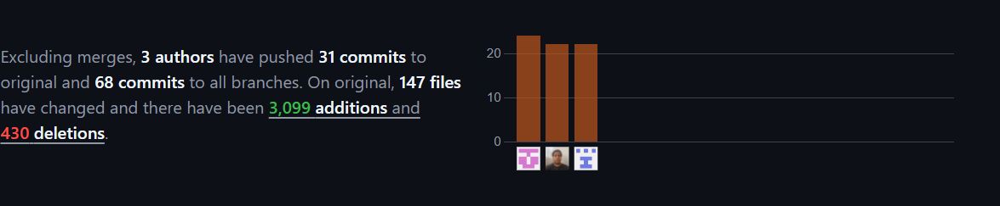

<h1 style="text-align: center;"><b>Universidad Peruana de Ciencias Aplicadas</b></h1>

<h2 style="text-align: center;">
    
Ingenieria de Software - Ciclo 5

    
Desarrollo de Aplicaciones Open Source SV54

</h2>

    

<h2 style="text-align: center;">
    
Informe de Trabajo Final

    
NAXUS

    
NutriSend

    
Hugo Allan Mori Paiva

</h2>

<h2 style="text-align: center;">Integrantes</h2>

<table style="margin-left: auto; margin-right: auto;">
  <tr>
    <th>Nombre y Apellidos</th>
    <th>Código</th>
  </tr>
  <tr>
    <td>Camila Leonor Espinoza Vivas</td>
    <td>U202214572</td>
  </tr>
  <tr>
    <td>Renzo José Araujo Ingunza</td>
    <td>u202113612</td>
  </tr>
  <tr>
    <td>Luis Alfonso Villegas Jipa</td>
    <td>u201717523</td>
  </tr>
</table>

<h4 style="text-align: center;">Agosto 2024</h4>

# Registro de Versiones del Informe

<table border="1" cellpadding="10" cellspacing="0" style="margin-left: auto; margin-right: auto;">
  <tr>
    <th>Version</th>
    <th>Fecha</th>
    <th>Autor</th>
    <th>Descripción de modificación</th>
  </tr>
  <tr>
    <td>TB1</td>
    <td>6/09/2024</td>
    <td>Camila Leonor Espinoza Vivas</td>
    <td>
      - Añadio contenido a todos los capitulo. 
      - Realizo codigo para el despliegue de la Landing Page.  
      - Aporto ideas para la creacion de User Stories.  
      - Realizo el capitulo 4
      - Desplego el repositorio en GitHub.  
      - Aportó ideas para los User Stories  
      - Realizó el capitulo 5 
    </td>
  </tr>
  <tr>
    <td>TB1</td>
    <td>6/09/2024</td>
    <td>Renzo José Araujo Ingunza</td>
    <td>
      - Realizo Web Applications Wireflow Diagrams.  
      - Aporto ideas para Information Architecture.  
      - Realizo la Web Applications Prototyping.  
      - Realizo el Software Object-Oriented Design.  
      - Aportó ideas para los User Stories  
      - Realizó el capitulo 5 
    </td>
  </tr> 
  <tr>
    <td>TB1</td>
    <td>6/09/2024</td>
    <td>Fatima Asmad Padilla</td>
    <td>
      - Realizó el analisis de competidores  
      - Realizó las estrategias ante los competidores  
      - Realizó diseño de entrevistas  
      - Realizó análisis de entrevistas  
      - Realizó User Persona  
      - Realizó User Task Matrix   
      - Realizó User Journey Mapping  
      - Empathy Mapping  
      - As-is Scenario Mapping  
      - Aportó ideas para los User Stories  
      - Realizó el capitulo 5 
    </td>
  </tr>
  <tr>
    <td>TB1</td>
    <td>6/09/2024</td>
    <td>Jhordi Luis Carranza Pérez</td>
    <td>
      - Realizó el startup profile  
      - Realizó el solution profile  
      - Realizó los segmentos objetivos  
      - Realizó el To-Be Scenario Mapping  
      - Realizó el Impact Mapping  
      - Realizó el capitulo 5 
    </td>
  </tr>
  <tr>
    <td>TB1</td>
    <td>6/09/2024</td>
    <td>Luis Alfonso Villegas Jipa</td>
    <td>
      - Contribuyo en el desarrollo del capitulo 1 
      - Realizó los User Stories  
      - Realizó el Product Backlog 
      - Realizó el capitulo 5 
    </td>
  </tr>
  <tr>
    <td>TP</td>
    <td>26/09/2024</td>
    <td>Camila Leonor Espinoza Vivas</td>
    <td>
      - Realizo la retroalimentacion 
      - Completo su parte del front 
      - Realizó los User Stories  
      - Mejoro el sprint 1 
    </td>
  </tr>
  <tr>
    <td>TP</td>
    <td>26/09/2024</td>
    <td>Renzo José Araujo Ingunza</td>
    <td>
      - Completo su parte del front 
      - Unio las partes de sus compañeros del front end  
      - Desplego el front end.  
    </td>
  </tr>
  <tr>
    <td>TP</td>
    <td>6/09/2024</td>
    <td>Fatima Asmad Padilla</td>
    <td>
      - Completo su parte del front 
      - Realizó el product backlog  
      - Realizó el sprint 2  
    </td>
  </tr>
  <tr>
    <td>TP</td>
    <td>6/09/2024</td>
    <td>Jhordi Luis Carranza Pérez</td>
    <td>
      - Completo su parte del front 
      - Realizó el impact map  
    </td>
  </tr>
  <tr>
    <td>TB2</td>
    <td>31/10/2024</td>
    <td>Camila Leonor Espinoza Vivas</td>
    <td>
      - Realizo su parte del bakcend 
      - Avanzo el sprint 3  
      - Agrego los TS en el capitulo 3  
    </td>
  </tr>
  <tr>
    <td>TB2</td>
    <td>26/09/2024</td>
    <td>Renzo José Araujo Ingunza</td>
    <td>
      - Realizo su parte del bakcend 
      - Avanzo el sprint 3  
    </td>
  </tr>
  <tr>
    <td>TB2</td>
    <td>31/10/2024</td>
    <td>Luis Alfonso Villegas Jipa</td>
    <td>
      - Realizo su parte del bakcend 
      - Avanzo el sprint 3  
    </td>
  </tr>
<tr>
    <td>TF</td>
    <td>18/11/2024</td>
    <td>Renzo José Araujo Ingunza</td>
    <td>
      - Creó el repositorio del frontend y desarrolló una plantilla para facilitar el avance del equipo. 
      - Supervisó el progreso y documentó las correcciones necesarias en el proyecto. 
    </td>
</tr>

<tr>
    <td>TF</td>
    <td>18/11/2024</td>
    <td>Luis Alfonso Villegas Jipa</td>
    <td>
      - Estableció los repositorios y supervisó la división de tareas, asegurando el cumplimiento de la rúbrica. 
      - Proporcionó retroalimentación escrita a sus compañeros sobre los avances del proyecto. 
    </td>
</tr>

<tr>
    <td>TF</td>
    <td>18/11/2024</td>
    <td>Camila Leonor Espinoza Vivas</td>
    <td>
      - Completó su parte del backend y avanzó en varias tareas específicas del proyecto. 
      - Realizó notificaciones y correcciones en los user stories, desplegando la base de datos y desarrollando funcionalidades clave. 
    </td>
</tr>
  <tr>
</table>

# Project Report Collaboration Insights

El enlace que sigue dirige al repositorio público de nuestra organización en GitHub: https://github.com/Open-Source-SI729-2402-SV54/informe.git

A continuación, se detalla el desarrollo de las actividades relacionadas con la elaboración del informe, incluyendo capturas de los análisis de colaboración y los commits en GitHub. Para la entrega de la TB1, se presenta un análisis de colaboración que muestra el número de contribuciones realizadas en el repositorio del informe.

**TB1**

En la TB1 se trabajaron los capítulos 1 a 5, enfocándose en el desarrollo de la idea y su consolidación. Se identificó la necesidad de mejorar la planificación alimentaria personalizada y se definió una propuesta de valor basada en un modelo freemium, destacando la automatización y personalización de menús mediante algoritmos. Se realizó un análisis de mercado y competencia, se delineó el diseño inicial de la plataforma y se desplego el Landing page.

**TP**

En la TP, se llevó a cabo el despliegue de la plataforma web, se corrigieron y perfeccionaron los user stories, y se afinaron funcionalidades según los objetivos establecidos.

**TB2**

En la TB2, el objetivo era el despliegue del backend, pero no se logró concretar. Durante esta etapa, dos integrantes del equipo se retiraron, lo que afectó la dinámica y carga de trabajo. A pesar de ello, se añadieron nuevas user stories que ampliaron y detallaron las funcionalidades previstas, sentando las bases para los próximos desarrollos.

**TF**

En la TF, se realizaron los arreglos pendientes, se completó el despliegue del backend y se logró la conexión con el frontend, integrando todas las funcionalidades para ofrecer una plataforma funcional y lista para el usuario final.

# Contenido 

## Tabla de contenidos
#### [Capítulo I: Introducción](/chapter01.md)
- [1.1. Startup Profile](/chapter01.md#11-startup-profile)
    - [1.1.1. Descripción de la Startup](/chapter01.md#111-descripción-de-la-starup)
    - [1.1.2. Perfiles de integrantes del equipo](/chapter01.md#112-perfiles-de-integrantes-del-equipo)
- [1.2. Solution Profile](/chapter01.md#12-Solution-Profile)
    - [1.2.1. Antecedentes y problemática](/chapter01.md#121-antecedentes-y-problemática)
    - [1.2.2. Lean UX Process](/chapter01.md#122-lean-ux-process)
        - [1.2.2.1. Lean UX Problem Statements](/chapter01.md#1221-lean-ux-problem-statements)
        - [1.2.2.2. Lean UX Assumptions](#1222-lean-ux-assumptions)
        - [1.2.2.3. Lean UX Hypothesis Statements](1223-lean-uX-hypothesis-statements)
        - [1.2.2.4. Lean UX Canvas](1224-lean-uX-canvas)
- [1.3. Segmentos objetivo](13-segmentos-objetivo)

#### [Capítulo II: Requirements Elicitation & Analysis](/chapter02.md#capítulo-ii-requeriments-elicitation--analysis)
- [2.1. Competidores](/chapter02.md#21-competidores)
    - [2.1.1. Análisis competitivo](/chapter02.md#211-análisis-competitivo)
    - [2.1.2. Estrategias y tácticas frente a competidores](/chapter02.md#212-estrategias-y-tácticas-frente-a-competidores)
- [2.2. Entrevistas](/chapter02.md#22-entrevistas)
    - [2.2.1. Diseño de entrevistas](/chapter02.md#221-diseño-de-entrevistas)
    - [2.2.2. Registro de entrevistas](/chapter02.md#222-registro-de-entrevistas)
    - [2.2.3. Análisis de entrevistas](/chapter02.md#223-análisis-de-entrevistas)
- [2.3. Needfinding](/chapter02.md#23-needfinding)
    - [2.3.1. User Personas](/chapter02.md#231-user-personas)
    - [2.3.2. User Task Matrix](/chapter02.md#232-user-task-matrix)
    - [2.3.3. User Journey Mapping](/chapter02.md#233-user-journey-mapping)
    - [2.3.4. Empathy Mapping](/chapter02.md#234-empathy-mapping)
    - [2.3.5. As-is Scenario Mapping](/chapter02.md#235-as-is-scenario-mapping)
- [2.4. Ubiquitous Language](/chapter02.md#24-ubiquitous-language)

#### [Capítulo III: Requirements Specification](/chapter03.md#capítulo-iii-requirements-specification)
- [3.1. To-Be Scenario Mapping](/chapter03.md#31-to-be-scenario-mapping)
- [3.2. User Stories](/chapter03.md#32-user-stories)
- [3.3. Impact Mapping](/chapter03.md#33-impact-mapping)
- [3.4. Product Backlog](/chapter03.md#33-impact-mapping)

##### [Capítulo IV: Product Design](/chapter04.md#capítulo-iv-product-design)

- [4.1. Style Guidelines](/chapter04.md#41-style-guidelines)
    - [4.1.1. General Style Guidelines](/chapter04.md#42-information-architecture)
    - [4.1.2. Web Style Guidelines](/chapter04.md#412-web-style-guidelines)
- [4.2. Information Architecture](/chapter04.md#42-information-architecture)
    - [4.2.1. Organization Systems](/chapter04.md#421-organization-systems)
    - [4.2.2. Labeling Systems](/chapter04.md#422-labeling-systems)
    - [4.2.3. SEO Tags and Meta Tags](/chapter04.md#423-seo-tags-and-meta-tags)
    - [4.2.4. Searching Systems](/chapter04.md#424-searching-systems)
    - [4.2.5. Navigation Systems](/chapter04.md#425-navigation-systems)
- [4.3. Landing Page UI Design](/chapter04.md#43-landing-page-ui-design)
    - [4.3.1. Landing Page Wireframe](/chapter04.md#431-landing-page-wireframe)
    - [4.3.2. Landing Page Mock-up](/chapter04.md#432-landing-page-mock-up)
- [4.4. Web Applications UX/UI Design](/chapter04.md#44-web-applications-uxui-design)
    - [4.4.1. Web Applications Wireframes](/chapter04.md#441-web-applications-wireframes)
    - [4.4.2. Web Applications Wireflow Diagrams](/chapter04.md#442-web-applications-wireflow-diagrams)
    - [4.4.3. Web Applications Mock-ups](/chapter04.md#443-web-applications-mock-ups)
    - [4.4.4. Web Applications User Flow Diagrams](/chapter04.md#444-web-applications-user-flow-diagrams)
- [4.5. Web Applications Prototyping](/chapter04.md#45-web-applications-prototyping)
- [4.6. Domain-Driven Software Architecture](/chapter04.md#46-domain-driven-software-architecture)
    - [4.6.1. Software Architecture Context Diagram](/chapter04.md#461-software-architecture-context-diagram)
    - [4.6.2. Software Architecture Container Diagrams](/chapter04.md#462-software-architecture-container-diagrams)
    - [4.6.3. Software Architecture Components Diagrams](/chapter04.md#463-software-architecture-components-diagrams)
- [4.7. Software Object-Oriented Design](/chapter04.md#47-software-object-oriented-design)
    - [4.7.1. Class Diagrams](/chapter04.md#471-class-diagrams)
    - [4.7.2. Class Dictionary](/chapter04.md#472-class-dictionary)
- [4.8. Database Design](/chapter04.md#48-database-design)
    - [4.8.1. Database Diagram](/chapter04.md#481-database-diagram)

#### [Capítulo V: Product Implementation, Validation & Deployment](/chapter05.md#capítulo-v-product-implementation-validation--deployment)
- [5.1. Software Configuration Management](/chapter05.md#51-software-configuration-management)
    - [5.1.1. Software Development Environment Configuration](/chapter05.md#512-source-code-management)
    - [5.1.2. Source Code Management](/chapter05.md#513-source-code-style-guide--conventions)
    - [5.1.3. Source Code Style Guide & Conventions](/chapter05.md#513-source-code-style-guide--conventions)
    - [5.1.4. Software Deployment Configuration](/chapter05.md#514-software-deployment-configuration)
- [5.2. Landing Page, Services & Applications Implementation](/chapter05.md#52-landing-page-services--applications-implementation)
    - [5.2.1. Sprint 1](/chapter05.md#521-sprint-1)
        - [5.2.1.1. Sprint Planning 1](/chapter05.md#5211-sprint-planning-1)
        - [5.2.1.2. Sprint Backlog 1](/chapter05.md#5212-sprint-backlog-1)
        - [5.2.1.3. Development Evidence for Sprint Review](/chapter05.md#5213-development-evidence-for-sprint-review)
        - [5.2.1.4. Testing Suite Evidence for Sprint Review](/chapter05.md#5214-testing-suite-evidence-for-sprint-review)
        - [5.2.1.5. Execution Evidence for Sprint Review](/chapter05.md#5215-execution-evidence-for-sprint-review)
        - [5.2.1.6. Services Documentation Evidence for Sprint Review](/chapter05.md#5216-services-documentation-evidence-for-sprint-review)
        - [5.2.1.7. Software Deployment Evidence for Sprint Review](/chapter05.md#5217-software-deployment-evidence-for-sprint-review)
        - [5.2.1.8. Team Collaboration Insights during Sprint](/chapter05.md#5218-team-collaboration-insights-during-sprint)
    - [5.2.2. Sprint 2](/chapter05.md#521-sprint-2)
        - [5.2.2.1. Sprint Planning 2](/chapter05.md#5221-sprint-planning-2)
        - [5.2.2.2. Sprint Backlog 2](/chapter05.md#5222-sprint-backlog-2)
        - [5.2.2.3. Development Evidence for Sprint Review](/chapter05.md#5223-development-evidence-for-sprint-review)
        - [5.2.2.4. Testing Suite Evidence for Sprint Review](/chapter05.md#5224-testing-suite-evidence-for-sprint-review)
        - [5.2.2.5. Execution Evidence for Sprint Review](/chapter05.md#5225-execution-evidence-for-sprint-review)
        - [5.2.2.6. Services Documentation Evidence for Sprint Review](/chapter05.md#5226-services-documentation-evidence-for-sprint-review)
        - [5.2.2.7. Software Deployment Evidence for Sprint Review](/chapter05.md#5227-software-deployment-evidence-for-sprint-review)
        - [5.2.2.8. Team Collaboration Insights during Sprint](/chapter05.md#5228-team-collaboration-insights-during-sprint)
      - [5.2.3. Sprint 3](/chapter05.md#523-sprint-3)
        - [5.2.3.1. Sprint Planning 3](/chapter05.md#5231-sprint-planning-2)
        - [5.2.3.2. Sprint Backlog 3](/chapter05.md#5232-sprint-backlog-3)
        - [5.2.3.3. Development Evidence for Sprint Review](/chapter05.md#5233-development-evidence-for-sprint-review)
        - [5.2.3.4. Testing Suite Evidence for Sprint Review](/chapter05.md#5234-testing-suite-evidence-for-sprint-review)
        - [5.2.3.5. Execution Evidence for Sprint Review](/chapter05.md#5235-execution-evidence-for-sprint-review)
        - [5.2.3.6. Services Documentation Evidence for Sprint Review](/chapter05.md#5236-services-documentation-evidence-for-sprint-review)
        - [5.2.3.7. Software Deployment Evidence for Sprint Review](/chapter05.md#5237-software-deployment-evidence-for-sprint-review)
        - [5.2.3.8. Team Collaboration Insights during Sprint](/chapter05.md#5238-team-collaboration-insights-during-sprint)
    - [5.3. Validation Interviews](/chapter05.md#53-validation-interviews)
      - [5.3.1. Diseño de Entrevistas](/chapter05.md#531-diseño-de-entrevistas)
      - [5.3.2. Registro de Entrevistas](/chapter05.md#532-registro-de-entrevistas)
      - [5.3.3. Evaluaciones según heurísticas](/chapter05.md#533-evaluaciones-según-heurísticas)

[Conclusiones](#conclusiones)

[Bibliografía](#bibliografía)

[Anexos](#anexos)

# Student Outcome

<table border="1" cellpadding="10" cellspacing="0" style="margin-left: auto; margin-right: auto;">
  <tr>
    <th>Criterio específico</th>
    <th>Acciones realizadas</th>
    <th>Conclusiones</th>
  </tr>
  <tr>
    <td>Comunica oralmente con efectividad a diferentes rangos de audiencia
    </td>
    <td>
      Camila Leonor Espinoza Vivas  
      TB1  
      En la primera entrega, creé los repositorios y me encargué de la división y supervisión de las tareas, asegurándome de que todo se cumpliera según la rúbrica del trabajo. Estuve pendiente de cada entrega y proporcioné retroalimentación sobre los avances de mis compañeros. Durante nuestras reuniones, comuniqué claramente las expectativas y objetivos, lo que facilitó una colaboración efectiva y ayudó a mantener al equipo alineado en nuestras metas.
       
      Renzo José Araujo Ingunza 
      TB1  
      En la primera entrega, avancé en los elementos asignados a través de reuniones grupales que realizamos de manera diaria y semanal. Esta organización me permitió progresar conforme a lo esperado y también ayudé en la coordinación del grupo, asegurando que todos estuviéramos alineados en nuestras tareas y objetivos. Durante estas reuniones, pude comunicarme efectivamente con mis compañeros, lo que facilitó una colaboración fluida y un entendimiento común sobre nuestras responsabilidades.
       
      Fatima Asmad Padilla 
      TB1  	
      Avanzó los elementos asignados a través de las reuniones grupales que fueron realizadas de manera diaria y semanal, por lo que pudo avanzar de la manera esperada. Ayudo en la coordinacion del grupo. 
       
      Jhordi Luis Carranza Pérez 	
      TB1  
      Avanzó los elementos asignados a través de las reuniones grupales que fueron realizadas de manera diaria y semanal. Su ausencia perjudico algunos puntos. 
       
      Luis Alfonso Villegas Jipa 
      TB1  
      En la primera entrega, trabajé en el informe del proyecto, donde realicé un análisis de los competidores para identificar las mejores prácticas del mercado y presentar nuestra propuesta de valor de manera efectiva. También desarrollé y analicé los user stories, asegurándome de que reflejaran las necesidades del usuario final utilizando un formato general que incluía el rol del usuario, la funcionalidad deseada y el beneficio esperado. Esto facilitó la alineación del equipo y permitió una mejor comprensión de los objetivos. Además, elaboré las technical stories, enfocándome en las tareas técnicas necesarias para implementar las funcionalidades, lo que mejoró la comunicación con mis compañeros desarrolladores y preparó al grupo para presentar nuestro trabajo a audiencias externas.
       
      Camila Leonor Espinoza Vivas  
      TP  
      En el trabajo parcial, establecí el repositorio del frontend y desarrollé una plantilla para que todos pudieran avanzar en sus respectivas partes. Supervisé el progreso de cada miembro del equipo y corregí los errores identificados en la primera entrega. A lo largo de este proceso, mantuve una comunicación constante con mis compañeros, asegurándome de que todos comprendieran las correcciones necesarias y cómo implementar los cambios. Esto fomentó un ambiente de trabajo colaborativo y mejoró la calidad del producto final.
       
      Renzo José Araujo Ingunza 
      TP  
      En el trabajo parcial, cumplí con los elementos asignados mediante las reuniones grupales diarias y semanales, lo que me permitió avanzar de acuerdo con las expectativas. Además, colaboré en la integración de todas las partes del frontend, asegurándome de que cada componente funcionara correctamente. A través de una comunicación clara y constante con el equipo, logramos unir nuestros esfuerzos y crear una interfaz cohesiva y fácil de usar para los usuarios finales.
       
      Fatima Asmad Padilla 
      TP  	
      Cupmplio con los elementos asignados a través de las reuniones grupales que fueron realizadas de manera diaria y semanal, pero de forma tardia aun asi pudo avanzar de la manera esperada.
       
      Jhordi Luis Carranza Pérez 	
      TP  
      Avanzó los elementos asignados a través de las reuniones grupales que fueron realizadas de manera diaria y semanal.  
       
      Luis Alfonso Villegas Jipa 
      TP  
      En el trabajo parcial, me enfoqué en el desarrollo del frontend para la funcionalidad de order, donde implementé la emisión de órdenes de compra categorizadas en breakfast, lunch y dinner. Durante este proceso, colaboré con mis compañeros para asegurar que la interfaz fuera intuitiva y fácil de usar, lo que facilitó la comunicación efectiva de nuestras ideas y decisiones. Además, trabajé en la presentación de esta funcionalidad a diferentes audiencias, asegurando que tanto los usuarios finales como los miembros del equipo comprendieran cómo navegar por las categorías y realizar pedidos de manera eficiente. Esta experiencia no solo mejoró mis habilidades técnicas, sino que también fortaleció nuestra capacidad para comunicar conceptos complejos de forma clara y accesible.
       
      Camila Leonor Espinoza Vivas  
      TB2  
      Durante el TB 2, completé mi parte del backend y avancé en las tareas TS05, TS11 y TS12. Aunque enfrenté algunos desafíos para alcanzar los objetivos específicos, mi compromiso se reflejó en la finalización del sprint 3. En mi entrevista, me comuniqué de manera efectiva sobre mis aportes al equipo, explicando los obstáculos que encontré y cómo los superé. Esta comunicación abierta ayudó a fortalecer la cohesión del grupo y a identificar áreas donde podríamos mejorar en el futuro.
       
      Renzo José Araujo Ingunza 
      TB2  
      Durante el TB 2, desarrollé mi parte del backend y avancé en las tareas TS08, TS09 y TS10. Aunque enfrenté algunos obstáculos, mi capacidad para ayudar a completar el sprint 3 refleja mi compromiso con el equipo. En mi entrevista, me comuniqué claramente sobre mis contribuciones y los desafíos que encontré, lo que mejoró la cohesión del grupo. Esta comunicación abierta fue fundamental para que todos entendieran cómo cada uno de nosotros estaba avanzando en el proyecto.
       
      Luis Alfonso Villegas Jipa 
      TB2  
      En la TB2, me encargué del desarrollo del backend para la funcionalidad de "Order", implementando métodos GET y POST que manejan las mismas categorías de breakfast, lunch y dinner. En este proceso, añadí detalles importantes como los nombres de los platillos, un ID generado automáticamente para cada orden, la cantidad de cada platillo y el total a pagar. Colaboré estrechamente con mis compañeros para asegurar que la lógica del backend se integrara perfectamente con el frontend, lo que facilitó una experiencia de usuario fluida. Además, me aseguré de comunicar claramente los aspectos técnicos del sistema a todos los miembros del equipo, lo que nos permitió alinear nuestras expectativas y objetivos. Esta experiencia no solo mejoró mis habilidades en programación, sino que también fortaleció nuestra capacidad para presentar información técnica de manera accesible a diferentes audiencias.
       
      Jhordi Luis Carranza Pérez 	
      TB2  
      La falta de participación de Jhordi limitó su capacidad para contribuir a la comunicación oral. Aunque se esperaba que proporcionara actualizaciones sobre su trabajo, su ausencia afectó la cohesión del equipo.
       
      Fatima Asmad Padilla 
      TB2  
      Al igual que Jhordi, su ausencia afectó la comunicación oral dentro del grupo. Se anticipaba que Fátima colaboraría en la documentación y las discusiones orales sobre el avance del proyecto, pero su retiro a último minuto dejó un vacío en la comunicación del equipo.
       
      Camila Leonor Espinoza Vivas  
      TF  
      En el trabajo final, realicé las notificaciones, proporcioné retroalimentación y correcciones a los user stories, además de desplegar la base de datos y desarrollar el backend para Meals, Category Meals y Type Meals. Durante este proceso, mantuve reuniones regulares con mis compañeros para discutir los avances y resolver cualquier duda que surgiera. Mi capacidad para comunicarme claramente sobre los cambios realizados y las funcionalidades implementadas fue clave para asegurar que todos estuvieran al tanto del progreso del proyecto y cómo cada parte se integraba en el conjunto.
       
      Renzo José Araujo Ingunza 
      TF  
      En el trabajo final, desarrollé tanto el frontend para la funcionalidad de schedule como el backend para las funcionalidades de IAM y schedule, además de actualizar el informe del proyecto. Durante este proceso, mantuve una comunicación constante con mis compañeros para asegurar que todos estuviéramos al tanto de los avances y cambios. Esta interacción no solo facilitó la colaboración efectiva entre los miembros del equipo, sino que también permitió que cada uno comprendiera cómo nuestras contribuciones individuales se integraban en el proyecto general.
       
      Luis Alfonso Villegas Jipa 
      TF  
      En el trabajo final, me enfoqué en la mejora del backend, reintegrando la funcionalidad de order tanto en los planes básicos como en los premium. Además, implementé una nueva funcionalidad de historial de órdenes, que permite a los usuarios revisar sus compras anteriores. A lo largo de este proceso, colaboré estrechamente con mis compañeros para garantizar que todas las mejoras se implementaran de forma efectiva y que la lógica del sistema se mantuviera coherente. Además, me aseguré de transmitir de manera clara los cambios y nuevas funcionalidades a todo el equipo, lo que facilitó una comprensión común sobre cómo estas mejoras beneficiarían a los usuarios finales. Esta experiencia no solo mejoró mis habilidades técnicas, sino que también fortaleció nuestra capacidad para comunicar información compleja de manera clara y accesible para diversas audiencias.
       
    </td>
    <td>
    TB1  
    El equipo mostró un enfoque comprometido y coordinado en la realización de las tareas asignadas, utilizando reuniones diarias y semanales para avanzar en el proyecto. La supervisión constante y la retroalimentación permitieron a los miembros ajustar su trabajo de acuerdo con las expectativas y la rúbrica del proyecto. Sin embargo, la falta de cumplimiento de ciertos objetivos individuales y la ausencia de algunos miembros afectaron el progreso en momentos puntuales. A pesar de estos desafíos, el equipo logró mantener una comunicación clara y avanzar en las tareas, destacando la capacidad de colaboración en la mayoría de los integrantes.
      
    TP1  
    El equipo demostró un enfoque comprometido y colaborativo en la realización de las tareas asignadas, participando activamente en reuniones diarias y semanales para asegurar el progreso del proyecto. La creación del repositorio por parte de Camila y el apoyo en la integración del front end por parte de Renzo fueron fundamentales para el avance. Sin embargo, algunos miembros, enfrentaron dificultades en el cumplimiento de plazos y objetivos, lo que afectó temporalmente el progreso general. A pesar de estos inconvenientes, la comunicación fluida y la supervisión constante permitieron al equipo ajustar su trabajo y avanzar en la dirección correcta, resaltando la capacidad de colaboración y el compromiso de la mayoría de los integrantes.
      
    TB2  
    El desarrollo del proyecto se vio significativamente afectado por la ausencia de dos miembros del equipo, Fátima y Jhordi, quienes decidieron retirarse en el último minuto. Esta situación obligó a los integrantes activos a reestructurar las tareas y a colaborar de manera más intensa para cumplir con los objetivos establecidos. A pesar de los desafíos que enfrentaron, como la redistribución de responsabilidades y la necesidad de comunicarse de manera más efectiva, el equipo demostró un fuerte compromiso y adaptabilidad. La capacidad de cada miembro para asumir nuevas tareas y trabajar juntos en la finalización del sprint 3 resalta la resiliencia del grupo ante la adversidad. Aunque la falta de participación de algunos compañeros generó dificultades, el equipo logró avanzar gracias a su colaboración y dedicación, lo que permitió cumplir con los plazos y alcanzar los hitos establecidos en el proyecto.
     TF  
    En el trabajo final, el equipo demostró una notable capacidad para comunicar oralmente con efectividad a diferentes rangos de audiencia. Luis, al crear los repositorios y supervisar la división de tareas, se aseguró de que todos los miembros del equipo comprendieran sus responsabilidades y el cumplimiento de la rúbrica del trabajo. Su habilidad para proporcionar retroalimentación clara durante las reuniones facilitó una colaboración fluida y mantuvo al grupo alineado.
    Renzo, encargado del repositorio del frontend, desarrolló una plantilla que permitió a todos avanzar en sus partes respectivas. Durante las reuniones, comunicó de manera efectiva las correcciones necesarias y supervisó el progreso del equipo, lo que ayudó a mantener un ambiente de trabajo colaborativo. Su enfoque en la comunicación constante garantizó que todos comprendieran las modificaciones requeridas.
     completó su parte del backend y avanzó en tareas específicas, mostrando su compromiso al finalizar el sprint 3. En sus presentaciones orales, comunicó claramente sus contribuciones y los desafíos superados, lo que mejoró la cohesión del grupo. Además, realizó notificaciones y correcciones en los user stories, desplegando la base de datos y desarrollando funcionalidades clave.
     
    </td> 
  </tr>
  <tr>
    <td>Comunica por escrito con efectividad a diferentes rangos de audiencia</td>
    <td>
      Camila Leonor Espinoza Vivas  
      TB1  
      En la primera entrega, creé los repositorios y me encargué de la división y supervisión de las tareas, asegurándome de que todo se cumpliera según la rúbrica del trabajo. Estuve pendiente de cada entrega y proporcioné retroalimentación escrita sobre los avances de mis compañeros. A través de informes y correos electrónicos, comuniqué claramente las expectativas y objetivos, lo que facilitó una colaboración efectiva y ayudó a mantener al equipo alineado en nuestras metas.
       
      Renzo José Araujo Ingunza 
      TB1  
      En la primera entrega, avancé en los elementos asignados a través de reuniones grupales que realizamos de manera diaria y semanal. Esta organización me permitió progresar conforme a lo esperado y también contribuí a la coordinación del grupo, asegurando que todos estuviéramos alineados en nuestras tareas y objetivos. Durante estas reuniones, documenté claramente los acuerdos y decisiones tomadas, lo que facilitó una colaboración fluida y un entendimiento común sobre nuestras responsabilidades.
       
      Fatima Asmad Padilla 
      TB1   
      Investigó los competidores actuales y potenciales de nuestro negocio, con el objetivo de obtener retroalimentación y resaltar los aspectos que pueden hacer que nos destaquemos frente a ellos. Esto permitió obtener una mejor comprensión del dominio del problema que abarca este modelo de negocio.
       
      Jhordi Luis Carranza Pérez 	
      TB1  
      Investigó el dominio y la aplicación del software a implementar, involucrando a todo el equipo en el proceso de investigación de la problemática y la segmentación de nuestro público objetivo, con una participación activa de cada miembro.
       
      Luis Alfonso Villegas Jipa 
      TB1  
      En la primera entrega, me encargué de elaborar el informe del proyecto, donde realicé un análisis detallado de los competidores para identificar las mejores prácticas del mercado y presentar nuestra propuesta de valor de manera clara. También desarrollé y analicé los user stories, asegurándome de que reflejaran adecuadamente las necesidades del usuario final, utilizando un formato general que incluía el rol del usuario, la funcionalidad deseada y el beneficio esperado. Esto facilitó la alineación del equipo y mejoró nuestra comprensión de los objetivos. Además, redacté las technical stories, centrándome en las tareas técnicas necesarias para implementar las funcionalidades, lo que optimizó la comunicación con mis compañeros desarrolladores y preparó al grupo para presentar nuestro trabajo a diferentes audiencias.
       
       
      Camila Leonor Espinoza Vivas  
      TP  
      En el trabajo parcial, establecí el repositorio del frontend y desarrollé una plantilla para que todos pudieran avanzar en sus respectivas partes. Supervisé el progreso de cada miembro del equipo y documenté las correcciones necesarias a partir de los errores identificados en la primera entrega. A lo largo de este proceso, mantuve una comunicación escrita constante con mis compañeros, asegurándome de que todos comprendieran las correcciones a implementar. Esto fomentó un ambiente de trabajo colaborativo y mejoró la calidad del producto final.
       
      Renzo José Araujo Ingunza 
      TP  
      En el trabajo parcial, cumplí con los elementos asignados mediante las reuniones grupales diarias y semanales, lo que me permitió avanzar de acuerdo con las expectativas. Además, colaboré en la integración de todas las partes del frontend, asegurándome de que cada componente funcionara correctamente. A través de una comunicación escrita clara y constante con el equipo, logré unir nuestros esfuerzos y crear una interfaz cohesiva y fácil de usar para los usuarios finales. Documenté cada paso del proceso para que todos los miembros del equipo pudieran seguir el progreso y entender las decisiones tomadas.
       
      Fatima Asmad Padilla 
      TP   
      Completó su parte del front end, aunque no dentro del tiempo estimado inicialmente. A pesar de esto, mostró iniciativa al actualizar el product backlog, lo cual ayudó a mantener una visión clara de las tareas pendientes y los avances. Aunque no abordó completamente la incorporación de nuevas user stories, su participación en el sprint 2 demuestra su disposición a colaborar en etapas críticas del proyecto.
       
      Jhordi Luis Carranza Pérez 	
      TP  
      Finalizó su parte del front end, aunque no alcanzó los objetivos específicos que se habían establecido. A pesar de estas dificultades, su contribución fue clave en la actualización del impact map y terminando el capitulo 5, lo que permitió al equipo ajustar su estrategia general y visualizar mejor las conexiones entre las metas del proyecto y las tareas individuales. Su participación en este aspecto estratégico fue valiosa para la planificación futura del equipo.
       
      Luis Alfonso Villegas Jipa 
      TP  
      En el trabajo parcial, me enfoqué en el desarrollo del frontend para la funcionalidad de order, donde implementé la emisión de órdenes de compra clasificadas en breakfast, lunch y dinner. Durante este proceso, colaboré con mis compañeros para asegurar que la interfaz fuera intuitiva y fácil de usar. Esto permitió una comunicación efectiva de nuestras ideas y decisiones, facilitando que tanto los usuarios finales como los miembros del equipo entendieran cómo navegar por las categorías y realizar pedidos de manera eficiente. Esta experiencia fortaleció nuestras habilidades para redactar conceptos técnicos accesibles a diferentes audiencias.
       
      Camila Leonor Espinoza Vivas  
      TB2  
      Durante la TB 2, completé mi parte del backend y avancé en las tareas TS05, TS11 y TS12. Aunque enfrenté algunos desafíos para alcanzar los objetivos específicos, mi compromiso se reflejó en la finalización del sprint 3. En mi informe escrito, comuniqué de manera efectiva mis aportes al equipo, explicando los obstáculos que encontré y cómo los superé. Esta documentación ayudó a fortalecer la cohesión del grupo y a identificar áreas donde podríamos mejorar en el futuro.
       
      Renzo José Araujo Ingunza 
      TB2  
      Durante el TB 2, desarrollé mi parte del backend y avancé en las tareas TS08, TS09 y TS10. Aunque enfrenté algunos obstáculos, mi capacidad para ayudar a completar el sprint 3 refleja mi compromiso con el equipo. En mi informe escrito, comuniqué claramente mis contribuciones y los desafíos que encontré, lo que mejoró la cohesión del grupo. Esta documentación permitió que todos comprendieran cómo cada uno de nosotros estaba avanzando en el proyecto y facilitó la identificación de áreas donde se necesitaba apoyo adicional.
       
      Luis Alfonso Villegas Jipa 
      TB2  
      En el trabajo parcial, me encargué del desarrollo del backend para la funcionalidad de order, implementando métodos GET y POST que gestionan las mismas categorías de breakfast, lunch y dinner. Añadí elementos clave como los nombres de los platillos, un ID generado automáticamente para cada orden, la cantidad solicitada y el total a pagar. Trabajé en estrecha colaboración con mis compañeros para asegurar que la lógica del backend se integrara sin problemas con el frontend. Además, me aseguré de documentar claramente los aspectos técnicos del sistema, lo que facilitó una comprensión compartida entre todos los miembros del equipo sobre cómo estas mejoras beneficiarían a los usuarios finales.
       
      Jhordi Luis Carranza Pérez 	
      TB2  
      La falta de participación de Jhordi limitó su capacidad para contribuir a la comunicación escrita. Aunque se esperaba que proporcionara actualizaciones sobre su trabajo, su ausencia afectó la cohesión del equipo.
       
      Fatima Asmad Padilla 
      TB2  
      Al igual que Jhordi, su ausencia afectó la comunicación escrita dentro del grupo. Se anticipaba que Fátima colaboraría en la documentación y las discusiones escritas sobre el avance del proyecto, pero su retiro a último minuto dejó un vacío en la comunicación del equipo.
       
      Camila Leonor Espinoza Vivas  
      TF  
      Durante el trabajo parcial, completé mi parte del backend y avancé en las tareas TS05, TS11 y TS12. Aunque enfrenté algunos desafíos para alcanzar los objetivos específicos, mi compromiso se reflejó en la finalización del sprint 3. En mi informe escrito, comuniqué de manera efectiva mis aportes al equipo, explicando los obstáculos que encontré y cómo los superé. Esta documentación ayudó a fortalecer la cohesión del grupo y a identificar áreas donde podríamos mejorar en el futuro.
       
      Renzo José Araujo Ingunza 
      TF  
      En el trabajo final, desarrollé tanto el frontend para la funcionalidad de schedule como el backend para las funcionalidades de IAM y schedule, además de actualizar el informe del proyecto. Durante este proceso, mantuve una comunicación escrita constante con mis compañeros para asegurar que todos estuviéramos al tanto de los avances y cambios. Esta interacción no solo facilitó la colaboración efectiva entre los miembros del equipo, sino que también permitió que cada uno comprendiera cómo nuestras contribuciones individuales se integraban en el proyecto general. Documenté todos los cambios realizados para asegurar una referencia clara en futuras discusiones.
       
      Luis Alfonso Villegas Jipa 
      TF  
      En el trabajo final, me centré en mejorar el backend, reintegrando la funcionalidad de order tanto en los planes básicos como en los premium. Implementé una nueva funcionalidad de historial de órdenes, que permite a los usuarios acceder a sus compras anteriores. A lo largo de este proceso, colaboré estrechamente con mis compañeros para garantizar que todas las mejoras se implementaran eficazmente y que la lógica del sistema se mantuviera coherente. También me aseguré de comunicar por escrito los cambios y nuevas funcionalidades a todo el equipo, lo que facilitó una comprensión común sobre cómo estas mejoras beneficiarían a los usuarios finales. Esta experiencia no solo perfeccionó mis habilidades técnicas, sino que también reforzó nuestra capacidad para redactar información compleja de manera clara y accesible para diversas audiencias.
       
    </td>
    <td>
    TB1 
    El equipo demostró una destacada capacidad para comunicar por escrito con efectividad a diferentes rangos de audiencia. Camila Leonor Espinoza Vivas, Renzo José Araujo Ingunza, Fatima Asmad Padilla, Jhordi Luis Carranza Pérez y Luis Alfonso Villegas Jipa realizaron contribuciones significativas en áreas clave como el diseño de la interfaz, la arquitectura de la información, la investigación del dominio y la redacción de documentación técnica. La elaboración de guías de estilo, la creación de wireframes, y el diseño de prototipos reflejan un enfoque meticuloso en la comunicación visual y técnica. La investigación sobre competidores y el análisis del dominio aportaron una comprensión valiosa para adaptar el proyecto a las necesidades del mercado. La capacidad del equipo para estructurar y presentar información técnica de manera clara y efectiva fue fundamental para el avance del proyecto y para asegurar la alineación con los objetivos del negocio.
     
    TP 
    El equipo mostró un alto nivel de colaboración y compromiso. Camila y Renzo lideraron tareas clave como la revisión, retroalimentación y despliegue del front end, además de apoyar a sus compañeros en la resolución de dudas. Aunque los demás enfrentaron dificultades para cumplir ciertos objetivos, completaron sus tareas y contribuyeron a aspectos importantes como el product backlog, el impact map. La comunicación efectiva permitió superar los desafíos y avanzar en el proyecto de manera sólida.
     
    TB2 
    La comunicación escrita en el equipo fue un factor crítico para el progreso del proyecto, especialmente en un contexto marcado por la ausencia de dos compañeros, Fátima y Jhordi. Camila se destacó como la principal comunicadora, asumiendo la responsabilidad de elaborar informes detallados y actualizados que facilitaron la comprensión del avance del backend por parte de todos los miembros del equipo. Su habilidad para presentar información técnica de manera accesible y clara permitió que el equipo se mantuviera alineado y en camino hacia el cumplimiento de los objetivos. 
    Por otro lado, Luis y Renzo también contribuyeron a la documentación y comunicaron sus avances de manera efectiva, aunque la falta de participación de Jhordi y Fátima creó un desafío adicional. En general, la capacidad del equipo para adaptarse a estas ausencias y fortalecer su comunicación escrita refleja un compromiso compartido hacia la transparencia y la colaboración. A pesar de las dificultades, el equipo demostró una notable capacidad para manejar la comunicación escrita, lo que fue fundamental para mantener el rumbo del proyecto y cumplir con los plazos establecidos.
     
    TF 
    En el trabajo final, el equipo demostró un alto nivel de colaboración y compromiso. Luis se encargó de crear los repositorios y supervisar la división de tareas, asegurándose de que todo estuviera alineado con la rúbrica del trabajo. Documentó el progreso y proporcionó retroalimentación escrita a sus compañeros, facilitando una comunicación clara y efectiva.
    Renzo estableció el repositorio del frontend, desarrollando una plantilla que permitió a todos avanzar en sus respectivas partes. Supervisó el progreso del equipo y documentó las correcciones necesarias, asegurando que cada miembro comprendiera las modificaciones requeridas. Su comunicación constante fomentó un ambiente colaborativo y productivo.
    Camila completó su parte del backend y avanzó en tareas específicas, enfrentando desafíos pero demostrando su compromiso al finalizar el sprint 3. En sus informes escritos, comunicó claramente sus contribuciones y los obstáculos superados, lo que mejoró la cohesión del grupo. Además, realizó notificaciones y correcciones en los user stories, desplegando la base de datos y desarrollando funcionalidades clave.

</td>
  </tr>
</table>

# Conclusiones

TB1

- Las recientes actualizaciones han permitido una optimización considerable en la interfaz de usuario y en la experiencia general de navegación. Se ha rediseñado la plataforma para que sea más intuitiva y fácil de usar, reduciendo el tiempo necesario para que los usuarios encuentren y utilicen las funciones principales. La disposición de los elementos y la simplificación de los procesos de navegación han contribuido a una interacción más fluida y agradable con la aplicación, lo que en última instancia mejora la satisfacción del usuario.

- NutriSend ha ampliado sus capacidades con la incorporación de varias nuevas funcionalidades. Entre estas se encuentran recomendaciones personalizadas de comidas, recordatorios automáticos para ingestas y opciones avanzadas de planificación que se ajustan a las necesidades dietéticas individuales. Estas mejoras no solo enriquecen la oferta de servicios, sino que también permiten a los usuarios adaptar el uso de la plataforma a sus preferencias específicas y objetivos de salud, aumentando así su utilidad y valor.

- La plataforma ha evolucionado para ofrecer un nivel de personalización más detallado y preciso. Ahora, NutriSend puede ajustar las recomendaciones de comidas basadas en el nivel de actividad física del usuario, sus preferencias dietéticas y sus objetivos de salud. Este grado de personalización asegura que los planes de comida se alineen más estrechamente con las necesidades individuales, facilitando una gestión más efectiva de la salud y el bienestar personal.

- La incorporación de funciones de automatización ha permitido que la planificación de comidas y la gestión de suscripciones se realicen de manera más eficiente. La automatización reduce la necesidad de intervención manual, lo que a su vez disminuye el riesgo de errores y simplifica el proceso para los usuarios. Este enfoque automatizado no solo mejora la precisión, sino que también facilita una administración más sencilla y efectiva de las preferencias dietéticas y las compras de alimentos.

TP

- El equipo demostró un fuerte espíritu de colaboración, con miembros que apoyaron a sus compañeros y fomentaron un ambiente de trabajo en equipo, lo que facilitó el avance del proyecto.

- Camila y Renzo desempeñaron roles fundamentales al encargarse de la revisión, retroalimentación y despliegue del front end, asegurando que el proyecto se mantuviera alineado con los estándares establecidos.

- La actualización del product backlog y del impact map refleja un compromiso con la mejora continua, permitiendo al equipo ajustar su estrategia y mantener una visión clara del progreso del proyecto.

- La comunicación constante entre los miembros del equipo fue clave para superar obstáculos, lo que subraya la importancia de mantener un diálogo abierto para el éxito en proyectos colaborativos.

TB2

- El equipo de desarrollo de NutriSend logró avances importantes, a pesar de contar con la participación de tres de los cinco miembros previstos. Este ajuste en la disponibilidad del equipo requirió una reestructuración de las tareas y una colaboración más intensa entre los integrantes activos para cumplir con los objetivos. A pesar de los desafíos, el equipo logró completar la documentación de los endpoints y llevar a cabo actividades de validación importantes. Estos avances proporcionan una base sólida para la continuidad del desarrollo en los próximos sprints y refuerzan la adaptabilidad y colaboración del equipo ante cambios inesperados.

- El Sprint 3 presentó tanto avances importantes en el desarrollo del backend de NutriSend como retos que desafiaron al equipo. A pesar de contar con solo tres de los cinco integrantes, el equipo trabajó de manera enfocada y logró cumplir con varios de los objetivos propuestos. Se implementaron los endpoints más críticos (gestión de usuarios, comidas, pedidos y horarios de comidas) y se documentaron adecuadamente utilizando OpenAPI. Esta documentación permitirá que futuras iteraciones se realicen con una mayor claridad y facilita el mantenimiento.

TF

- El equipo demostró un alto nivel de colaboración al establecer repositorios y supervisar las tareas asignadas. La comunicación escrita clara y la retroalimentación constante permitieron que todos los miembros comprendieran sus responsabilidades y se alinearan con los objetivos del proyecto, lo que resultó en un avance cohesivo hacia la finalización exitosa del trabajo final.

- Cada miembro del equipo, Luis, Renzo y Camila, utilizó estrategias efectivas para comunicar tanto por escrito como de forma oral. Esto incluyó la creación de documentos informativos, presentaciones claras y discusiones en grupo que facilitaron la comprensión de los avances y desafíos. Esta capacidad para adaptar el mensaje según el público contribuyó a mantener a todos informados y comprometidos con el proyecto.

- A pesar de enfrentar obstáculos durante el desarrollo del trabajo final, el equipo logró superarlos gracias a una comunicación abierta y efectiva. Las discusiones sobre los problemas encontrados y las soluciones propuestas no solo mejoraron la cohesión del grupo, sino que también permitieron a cada miembro expresar sus aportes y preocupaciones. Esto fortaleció el compromiso colectivo hacia el éxito del proyecto.

# Video About-the-Team: 

# Bibliografía

Freshly. (n.d.). Freshly. https://www.freshly.com/

Blue Apron. (n.d.). Blue Apron. https://www.blueapron.com/

HelloFresh. (n.d.). HelloFresh. https://www.hellofresh.com/

Smith, J. (2023). The impact of personalized meal planning on dietary habits. Journal of Nutrition and Health, 15(2), 45-59. https://doi.org/10.1016/j.jnh.2023.01.012

Johnson, L., & Davis, K. (2022). Advancements in food delivery services: Trends and technologies. Food Technology Review, 28(4), 77-92. https://doi.org/10.1080/09506620108985614

Brown, A., & White, M. (2023). User experience design in web applications: Principles and practices. Web Design Journal, 21(3), 102-118. https://doi.org/10.1111/wdj.2023.0023

Lee, C. (2024). Automating meal planning: Enhancing user engagement through technology. International Journal of Food Service Management, 31(1), 23-35. https://doi.org/10.1016/j.ijfsm.2023.07.004

Williams, R. (2023). Data security in online food services: Protecting user information. Journal of Cybersecurity and Privacy, 11(2), 55-70. https://doi.org/10.1016/j.jcyber.2023.03.009

# Anexos

Video-About-Product: https://upcedupe-my.sharepoint.com/:v:/g/personal/u202214572_upc_edu_pe/EeabX430di9Hv8bQ-23lnNcB8Zch1Qb7uMfcqhBl8S7HNQ?nav=eyJyZWZlcnJhbEluZm8iOnsicmVmZXJyYWxBcHAiOiJPbmVEcml2ZUZvckJ1c2luZXNzIiwicmVmZXJyYWxBcHBQbGF0Zm9ybSI6IldlYiIsInJlZmVycmFsTW9kZSI6InZpZXciLCJyZWZlcnJhbFZpZXciOiJNeUZpbGVzTGlua0NvcHkifX0&e=VgIZzf

Despliegue del lading-page (version0.1): https://open-source-si729-2402-sv54.github.io/landing-page/

Repositorio del informe: https://github.com/Open-Source-SI729-2402-SV54/informe.git

Repositorio del landing-page: https://github.com/Open-Source-SI729-2402-SV54/landing-page.git

Repositoria del front-end: https://github.com/Open-Source-SI729-2402-SV54/front-end.git

Repositorio del front-end desplegado: https://github.com/C7leo/front-end-master.git

Despligue del front-end: front-end-master-rouge.vercel.app

Repositorio del backend: https://github.com/Open-Source-SI729-2402-SV54/nutrisend-platform.git

Despliegue del backend: https://graceful-respect-production.up.railway.app/swagger-ui/index.html#/

As-is Scenario Mapping: https://miro.com/welcomeonboard/MmJhQlMzbUk5WE1NNkRtRXFlMWVqOG9KTDNrYVgwQzFZdHBzTjBGT0prdVc2elVrQnVmZHBaZEdCSERyNjBWQXwzNDU4NzY0NTUxNjIyOTUwNzc1fDI=?share_link_id=127293495699 

To-Be Scenario Maps: https://miro.com/app/board/uXjVKlfaPCE=/ 

Impact-Map: https://miro.com/welcomeonboard/dEwzZkJyaXFVeWVSNzUwc2FlMUtZRm5UbDA3YzlmaDV0NmV4a2JNR3IzRWQzdGVHNGZuSVJySlRDbTZjNDZGdnwzNDU4NzY0NTIzNDE1MDY4MDA4fDI=?share_link_id=541791359949

User Flow diagrams lucidchart:
https://lucid.app/lucidspark/218fc663-d0e7-4abd-ac28-5dcf2880c784/edit?viewport_loc=-1776%2C-1502%2C13846%2C7030%2C0_0&invitationId=inv_d8c0a7b4-5892-4745-bb5d-a3c04d7deb75

Wireframes, Mock-ups y Prototypes (figma):
https://www.figma.com/design/a64BVB1zNy0aycIi3TtTg7/Landing-Page?node-id=6-3&node-type=CANVAS&t=Nvxq0eWvqTN79PFb-0

NutriSend diagram class lucidchart: 
https://lucid.app/lucidchart/d2d74609-8e59-4b27-86f3-7baa1fd12925/edit?viewport_loc=486%2C168%2C4056%2C2033%2CHWEp-vi-RSFO&invitationId=inv_36ef38f1-e55f-4db4-985f-79e351548972

NutriSend diagram database lucidchart: 
https://lucid.app/lucidchart/70432eed-3de6-4692-b911-abeeb9d8b2fc/edit?viewport_loc=-1035%2C-384%2C3903%2C2343%2CHWEp-vi-RSFO&invitationId=inv_3b35149f-30bf-4772-81cd-70f8a72eae10 

Spring 1 Trello: 
https://trello.com/b/OwgxqazN

Spring 2 Trello: https://trello.com/invite/b/66d7a6d3f74f34d8d49ed99d/ATTI969f71c137d5b5526abf7dfc030d8a6039C6F076/spring-1-nutrisend 

Sprint 3 Trello: https://trello.com/invite/b/672512a1979b384bf1006015/ATTIbe8ef605aa3f26bd40bb76cbc2e4b157520B003D/sprint-3-nutrisend

Sprint 4 Trello: https://trello.com/invite/b/673cf966f7bbf370eb68a0d5/ATTIbbe28aab0d51ee7bf68e14b8ad5b1c8278E7F2F5/sprint-4-nutrisend
