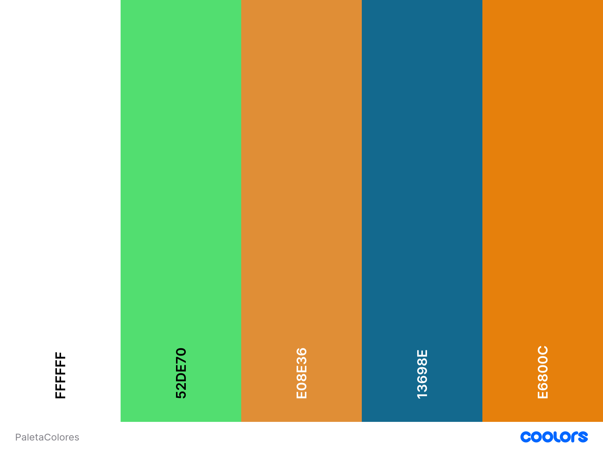
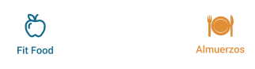
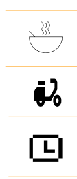

# Chapter IV: Product Design 
---
## 4.1. Style Guidelines.

Debido al rubro al que nuestra solución web está enfocada al sector gastronómico y fitnes. Es necesario que tenga un estilo llamativo y que despierte
el apetito del cliente, resaltando los platillos y los diversos ejercicios mostrados en el sitio web.

### 4.1.1. General Style Guidelines.

*Colores* 
NutriSend se enfoca en mantener un estilo minimalista que permita al usuario una comprensión inmediata del sitio web. Utiliza colores que 
estimulan el apetito y transmiten frescura y salud, creando una experiencia visual que no solo atrae, sino que también fomenta el bienestar.

*Iconos* 
Dado que NutriSend está diseñado para deportistas y personas que no tienen tiempo para cocinar, hemos desarrollado una colección de íconos 
específicos para mejorar el prototipo del sistema. Estos íconos están destinados a hacer la interfaz más iteractiva y alineada con los objetivos
de nuestro servicio, proporcionando una experiencia visualmente coherente y relevante.

 

*Font* 
Finalmente, para garantizar una apariencia uniforme en el desarrollo de nuestro aplicativo, utilizaremos la fuente **Roboto**. Elegimos Roboto 
por su legibilidad, espaciado equilibrado y diseño sin serifas, lo que proporciona una flexibilidad óptima y una experiencia de lectura clara y 
coherente en todas las plataformas de NutriSend. 
