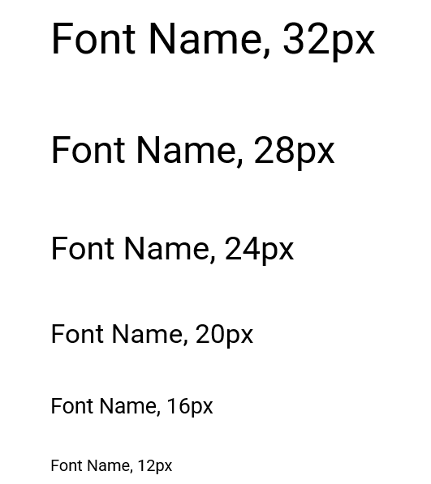

# Chapter IV: Product Design 
---
## 4.1. Style Guidelines.

Debido al rubro al que nuestra solución web está enfocada al sector gastronómico y fitnes. Es necesario que tenga un estilo llamativo y que despierte
el apetito del cliente, resaltando los platillos y los diversos ejercicios mostrados en el sitio web.

### 4.1.1. General Style Guidelines.

*Colores* 
NutriSend se enfoca en mantener un estilo minimalista que permita al usuario una comprensión inmediata del sitio web. Utiliza colores que 
estimulan el apetito y transmiten frescura y salud, creando una experiencia visual que no solo atrae, sino que también fomenta el bienestar.

*Iconos* 
Dado que NutriSend está diseñado para deportistas y personas que no tienen tiempo para cocinar, hemos desarrollado una colección de íconos 
específicos para mejorar el prototipo del sistema. Estos íconos están destinados a hacer la interfaz más iteractiva y alineada con los objetivos
de nuestro servicio, proporcionando una experiencia visualmente coherente y relevante.

 

*Font* 
Finalmente, para garantizar una apariencia uniforme en el desarrollo de nuestro aplicativo, utilizaremos la fuente **Roboto**. Elegimos Roboto 
por su legibilidad, espaciado equilibrado y diseño sin serifas, lo que proporciona una flexibilidad óptima y una experiencia de lectura clara y 
coherente en todas las plataformas de NutriSend. 

*Contenido* 
El contenido del sitio web será claro y accesible para el usuario, utilizando un lenguaje casual y respetuoso. Las imágenes mostrarán ejemplos de los platillos ofrecidos por los restaurantes.

### 4.1.2. Web Style Guidelines.

se ha establecido un sistema en que el contenido del sitio web será de fácil acceso y navegación, facilitando la experiencia para el usuario. 

**Jerárquico (Visual hierarchy):** 
* Este enfoque se implementa en la organización de la información en la página de inicio (Landing Page) y en las principales categorías del sitio web. Los elementos se disponen de manera jerárquica, dando prioridad a la información más relevante y resaltando los elementos clave mediante un tamaño, color o posición distintivos.

* Por ejemplo, en la Landing Page, las ofertas especiales y las categorías más populares se destacan en secciones prominentes, seguidas de otras áreas con información adicional y promociones.

**Organización Secuencial (Step-by-Step to Accomplish):** 

* Será utilizado tanto en los registros de usuarios como en los procesos de compra de los diversos productos, se podrá guiar al usuario con pasos secuenciales para completar cada acción.

* En el sitio web, este enfoque se aplica en el proceso de compra de productos, donde el usuario sigue un flujo paso a paso desde la selección de los productos hasta el pago y la confirmación del pedido.

**Matricial:** 
* El sistema matricial se emplea en la categorización de los productos, ya sea para un platillos estándar o uno balanceado.

* El usuario será capaz de filtrar los resultados según sus requisitos como la rutina y el tipo de alimento que escogerá, proporcionando una experiencia más amena.

## 4.2.2. Labeling Systems.

