## 4.1. Style Guidelines.

Debido al rubro al que nuestra solución web está enfocada al sector gastronómico y fitnes. Es necesario que tenga un estilo llamativo y que despierte el apetito del cliente, resaltando los platillos y los diversos ejercicios mostrados en el sitio web.

### 4.1.1. General Style Guidelines.

**Branding design**<br>

Para la creación del logo de nuestro producto NutriSend, se ha optado por un diseño moderno y minimalista, utilizando una tipografía clara y legible acompañada por un icono que simboliza salud y alimentacion sana. 
</br>

<br>
<div style="text-align: center;">
    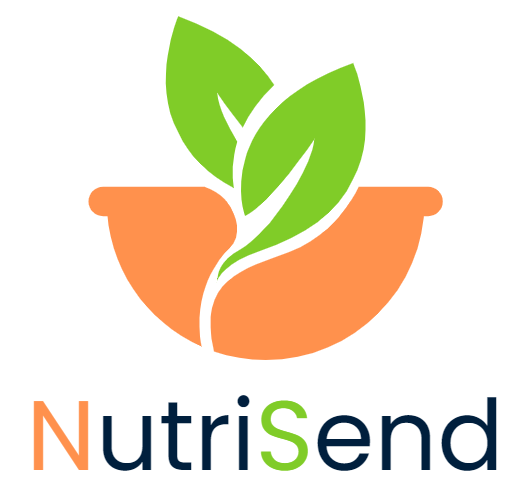
</div></br>

**Colores** <br>
NutriSend se enfoca en mantener un estilo minimalista que permita al usuario una comprensión inmediata del sitio web. Utiliza colores que estimulan el apetito y transmiten frescura y salud, creando una experiencia visual que no solo atrae, sino que también fomenta el bienestar. </br>

<br>
<div style="text-align: center;">
    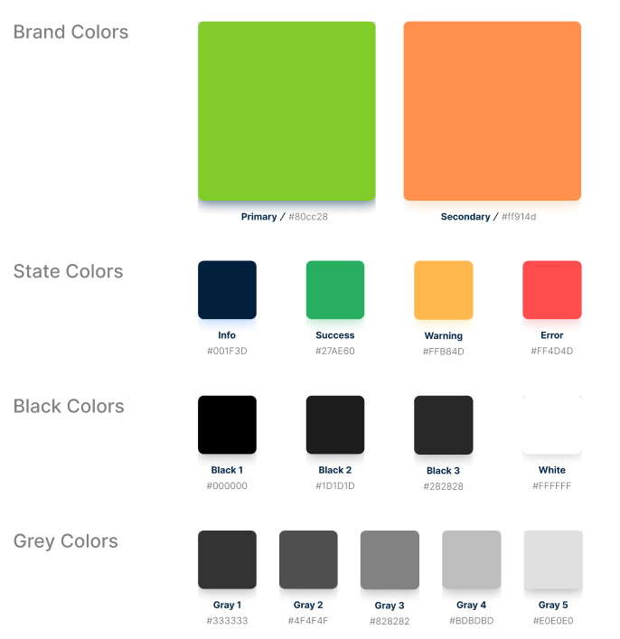
</div></br>

**Iconos**<br>
Dado que NutriSend está diseñado para deportistas y personas que no tienen tiempo para cocinar, hemos desarrollado una colección de íconos específicos para mejorar el prototipo del sistema. Estos íconos están destinados a hacer la interfaz más iteractiva y alineada con los objetivos de nuestro servicio, proporcionando una experiencia visualmente coherente y relevante.</br>

<br>
<div style="text-align: center;">
    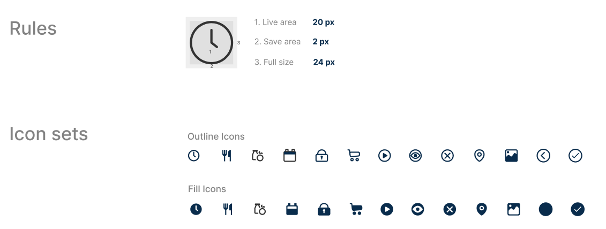
</div></br>

**Typography**<br>
Para garantizar una apariencia uniforme en el desarrollo de nuestro aplicativo, utilizaremos la fuente Poppins. Elegimos Poppins por su legibilidad, espaciado equilibrado y diseño sin serifas, lo que proporciona una flexibilidad óptima y una experiencia de lectura clara y coherente en todas las plataformas de NutriSend.</br>

<br>
<div style="text-align: center;">
    
    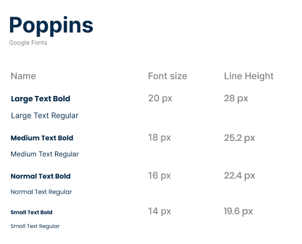

</div></br>

**Spacing**<br>
El espaciado de la aplicación web es importante debido a que no queremos abrumar a nuestros usuarios, ya que nuestra aplicación tiene como objetivo ofrecer una experiencia de usuario sencilla y agradable. Consideramos que un diseño limpio y organizado mejora la usabilidad y reduce la carga cognitiva del usuario, permitiéndole interactuar de manera eficiente con las diferentes funciones y secciones de la aplicación.</br>

<div style="text-align: center;">
    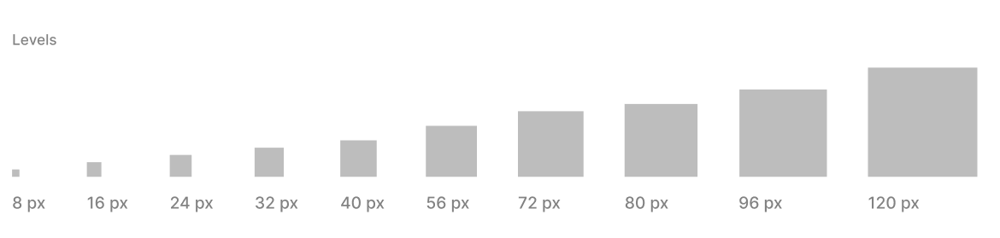
</div></br>

**Tono de comunicación y lenguaje**<br>
El tono de comunicación y lenguaje de NutriSend es casual, amigable y motivador. Queremos que los usuarios se sientan cómodos al navegar por nuestra plataforma, por lo que utilizamos un lenguaje claro y directo que resuene con sus necesidades diarias. Nos dirigimos a ellos de manera cercana, como un amigo que les guía en su camino hacia un estilo de vida más saludable.</br>

### 4.1.2. Web Style Guidelines.

Para NutriSend, estamos planeando desarrollar una plataforma web que implementará un diseño adaptable (conocido como Web Responsive Design) con el objetivo de optimizar la presentación de información en cualquier dispositivo. Esto asegurará que el contenido sea de fácil acceso y navegación, mejorando en última instancia la experiencia del usuario.

Hemos establecido un sistema en el que la información se organiza de manera jerárquica (Visual Hierarchy), particularmente en la Landing Page y las principales categorías del sitio web. Los elementos se disponen dando prioridad a la información más relevante, utilizando tamaños, colores y posiciones distintivas para resaltar los elementos clave. 

También utilizaremos un sistema Matricial para la categorización de productos, permitiendo a los usuarios filtrar resultados según sus preferencias, como la rutina y el tipo de alimento que desean seleccionar, proporcionando una experiencia más amena y personalizada.

Como equipo, hemos optado por incorporar el patrón de diseño en forma de Z en nuestro sitio web. Esta técnica de diseño web es altamente efectiva para mejorar la experiencia del usuario, guiando su atención hacia los elementos clave y potenciando la eficacia del contenido en la página. Por lo general, colocamos el logotipo en la esquina superior izquierda, asegurándonos de que sea lo primero que llame la atención del usuario. Justo enfrente, en la esquina superior derecha, ubicamos la barra de navegación, acompañada de un llamado a la acción destacado

## 4.2. Information Architecture.

### 4.2.1. Organization Systems.

En base a nuestra aplicación, hemos decidido que nuestro diseño y organización visual será jerárquico, para que los usuarios puedan distinguir claramente la importancia de cada funcionalidad de la app. Al mismo tiempo, utilizamos un sistema moderno y sencillo para atraer a los usuarios.

**Landing Page**

<table border="1" cellpadding="10" cellspacing="0" style="margin-left: auto; margin-right: auto;">
  <tr>
    <th>Tópico</th>
    <th>Descripción</th>
  </tr>
  <tr>
    <td>Home</td>
    <td>La página de inicio muestra una vista general del servicio y destaca las características clave.</td>
  </tr>
  <tr>
    <td>About Us</td>
    <td>En esta sección, NutriSend explica nuestro compromiso con un estilo de vida saludable. También proporcionamos ejemplos de la información detallada que la app web ofrece, como proteínas, vitaminas y calorías de un plato como las rutinas de ejercicio personalizadas.</td>
  </tr> 
  <tr>
    <td>Package</td>
    <td>La página ofrece una descripción detallada de los dos planes de suscripción disponibles: uno gratuito con funcionalidades básicas y uno de pago con características premium. Los usuarios pueden comparar los planes y elegir el que mejor se adapte a sus necesidades.</td>
  </tr>
  <tr>
    <td>Menu</td>
    <td>Esta sección muestra un catálogo de las comidas que ofrecemos, organizadas en dos categorías: FitFood para opciones saludables y Lunch para comidas más variadas. Los usuarios pueden explorar los menús, ver detalles de cada plato y obtener recomendaciones según sus preferencias. Asi como tambien se mostraran las reseñas de nuestros usuarios. </td>
  </tr>
  <tr>
    <td>Sign In</td>
    <td>La página para que el usuario ingrese a su cuenta. Aquí se solicitan las credenciales de inicio de sesión y se ofrece la opción de recuperar la contraseña en caso de olvido.</td>
  </tr>
  <tr>
    <td>Sign Up</td>
    <td>La página para que el usuario se registre en NutriSend. Incluye un formulario para ingresar información básica como nombre, correo electrónico y contraseña, así como la opción de aceptar los términos y condiciones del servicio.</td>
  </tr>
</table>

**App Web**

<table border="1" cellpadding="10" cellspacing="0" style="margin-left: auto; margin-right: auto;">
  <tr>
    <th>Tópico</th>
    <th>Descripción</th>
  </tr>
  <tr>
    <td>Home</td>
    <td>La página principal de la aplicación web muestra un resumen de la actividad reciente, sugerencias personalizadas y acceso rápido a las principales funcionalidades. Aquí los usuarios pueden ver sus comidas planificadas y novedades relevantes.</td>
  </tr>
  <tr>
    <td>Order</td>
    <td>En esta sección, NutriSend permite a los usuarios realizar pedidos de sus comidas planificadas, mostrando las dos categorías disponibles: FitFood y Lunch. Ofrece opciones para seleccionar, modificar y confirmar pedidos.</td>
  </tr> 
  <tr>
    <td>Profile</td>
    <td>En la sección de perfil, los usuarios pueden gestionar su información personal, como datos de contacto, preferencias alimenticias y ajustes de cuenta. También pueden acceder a los planes de suscripción.</td>
  </tr>
</table>

Pagina de Order

<table border="1" cellpadding="10" cellspacing="0" style="margin-left: auto; margin-right: auto;">
  <tr>
    <th>Tópico</th>
    <th>Descripción</th>
  </tr>
  <tr>
    <td>Categorias</td>
    <td>En esta seccion, NutriSend permite a los usuarios escoger el tipo de categoria que desean como: Sport, Healthy, Availability</td>
  </tr>
  <tr>
    <td>Sub-Categorias</td>
    <td>En esta sección, NutriSend permite a los usuarios escoger las subcategorias de la categoria que selecciono anteriormente </td>
  </tr> 
  <tr>
    <td>Comidas</td>
    <td>En esta sección, NutriSend permite a los usuarios seleccionar la comida de su desayuno, almuerzo y cena</td>
  </tr>
  <tr>
    <td>Metodos de pago</td>
    <td>En esta sección, NutriSend permite a los usuarios despues de seleccionar la comida que desea ordenar lo lleva a un apartado para que pueda pagar</td>
  </tr>
</table>

Pagina de Profile

### 4.2.2. Labeling Systems.

NutriSend se ha diseñado con un enfoque minimalista y claro para evitar cualquier tipo de confusiones. Las etiquetas son simples, precisas y concisas, facilitando la navegación y la comprensión de la información ofrecida.

NutriSend se ha diseñado con un enfoque minimalista y claro para evitar cualquier tipo de confusiones. Las etiquetas son simples, precisas y concisas, facilitando la navegación y la comprensión de la información ofrecida.

**Etiquetas Principales**

- **Inicio**: La página principal, que presenta la propuesta de valor de NutriSend junto con sus principales segmentos.
- **Información Nutricional**: Información concisa y fácil de entender los nutrientes de cada platillo, que incluye las calorías, proteínas, grasas y carbohidratos.
- **Ejercicios**: Rutinas de ejercicios que complementan el régimen que estén llevando los usuarios.
- **Perfil**: Información principal del usuario junto con las opción de configuración de la cuenta.

Etiquetas para la Representación de Información Nutricional

- Calorías: Será representado por "KCAL" en cada porción.
Proteínas: Será representado por "g" por porción.
- Grasas: Será representado "g" por porción.
- Carbohidratos: Será representado por "g" por porción.
- Consideraciones del Diseño

Las etiquetas son breves y fáciles de entender.
Se ve priorizado el lenguaje Cotidiano y familiar para el usuario.
Los elementos visuales como los íconos mejoran la experiencia del usuario.

### 4.2.3. SEO Tags and Meta Tags

**Landing Page**

- Title: 

<div style="text-align: center;">

```html
<title>NutriSend</title>
```

</div>

- Meta Description: 

<div style="text-align: center;">

```html
<meta name="description" content="Tú rutina y comida al instante, con el mejor precio."/>
```

</div>


- Meta Keyboard: 

<div style="text-align: center;">

```html
<meta name="keywords" content="NutriSend, delicious, healthy meals, food delivery, food service, exercises, diet, UPC, students, Lima."/>
```

</div>

- Meta Author: 

<div style="text-align: center;">

```html
<meta name="author" content="NAXUS"/>
<meta name="copyright" content="Copyright NAXUS team" />
```

</div>

**Web Application**

- Title: NutriSend

<div style="text-align: center;">

```html
<title>NutriSend</title>
```

</div>

- Meta Description: 

<div style="text-align: center;">

```html
<meta name="description" content="Con NutriSend, organiza tus comidas de manera sencilla y recibe opciones nutritivas en tu puerta. Ideal para profesionales ocupados y personas con planes alimenticios específicos."/>
```

</div>


- Meta Keyboard: 

<div style="text-align: center;">

```html
<meta name="keywords" content="NutriSend, delicious, healthy meals, food delivery, food service, diet, exercises, UPC, Naxus, students, Lima."/>
```

</div>

- Meta Author: 

<div style="text-align: center;">

```html
<meta name="author" content="NAXUS"/>
<meta name="copyright" content="Copyright NutriSend team" />
```

</div>

### 4.2.4. Searching Systems.

NutriSend, el sistema de filtrado ha sido diseñado para proporcionar una experiencia eficiente y fluida a la hora de buscar platillos y rutinas, sin la necesidad de sentirse abrumados por el volumen de contenido.

**Opciones de Búsqueda Ofrecidas**

Categorías de Búsqueda
* Los usuarios pueden navegar por categorías predefinidas como "Almuerzos", "Comida fit" y "Ejecicios".
* Estas categorías están organizadas de forma clara para facilitar el acceso directo a la información más relevante.

Búsqueda avanzada con filtros
* Tipos de comida: Almuerzos, Comida fit.
* Objetivos de Ejercicios: Ganar masa múscular, quemar grasa, ganar resistencia.
* Información Nutricional: grasa, calorías, proteínas.

**Visualización de los Datos Después de la Búsqueda**

Resultados en forma de Tarjetas

Los resultados se muestran en tarjetas visualmente atractivas que contienen:

* Nombre del platillo o rutina de ejercicio.
* Una imagen destacada del platillo o el ejercicio.
* Información nutricional clave (proteínas, calorías, grasas).

**Orden de los Resultados**

Los resultados están ordenados por: 

* Relevancia.

En conjunto, estas herramientas permiten que el proceso de búsqueda en el sitio web de NutriSend sea intuitivo, rápido y enfocado en satisfacer las necesidades del usuario.

### 4.2.5. Navigation Systems.

Landing Page y Secciones Principales

Menú Principal: El menú principal contiene las opciones más importantes de navegación como "Home", "Order", "Profile" y el ícono de "carrito de compras". Dicho menú permite un acceso rápido y directo a las secciones clave desde cualquier página.

Categoría de Productos: Los productos se dividen en dos categorías: "Fit food" y "Almuerzos", cada uno está representado con intuitivos íconos, en el que el usuario puede hacer click en cualquiera de estos apartados para explorar las diversas opciones de ejecicios o comida.

Visualización de Productos: Los productos se encuentran en tarjetas organizados por filas, con la información necesaria para el usuario como el nombre, la imagen del producto, el precio y el botón de "Add" para agregar los platillos o ejercicios que el usuario desee.

Porceso de Compra: una vez finalizado el proceso de elección de los productos, el usuario puede visualizar su carrito y proceder con la compra. En esta sección se incluyen detalles como la dirección de la entrega, los elementos que ha seleccionado, la cantidad y el total a pagar. Un proceso lineal, guiando al usuario de manera eficiente hasta la confirmación del pedido.

## 4.3. Landing Page UI Design.
NutriSend se ha estructurado con un enfoque en la simplicidad, claridad y facilidad de navegación para el usuario. A continuación, se muestra cómo se han implementado las decisiones de diseño y arquitectura de contenido para proporcionar una experiencia intuitiva para los usuarios.
### 4.3.1. Landing Page Wireframe

En esta sección se mostrará una representación de la landing page para Desktop Web Browser y Web Mobile Browser: https://www.figma.com/design/a64BVB1zNy0aycIi3TtTg7/Landing-Page?node-id=6-4&m=dev&t=aZwnPfeFio9ybCCN-1 <br>

**Landing Page para Desktop Web Browser:**
<br>
<div style="text-align: center;">
    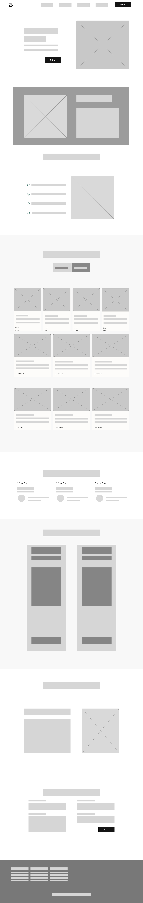
</div>
</br>

**Web Mobile Browser**

<br>
<div style="text-align: center;">
    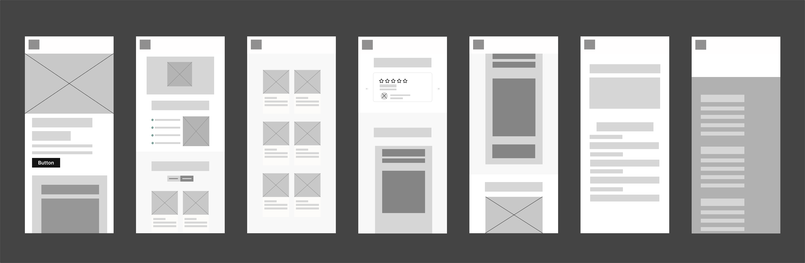
</div>
</br>

## 4.3.2. Landing Page Mock-up.

**Landing Page para Desktop Web Browser:**

<br>
<div style="text-align: center;">
    
</div>
</br>

**Web Mobile Browser**

<br>
<div style="text-align: center;">
    
</div>
</br>

## 4.6. Domain-Driven Software Architecture.
### 4.6.1. Software Architecture Context Diagram.

Elementos:

* El sistema principal: 
<div>

```Structurizr DSL
nutrisend = softwaresystem "NutriSend" "Platform for meal planning and support for a healthy lifestyle" 
```

</div>

*  Personas (Usuarios):
<div>

```Structurizr DSL
basicUser = person "Basic User" "User who uses the free plan"
athlete = person "Athlete" "User who uses the premium plan"
```

</div>

Otros Sistemas de Software:

<div>

```Structurizr DSL
 gmail = softwaresystem "Gmail" "Authentication provider for NutriSend"
```

</div>

Relaciones/Flujos de Información:
<div>

```Structurizr DSL
basicUser -> webapp "Plans and orders meals"
athlete -> webapp "Plans and orders meals according to their exercise regimen"
```

</div>

<div style="text-align: center;">
    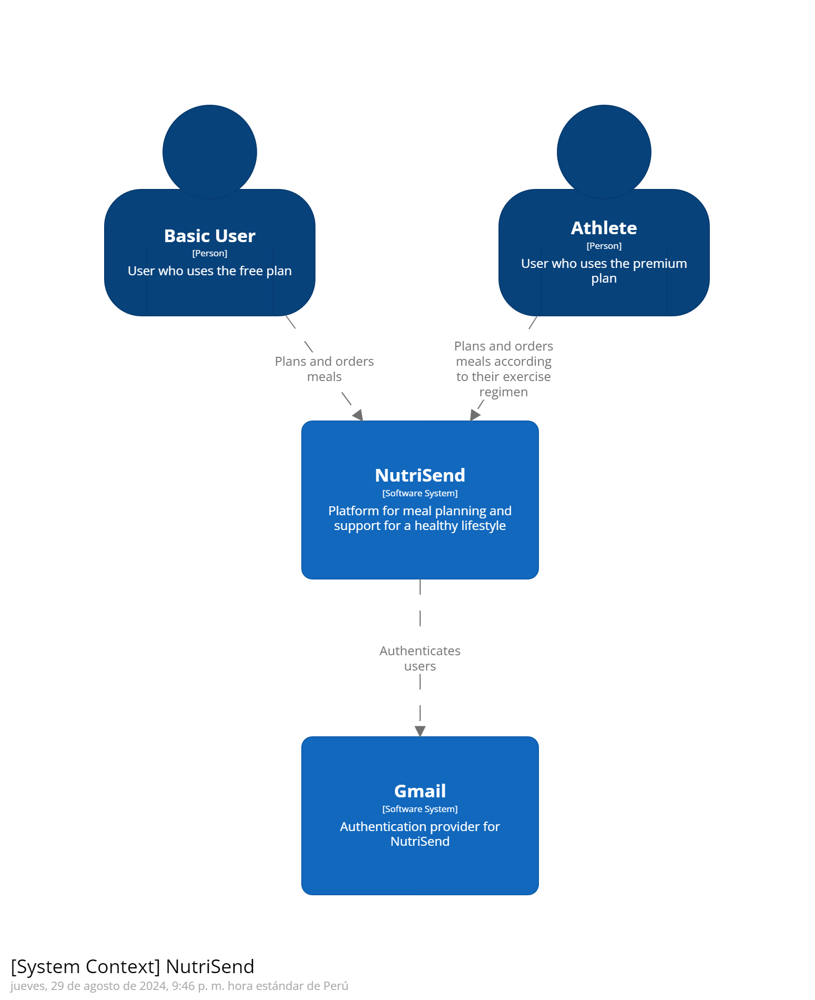
</div>


### 4.6.2. Software Architecture Container Diagrams.

4.6.2. Software Architecture Container Diagram
Elementos:

* Contenedores del sistema principal:
<div >

```Structurizr DSL
webApp = container "Web App" "Main interface for users" "HTML, CSS, JavaScript"
frontendService = container "Frontend Service" "Handles presentation logic and communication with backend" "TypeScript"
backendApi = container "Backend API" "API for business logic" "Node.js, Express"
database = container "Database" "Stores user, plan, and order information" "MySQL"
authService = container "Authentication Service" "Provides authentication for users" "OAuth 2.0"
paymentService = container "Payment Service" "Manages payments and subscriptions" "Stripe"
```
</div>

<div style="text-align: center;">
    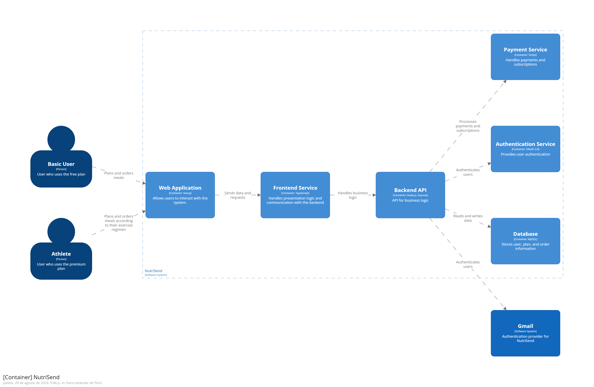
</div>

### 4.6.3. Software Architecture Components Diagrams.

Elementos:

* Componentes del Backend API:
<div>

```Structurizr
userService = component "User Service" "Handles user logic and authentication" "JavaScript"
orderService = component "Order Service" "Manages order and meal plan logic" "JavaScript"
paymentService = component "Payment Service" "Handles payment transactions" "JavaScript"
authService = component "Auth Service" "Provides authentication and authorization" "JavaScript"
databaseAccess = component "Database Access" "Manages database access and operations" "JavaScript"
```
</div>

<div style="text-align: center;">
    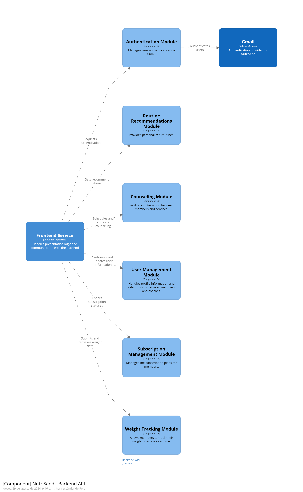
</div>

## 4.8. Database Design.
### 4.8.1. Database Diagram.

<div style="text-align: center;">
    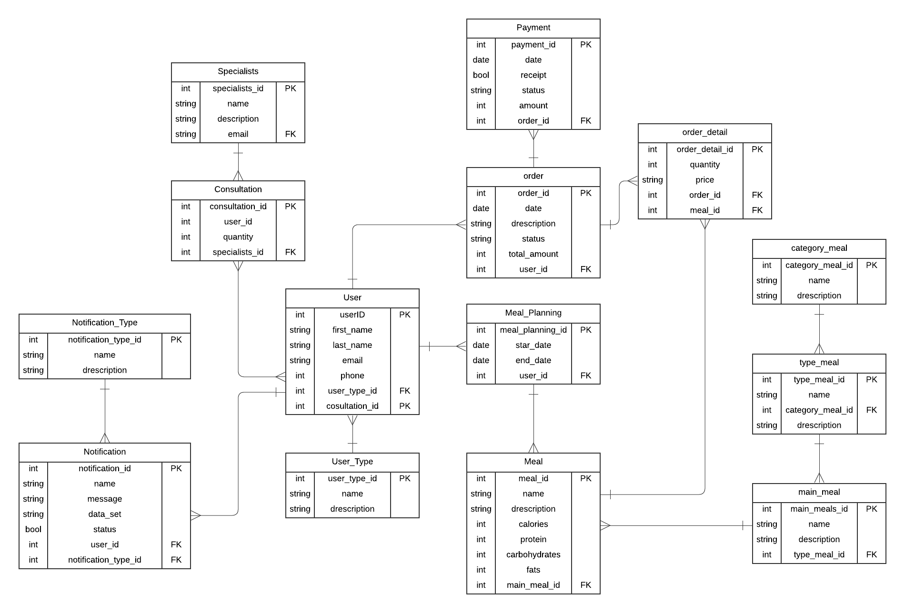
</div>