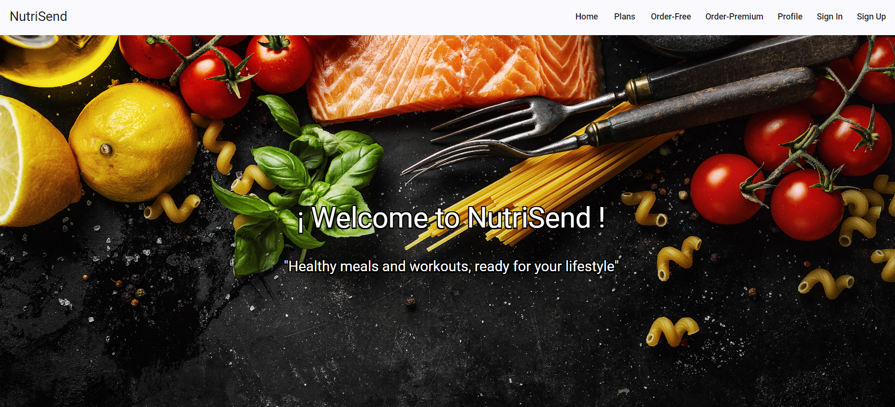
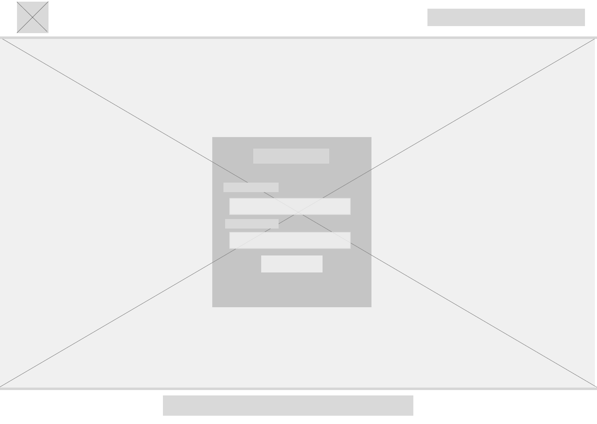
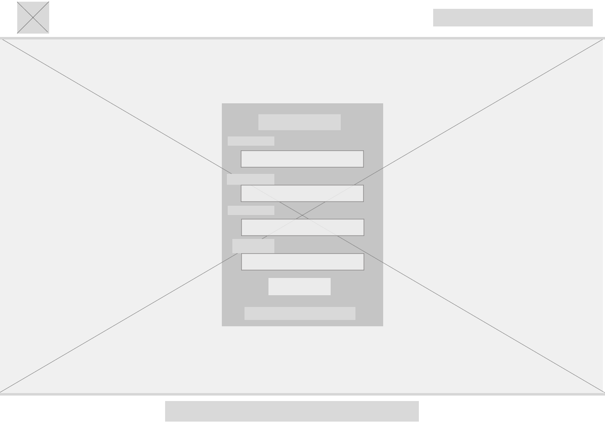
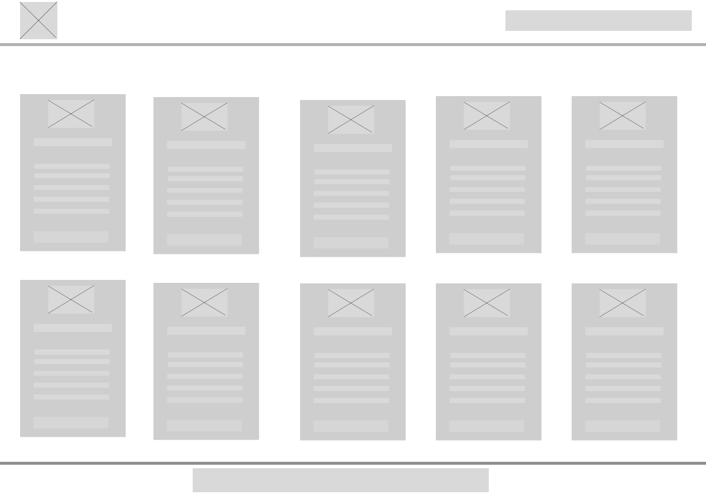

# Chapter IV: Product Design 
---
## 4.1. Style Guidelines.

Debido al rubro al que nuestra solución web está enfocada al sector gastronómico y fitnes. Es necesario que tenga un estilo llamativo y que despierte
el apetito del cliente, resaltando los platillos y los diversos ejercicios mostrados en el sitio web.

### 4.1.1. General Style Guidelines.

*Colores* 
NutriSend se enfoca en mantener un estilo minimalista que permita al usuario una comprensión inmediata del sitio web. Utiliza colores que 
estimulan el apetito y transmiten frescura y salud, creando una experiencia visual que no solo atrae, sino que también fomenta el bienestar.

*Iconos* 
Dado que NutriSend está diseñado para deportistas y personas que no tienen tiempo para cocinar, hemos desarrollado una colección de íconos 
específicos para mejorar el prototipo del sistema. Estos íconos están destinados a hacer la interfaz más iteractiva y alineada con los objetivos
de nuestro servicio, proporcionando una experiencia visualmente coherente y relevante.

 

*Font* 
Finalmente, para garantizar una apariencia uniforme en el desarrollo de nuestro aplicativo, utilizaremos la fuente **Roboto**. Elegimos Roboto 
por su legibilidad, espaciado equilibrado y diseño sin serifas, lo que proporciona una flexibilidad óptima y una experiencia de lectura clara y 
coherente en todas las plataformas de NutriSend. 

*Contenido* 
El contenido del sitio web será claro y accesible para el usuario, utilizando un lenguaje casual y respetuoso. Las imágenes mostrarán ejemplos de los platillos ofrecidos por los restaurantes.

### 4.1.2. Web Style Guidelines.

se ha establecido un sistema en que el contenido del sitio web será de fácil acceso y navegación, facilitando la experiencia para el usuario. 

**Jerárquico (Visual hierarchy):** 
* Este enfoque se implementa en la organización de la información en la página de inicio (Landing Page) y en las principales categorías del sitio web. Los elementos se disponen de manera jerárquica, dando prioridad a la información más relevante y resaltando los elementos clave mediante un tamaño, color o posición distintivos.

* Por ejemplo, en la Landing Page, las ofertas especiales y las categorías más populares se destacan en secciones prominentes, seguidas de otras áreas con información adicional y promociones.

**Organización Secuencial (Step-by-Step to Accomplish):** 

* Será utilizado tanto en los registros de usuarios como en los procesos de compra de los diversos productos, se podrá guiar al usuario con pasos secuenciales para completar cada acción.

* En el sitio web, este enfoque se aplica en el proceso de compra de productos, donde el usuario sigue un flujo paso a paso desde la selección de los productos hasta el pago y la confirmación del pedido.

**Matricial:** 
* El sistema matricial se emplea en la categorización de los productos, ya sea para un platillos estándar o uno balanceado.

* El usuario será capaz de filtrar los resultados según sus requisitos como la rutina y el tipo de alimento que escogerá, proporcionando una experiencia más amena.

## 4.2.2. Labeling Systems.
NutriSend se ha diseñado con un enfoque minimalista y claro para evitar cualquier tipo de confusiones. Las etiquetas son simples, precisas y concisas, facilitando la navegación y la comprensión de la información ofrecida.

**Etiquetas Principales** 
* *Inicio:* La página principal, que presenta la propuesta de valor de NutriSend junto con sus principales segmentos.
* *Información Nutricional*: Información concisa y fácil de entender los nutrientes de cada platillo, que incluye las calorías,
  proteínas, grasas y carbohidratos.
* *Ejercicios:* Rutinas de ejercicios que complementan el régimen que estén llevando los usuarios.
* *Perfil:* Información principal del usuario junto con las opción de configuración de la cuenta.

**Etiquetas para la Representación de Información Nutricional** 
* *Calorías:* Será representado por "KCAL" en cada porción.
* *Proteínas:* Será representado por "g" por porción. 
* *Grasas:* Será representado "g" por porción.
* *Carbohidratos:* Será representado por "g" por porción.

**Consideraciones del Diseño** 
* Las etiquetas son breves y fáciles de entender.
* Se ve priorizado el lenguaje Cotidiano y familiar para el usuario.
* Los elementos visuales como los íconos mejoran la experiencia del usuario.

## 4.2.3. SEO Tags and Meta Tags

**Landing Page**
* *Title:* NutriSend | Tú rutina y comida al instante, con el mejor precio.
* *Meta Description:* NutriSend es la plataforma ideal para recibir los mejores comidas y las más saludables al instante. Diseñadas para personas ocupadas y para personas con planes alimenticios estrictos.
* *Meta Keyboard:* NutriSend, comidas deliciosas, saludables, entrega de alimentos, servicio de comida, dieta, UPC, estudiantes, Lima.
* *Meta Author:* NAXUS - Universidad Peruana de Ciencias Aplicadas

**Web Application**
* *Title:* NutriSend | Comidas y entrenamientos saludables, listos para tu estilo de vida
* *Meta Description:* Con NutriSend, organiza tus comidas de manera sencilla y recibe opciones nutritivas en tu puerta.
  Ideal para profesionales ocupados y personas con planes alimenticios específicos.
* *Meta Keyboard:* NutriSend, comidas deliciosas, saludables, entrega de alimentos, servicio de comida, dieta, ejercicios,
   UPC, Naxus, estudiantes, Lima.
* *Meta Author:* comida saludable, planificación de comidas, delivery de alimentos, comida nutritiva,
  estilo de vida saludable, ejercicio, UPC, NAXUS, Lima.

## 4.2.4. Searching System

NutriSend, el sistema de filtrado ha sido diseñado para proporcionar una experiencia eficiente y fluida a la hora de buscar platillos y rutinas, sin la necesidad de sentirse abrumados por el volumen de contenido.

### Opciones de Búsqueda Ofrecidas
*Categorías de Búsqueda*
* Los usuarios pueden navegar por categorías predefinidas como "Almuerzos", "Comida fit" y "Ejecicios".
* Estas categorías están organizadas de forma clara para facilitar el acceso directo a la información más relevante.

*Búsqueda avanzada con filtros*
* Tipos de comida: Almuerzos, Comida fit.
* Objetivos de Ejercicios: Ganar masa múscular, quemar grasa, ganar resistencia.
* Información Nutricional: grasa, calorías, proteínas.

### Visualización de los Datos Después de la Búsqueda

*Resultados en forma de Tarjetas*  
Los resultados se muestran en tarjetas visualmente atractivas que contienen:

* Nombre del platillo o rutina de ejercicio.
* Una imagen destacada del platillo o el ejercicio.
* Información nutricional clave (proteínas, calorías, grasas).

*Orden de los Resultados* 
Los resultados están ordenados por: 

* Relevancia.

En conjunto, estas herramientas permiten que el proceso de búsqueda en el sitio web de NutriSend sea intuitivo, rápido y enfocado en satisfacer las necesidades del usuario.

## 4.2.5. Navigation Systems

**Landing Page y Secciones Principales**

* *Menú Principal:* El menú principal contiene las opciones más importantes de navegación como "Home", "Order", "Profile" y el ícono de "carrito de compras".
  Dicho menú permite un acceso rápido y directo a las secciones clave desde cualquier página.
  
* *Categoría de Productos:* Los productos se dividen en dos categorías: "Fit food" y "Almuerzos", cada uno está representado con intuitivos íconos, en el que
  el usuario puede hacer click en cualquiera de estos apartados para explorar las diversas opciones de ejecicios o comida.
  
* *Visualización de Productos:* Los productos se encuentran en tarjetas organizados por filas, con la información necesaria para el usuario como el nombre,
   la imagen del producto, el precio y el botón de "Add" para agregar los platillos o ejercicios que el usuario desee.
  
* *Porceso de Compra:* una vez finalizado el proceso de elección de los productos, el usuario puede visualizar su carrito y proceder con la compra.
   En esta sección se incluyen detalles como la dirección de la entrega, los elementos que ha seleccionado, la cantidad y el total a pagar. Un proceso lineal,
   guiando al usuario de manera eficiente hasta la confirmación del pedido.

## 4.3. Landing Page UI Design

NutriSend se ha estructurado con un enfoque en la simplicidad, claridad y facilidad de navegación para el usuario. A continuación, se muestra cómo se han implementado las decisiones de diseño y arquitectura de contenido para proporcionar una experiencia intuitiva para los usuarios.

## 4.3.1. Landing Page Wireframe.

En esta sección se mostrará una representación menor de la langin page. 
**Landing Page para Desktop Web Browser:**

**Web Mobile Browser** 
En este apartado se mostrará un esquema de bajo nivel de la versión mobile de NutriSend.

## 4.3.2. Landing Page Mock-up.

## 4.4. Web Applications UX/UI Design.
### 4.4.1. Web Applications Wireframes.   
La representación de wireframe de nuestro sitio web está compuesto por: 

**Home:**  En esta sección se presentará el sitio web como introducción. 

**Sign In/ Sign Up:** En esta sección el usuario podrá iniciar sesión o registrarse en caso no tuviera una cuenta. 

**Orden Premium:** Sección encargada de mostrar los alimentos sanos en conjunto con varios tipos de ejercicios. 

**Orden Free:** En este apartado se mostrará la lista de almuerzos "clásicos" que cualquier usuario puede tener acceso. 

### 4.4.2. Web Applications Wireflow Diagrams. 
**UH00X: Actualizar información de la cuenta** 
Como usuario, quiero la capacidad de actualizar fácilmente mis datos de perfil para garantizar que la información asociada a mi cuenta esté siempre actualizada y precisa.

**UH000X: Creación de cuenta nueva** 
Como usuario, quiero tener la capacidad de registrar una cuenta nueva en el sitio web para poder acceder a todas las funcionalidades y opciones disponibles.

**UH00X: Seleccionar menú** 
Como un usuario, quiero seleccionar un menú de opciones disponibles, para poder realizar mi pedido de manera fácil y rápida.

**UH00x: Acceder a los planes de suscripción** 
como usuario que busca opciones saludables de comida, quiero tener una lista variada de alimentos saludables para progresar con mis objetivos nutricionales.

### 4.4.3. Web Application Mock Ups.
Utilizando la paleta de colores y los estilos definidos, nuestro concepto de los mock ups será de la siguiente manera: 

