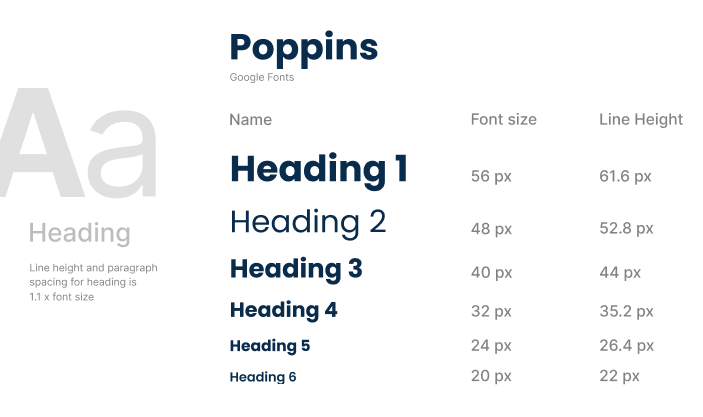

## 4.1. Style Guidelines.

Debido al rubro al que nuestra solución web está enfocada al sector gastronómico y fitnes. Es necesario que tenga un estilo llamativo y que despierte el apetito del cliente, resaltando los platillos y los diversos ejercicios mostrados en el sitio web.

### 4.1.1. General Style Guidelines.

**Branding design** 

 

 

    

 

**Colores**  
NutriSend se enfoca en mantener un estilo minimalista que permita al usuario una comprensión inmediata del sitio web. Utiliza colores que estimulan el apetito y transmiten frescura y salud, creando una experiencia visual que no solo atrae, sino que también fomenta el bienestar.  

 

    

 

**Iconos** 
Dado que NutriSend está diseñado para deportistas y personas que no tienen tiempo para cocinar, hemos desarrollado una colección de íconos específicos para mejorar el prototipo del sistema. Estos íconos están destinados a hacer la interfaz más iteractiva y alineada con los objetivos de nuestro servicio, proporcionando una experiencia visualmente coherente y relevante. 

 

    

 

**Typography** 
Para garantizar una apariencia uniforme en el desarrollo de nuestro aplicativo, utilizaremos la fuente Poppins. Elegimos Poppins por su legibilidad, espaciado equilibrado y diseño sin serifas, lo que proporciona una flexibilidad óptima y una experiencia de lectura clara y coherente en todas las plataformas de NutriSend. 

 

    
    

 

**Spacing** 
El espaciado de la aplicación web es importante debido a que no queremos abrumar a nuestros usuarios, ya que nuestra aplicación tiene como objetivo ofrecer una experiencia de usuario sencilla y agradable. Consideramos que un diseño limpio y organizado mejora la usabilidad y reduce la carga cognitiva del usuario, permitiéndole interactuar de manera eficiente con las diferentes funciones y secciones de la aplicación. 

    

 

**Tono de comunicación y lenguaje** 
El tono de comunicación y lenguaje de NutriSend es casual, amigable y motivador. Queremos que los usuarios se sientan cómodos al navegar por nuestra plataforma, por lo que utilizamos un lenguaje claro y directo que resuene con sus necesidades diarias. Nos dirigimos a ellos de manera cercana, como un amigo que les guía en su camino hacia un estilo de vida más saludable. 

### 4.1.2. Web Style Guidelines.

Para NutriSend, estamos planeando desarrollar una plataforma web que implementará un diseño adaptable (conocido como Web Responsive Design) con el objetivo de optimizar la presentación de información en cualquier dispositivo. Esto asegurará que el contenido sea de fácil acceso y navegación, mejorando en última instancia la experiencia del usuario.

Hemos establecido un sistema en el que la información se organiza de manera jerárquica (Visual Hierarchy), particularmente en la Landing Page y las principales categorías del sitio web. Los elementos se disponen dando prioridad a la información más relevante, utilizando tamaños, colores y posiciones distintivas para resaltar los elementos clave. 

También utilizaremos un sistema Matricial para la categorización de productos, permitiendo a los usuarios filtrar resultados según sus preferencias, como la rutina y el tipo de alimento que desean seleccionar, proporcionando una experiencia más amena y personalizada.

Como equipo, hemos optado por incorporar el patrón de diseño en forma de Z en nuestro sitio web. Esta técnica de diseño web es altamente efectiva para mejorar la experiencia del usuario, guiando su atención hacia los elementos clave y potenciando la eficacia del contenido en la página. Por lo general, colocamos el logotipo en la esquina superior izquierda, asegurándonos de que sea lo primero que llame la atención del usuario. Justo enfrente, en la esquina superior derecha, ubicamos la barra de navegación, acompañada de un llamado a la acción destacado

## 4.2. Information Architecture.

### 4.2.1. Organization Systems.

En base a nuestra aplicación, hemos decidido que nuestro diseño y organización visual será hecha como una jerarquía, debido a que queremos que nuestros usuarios distingan la importancia de cada una de las funcionalidades de la app. Al mismo tiempo utilizamos un sistema moderno y sencillo para que nuestros usuarios se sientan más atraídos.

**Landign Page**

<table border="1" cellpadding="10" cellspacing="0" style="margin-left: auto; margin-right: auto;">
  <tr>
    <th>Tópico</th>
    <th>Descripción</th>
  </tr>
  <tr>
    <td>Home</td>
    <td>La página de inicio puede mostrar una vista general del servicio y destacar las características clave.
</td>
  </tr>
  <tr>
    <td>About Us</td>
    <td>En esta sección, NutriSend explica nuestro compromiso con un estilo de vida saludable. También proporcionaremos un ejemplo de la información detallada que la app ofrece, como proteínas, vitaminas y calorías de un plato</td>
  </tr> 
  <tr>
    <td>Package</td>
    <td>La página ofrece una descripción detallada de los dos planes de suscripción disponibles: uno gratuito con funcionalidades básicas y uno de pago con características premium. Aquí los usuarios pueden comparar los planes y elegir el que mejor se adapte a sus necesidades.</td>
  </tr>
  <tr>
    <td>Menu</td>
    <td>Esta sección muestra un catálogo de las comidas que ofrecemos, organizadas en dos categorías: FitFood para opciones saludables y Lunch para comidas más variadas. Los usuarios pueden explorar los menús, ver detalles de cada plato y obtener recomendaciones según sus preferencias.</td>
  </tr>
  <tr>
    <td>Sing In</td>
    <td>La página para que el usuario ingrese a su cuenta. Aquí se solicitan las credenciales de inicio de sesión y se ofrece la opción de recuperar la contraseña en caso de olvido.</td>
  </tr>
  <tr>
    <td>Sing Up</td>
    <td>La página para que el usuario se registre en NutriSend. Incluye un formulario para ingresar información básica como nombre, correo electrónico y contraseña, así como la opción de aceptar los términos y condiciones del servicio.</td>
  </tr>
</table>

**App Web**

<table border="1" cellpadding="10" cellspacing="0" style="margin-left: auto; margin-right: auto;">
  <tr>
    <th>Tópico</th>
    <th>Descripción</th>
  </tr>
  <tr>
    <td>Home</td>
    <td>La página principal de la aplicación web muestra un resumen de la actividad reciente, sugerencias personalizadas y acceso rápido a las principales funcionalidades. Aquí los usuarios pueden ver sus comidas planificadas y novedades relevantes.</td>
  </tr>
  <tr>
    <td>Order</td>
    <td>En esta sección, NutriSend permite a los usuarios realizar pedidos de sus comidas planificadas. Mostrando sus dos categorias: FitFood y Lunch. Ofrece opciones para seleccionar, modificar y confirmar pedidos.</td>
  </tr> 
  <tr>
    <td>Profile</td>
    <td>En la sección de perfil, los usuarios pueden gestionar su información personal, como datos de contacto, preferencias alimenticias y ajustes de cuenta. También se puede acceder a los planes de suscripcion.</td>
  </tr>
</table>

### 4.2.2. Labeling Systems.
### 4.2.3. SEO Tags and Meta Tags
### 4.2.4. Searching Systems.
### 4.2.5. Navigation Systems.
## 4.3. Landing Page UI Design.
NutriSend se ha estructurado con un enfoque en la simplicidad, claridad y facilidad de navegación para el usuario. A continuación, se muestra cómo se han implementado las decisiones de diseño y arquitectura de contenido para proporcionar una experiencia intuitiva para los usuarios.
### 4.3.1. Landing Page Wireframe

En esta sección se mostrará una representación menor de la langin page. 

**Landing Page para Desktop Web Browser:**
 

    

 

**Web Mobile Browser**

En este apartado se mostrará un esquema de bajo nivel de la versión mobile de NutriSend.

## 4.3.2. Landing Page Mock-up.
