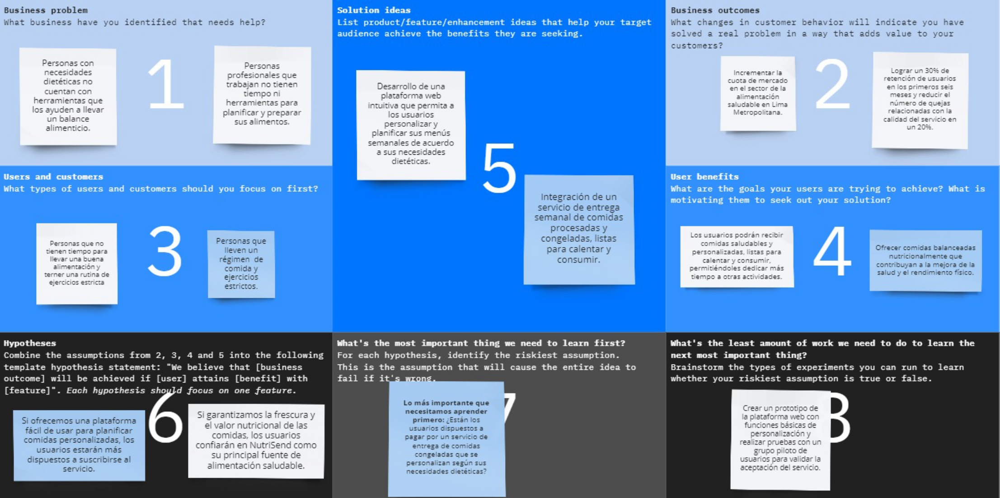

# Capítulo I: Introducción
## 1.1. Startup Profile

### 1.1.1. Descripción de la Startup

NAXUS es una startup innovadora creada por estudiantes de la Universidad Peruana de Ciencias Aplicadas (UPC), específicamente de la Facultad de Ingeniería. Nuestra startup ofrece una plataforma web llamada **NutriSend**, diseñada para simplificar la planificación de comidas y apoyar un estilo de vida saludable. NutriSend se posiciona como una solución ideal para quienes buscan mantener un equilibrio entre su vida personal y sus objetivos de salud, proporcionando comodidad y calidad en cada entrega.

NutriSend se enfoca en proporcionar alimentos que se ajustan a las calorías, carbohidratos, grasas y proteínas que pueden consumir nuestros clientes, en lugar de centrarse en aspectos nutricionales generales. 

**Misión**: Nuestro propósito es facilitar la vida de nuestros clientes, brindándoles alimentos que se alinean con sus requerimientos específicos de calorías, carbohidratos, grasas y proteínas. Nos dedicamos a ofrecer una solución práctica y personalizada que respalde un estilo de vida saludable, ayudando a nuestros usuarios a alcanzar sus metas de bienestar de manera efectiva.

**Visión**: Queremos ser la plataforma de referencia en planificación alimentaria personalizada, reconocida por nuestra habilidad para adaptar los alimentos a las necesidades cuantitativas de cada cliente. Nuestro objetivo es capacitar a las personas para que gestionen su salud y nutrición, haciendo que una alimentación equilibrada sea un estándar accesible y conveniente para todos.

**Objetivos**:

- Optimizar la planificación alimentaria con herramientas precisas.
- Ofrecer menús personalizados según necesidades individuales.
- Facilitar el acceso a alimentos saludables y equilibrados.
- Innovar y mejorar continuamente nuestros servicios.
- Asegurar alta satisfacción del cliente con un servicio confiable.
- Expandir nuestra base de usuarios y presencia en el mercado.

NutriSend ofrece diferentes planes adaptados a las necesidades de sus usuarios:

**1) Plan Básico (Gratis):**
   - Funcionalidad: Permite a los usuarios planificar y pedir alimentos para la semana.
   - Beneficios: Acceso a recetas básicas, lista de compras semanal automatizada, y recomendaciones generales de alimentación.

**2) Plan Premium (Pago Completo):**
   - Funcionalidad: Ofrece la experiencia completa y personalizada para usuarios con necesidades específicas de planificación a largo plazo.
   - Beneficios:
     - Planificación y pedidos de alimentos para todo el mes, con ajustes automáticos según las necesidades nutricionales del usuario.
     - Menús personalizados que se ajustan dinámicamente según el régimen deportivo, objetivos de salud, y disponibilidad de alimentos. 
     - Alertas avanzadas que indican el momento óptimo para consumir alimentos, sincronizadas con el horario deportivo y otros hábitos de salud. 

### 1.1.2.   Perfiles de integrantes del equipo

<table border="1" cellpadding="10" cellspacing="0" style="margin-left: auto; margin-right: auto;">
  <tr>
    <th>Miembros del equipo</th>
    <th>Código del Estudiante</th>
    <th>Carrera</th>
    <th>Principales conocimientos / habilidades</th>
  </tr>
  <tr>
    <td>Camila Leonor Espinoza Vivas</td>
    <td>u202214572</td>
    <td>Ingeniería de Software</td>
    <td>----</td>
  </tr>
  <tr>
    <td>Renzo José Araujo Ingunza</td>
    <td>u202113612</td>
    <td>Ingeniería de Software</td>
    <td>Soy una persona responsable y aplicada. para este proyecto cuento con conocimientos en lenguajes de programación como C + +, Python y java.</td>
  </tr>
  <tr>
    <td>Fatima Asmad Padilla</td>
    <td>u202113612</td>
    <td>----</td>
    <td>----</td>
  </tr>
  <tr>
    <td>Jhordi Luis Carranza Pérez</td>
    <td>u20191e835</td>
    <td>Ingeniería de Software</td>
    <td>Soy una persona dispuesta a seguir aprendiendo y mejorando constantemente. Mis conocimientos de programación en C++, Python, HTML y sobre todo la lógica de programación serán de vital ayuda para la realización de este proyecto.</td>
  </tr>
  <td>Renzo José Araujo Ingunza</td>
    <td>u202113612</td>
    <td>----</td>
    <td>----</td>
  </tr>  
   <td>Luis Alfonso Villegas Jipa</td>
    <td>u201717523</td>
    <td>Ingeniería de Software</td>
    <td>Soy una persona creativa que le gusta aprender nuevos horizontes. Tengo conocimientos de programacion en C++, Python, HTML y JS. Asimismo tengo conocimientos en SQl (Visual Management) y NoSQl (MongoDB).
    </td>
  </tr>  
</table>

## 1.2. Solution Profile

### 1.2.1. Antecedentes y problemática
- **Antecedentes** 

  Desde el inicio de la pandemia de Covid-19 en Perú, se han producido cambios significativos en los hábitos de vida de las personas, particularmente en lo que respecta a la cocina. Durante el confinamiento, la cocina y la repostería emergieron como actividades clave para el 66% de los hogares peruanos, lo que evidenció una transformación en las rutinas diarias y en el valor asignado a la preparación de alimentos caseros. Aunque muchos de estos hábitos persisten, la realidad actual muestra un escenario mixto: mientras que un 62% de las familias aún mantiene prácticas de cocina, un 13% ha señalado una disminución en el tiempo disponible para cocinar debido a la reactivación de la vida laboral y académica (Kantar, 2021).

  Este cambio en el ritmo de vida ha generado una demanda creciente de soluciones que ofrezcan comodidad sin sacrificar la calidad y la salud en la alimentación. El mercado necesita adaptarse a un nuevo tipo de consumidor: uno que, a pesar de su interés en mantener hábitos alimenticios saludables, enfrenta limitaciones de tiempo y busca alternativas prácticas.
  
- **Problemática:** Para definir la problemática, nuestro equipo ha dispuesto la estrategia de las 5'W's y 2'H's
  
  ***5’W’s:***

  **1. What(Qué):**
  
  Desarrollar una plataforma que ofrezca comida procesada y fría, lista para calentar y consumir. Este servicio está dirigido a personas que tienen dificultades para cocinar regularmente, así como a quienes siguen planes alimenticios estructurados que requieren control y planificación rigurosos.

  **2. Who(Quién):**

  Nuestro público objetivo incluye:

  * Profesionales y estudiantes con agendas apretadas que encuentran difícil dedicar tiempo a la cocina.
  * Personas que siguen regímenes alimenticios específicos, como deportistas y aquellos con condiciones de salud que requieren un control en su alimentación.

  **3. Where(Dónde):**

  El servicio estará disponible en Lima Metropolitana, enfocándose en áreas con alta densidad de población y una alta demanda de servicios de comida procesada y saludable. Las entregas se realizarán en puntos estratégicos de la ciudad para optimizar la logística y asegurar una cobertura amplia y eficiente. Nos podran encontrar en nuestras redes sociales, asi como en nuestra plataforma principal donde encontraras nuestra aplicacion web

  **4. When(Cuándo):**

  NutriSend operará durante todo el año, adaptando sus ofertas a las estaciones y a los cambios en las necesidades y preferencias de los usuarios. La flexibilidad en la planificación y la capacidad de ajustar los menús según el momento del año son clave para responder a las variaciones en la demanda y en los hábitos de los consumidores.

  **5. Why(Por qué):**

  El objetivo es ofrecer una solución práctica y segura para aquellos que, debido a limitaciones de tiempo o necesidades dietéticas específicas, no pueden cocinar regularmente. NutriSend busca facilitar una alimentación saludable y balanceada sin comprometer la calidad ni la conveniencia.

  ***2’H’s:***

  **1. How(Cómo):**

  Los alimentos serán preparados por chefs profesionales, luego procesados y congelados para garantizar la frescura y seguridad alimentaria. La plataforma en línea permitirá a los usuarios seleccionar y pedir sus comidas de manera sencilla. El proceso incluye un sistema de control de calidad rigurosamente implementado para asegurar que cada entrega cumpla con los estándares de nutrición y seguridad.

  **2. How Much(Cuánto):**

  Los platos se mantendrán frescos y seguros en el refrigerador por hasta 8 días. Los precios se fijarán de manera competitiva, considerando el costo del proceso de preparación, la calidad de los ingredientes, y la conveniencia del servicio. El objetivo es ofrecer una opción accesible y atractiva para un amplio espectro de consumidores, equilibrando calidad y costo.

### 1.2.2. Lean UX Process.

#### 1.2.2.1. Lean UX Problem Statements

**¿Cómo podemos ofrecer una solución conveniente y rápida que satisfaga las necesidades alimentarias de los usuarios ocupados sin comprometer la calidad de  los alimentos preparados?**

Para los usuarios con agendas ocupadas que no disponen de tiempo para cocinar con frecuencia, NutriSend aborda el reto de ofrecer una solución rápida y conveniente que cubra sus necesidades alimentarias sin sacrificar la calidad.

**¿Cómo podemos ofrecer una solución rápida y conveniente que cumpla con los requisitos alimenticios de los usuarios con un plan estructurado, permitiéndoles controlar sus alimentos, mantener una rutina de ejercicios y llevar un estilo de vida más saludable sin sacrificar la calidad ni el valor nutricional de los alimentos preparados?**

Para los usuarios con un plan alimenticio estructurado que desean tener un control sobre sus alimentos y llevar una rutina de ejercicios y llevar un estilo de vida más saludable. NutriSend aborda el reto de ofrecer una solución rápida y conveniente que cumpla con los requisitos alimenticios sin sacrificar la calidad ni el valor nutricional de los alimentos preparados y tener una estructura de ejercicios establecidos.

#### 1.2.2.2. Lean UX Assumptions.
- **Business Assumptions**: Asumimos que NutriSend podrá capturar una cuota significativa del mercado en Lima, basándose en la demanda existente de servicios alimenticios convenientes y saludables.
- **Business Outcomes Assumptions**: Creemos que la retención de clientes y la satisfacción aumentarán si se ofrece una experiencia de usuario óptima y productos de alta calidad.
- **User Assumptions**: Asumimos que los usuarios valoran la conveniencia y rapidez en la entrega, y prefieren alimentos saludables y de calidad.
- **User Outcomes Assumptions**: Creemos que los usuarios estarán dispuestos a pagar por la conveniencia y calidad del servicio si este cumple con sus expectativas en cuanto a salud y nutrición.
- **Feature Assumptions**: Suponemos que la facilidad de uso de la plataforma y la personalización de los menús serán factores clave para el éxito de NutriSend.

#### 1.2.2.3. Lean UX Hypothesis Statements
- **Nosotros creemos que** si ofrecemos una plataforma fácil de usar con un proceso de pedido sencillo, **sabremos que es verdad** cuando veamos un incremento en la frecuencia de pedidos.
- **Nosotros creemos que** si proporcionamos alimentos saludables y de alta calidad, **sabremos que es verdad** cuando atraigamos a usuarios con necesidades dietéticas específicas.
- **Nosotros creemos que** si garantizamos la frescura y seguridad alimentaria de nuestros productos, **sabremos que es verdad** cuando observemos un aumento en la confianza y satisfacción del cliente.
- **Nosotros creemos que** si nos enfocamos en zonas estratégicas de Lima para la entrega, **sabremos que es verdad** cuando logremos optimizar los tiempos de entrega y reducir los costos operativos.
- **Nosotros creemos que** si ofrecemos precios competitivos que reflejen la calidad del servicio, **sabremos que es verdad** cuando logremos una mayor retención y lealtad de los clientes.

#### 1.2.2.4. Lean UX Canvas

## 1.3. Segmentos objetivo
Los segmentos objetivo de NutriSend son:

- **Personas con tiempo limitado para cocinar**: Este segmento está compuesto por profesionales jóvenes y estudiantes universitarios que, debido a sus agendas ocupadas, no disponen del tiempo necesario para preparar comidas saludables. Suelen vivir en zonas urbanas de Lima metropolitana y valoran la conveniencia y rapidez en la obtención de alimentos de calidad.  
  **Características demográficas**: Jóvenes de 18 a 35 años, residentes en Lima, con ingresos medios a altos, interesados en mantener un estilo de vida saludable.

- **Personas que siguen un régimen alimenticio estructurado con ejercicios**: Este grupo incluye a personas que se preocupan por su salud y que siguen un plan de alimentación específico acompañado de una rutina de ejercicios. Están interesados en mantener una dieta equilibrada que se ajuste a sus necesidades nutricionales y de ejercicio.  
  **Características demográficas**: Adultos de 18 a 45 años, con ingresos medios a altos, activos físicamente, y con una fuerte inclinación hacia la salud y el bienestar.