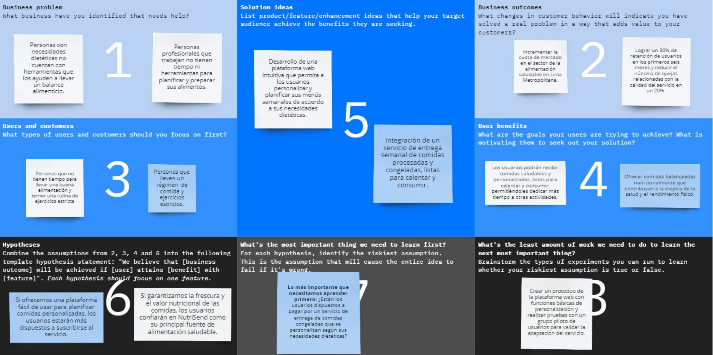
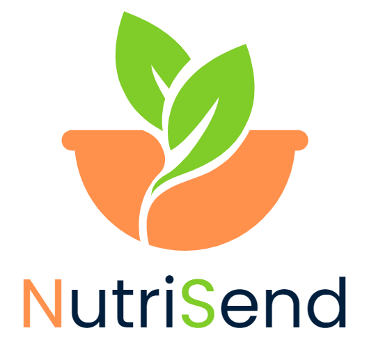
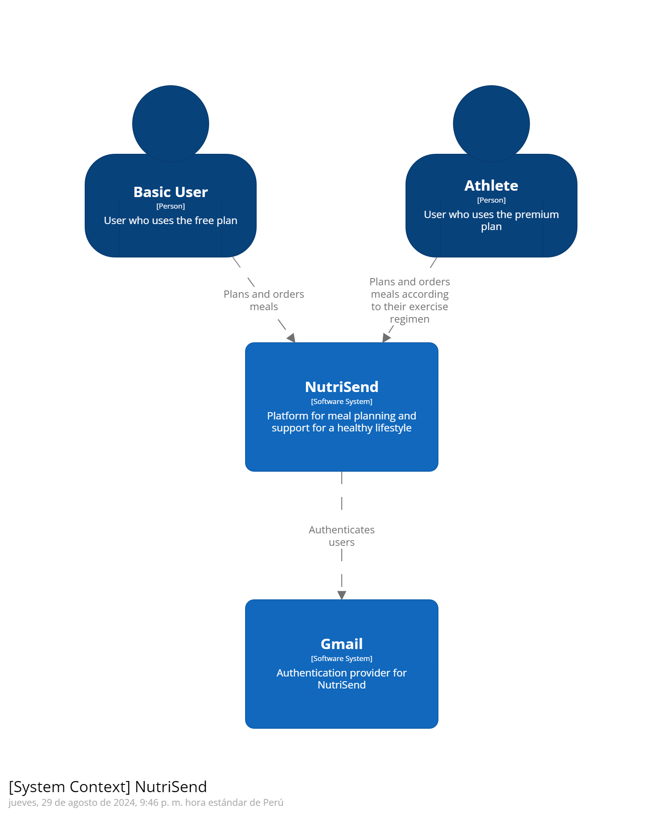

<style> body { font-family: 'Times New Roman', Times, serif; } </style>

<h1 style="text-align: center;"><b>Universidad Peruana de Ciencias Aplicadas</b></h1>

<h2 style="text-align: center;">
    <p>Ingenieria de Software - Ciclo 5</p>
    <p>Desarrollo de Aplicaciones Open Source SV54</p>
</h2>

<div style="text-align: center;">
    
</div>

<h2 style="text-align: center;">
    <p>Informe de Trabajo Final</p>
    <p>NAXUS</p>
    <p>NutriSend</p>
    <p>Hugo Allan Mori Paiva</p>
</h2>

<h2 style="text-align: center;">Integrantes</h2>

<table style="margin-left: auto; margin-right: auto;">
  <tr>
    <th>Nombre y Apellidos</th>
    <th>Código</th>
  </tr>
  <tr>
    <td>Camila Leonor Espinoza Vivas</td>
    <td>U202214572</td>
  </tr>
  <tr>
    <td>Renzo José Araujo Ingunza</td>
    <td>u202113612</td>
  </tr>
  <tr>
    <td>Fatima Asmad Padilla</td>
    <td>u202113612</td>
  </tr>
   <tr>
    <td>Jhordi Luis Carranza Pérez</td>
    <td>u20191e835</td>
  </tr>
  <tr>
    <td>Luis Alfonso Villegas Jipa</td>
    <td>u201717523</td>
  </tr>
</table>

<h4 style="text-align: center;">Agosto 2024</h4>

# Registro de Versiones del Informe

<table border="1" cellpadding="10" cellspacing="0" style="margin-left: auto; margin-right: auto;">
  <tr>
    <th>Version</th>
    <th>Fecha</th>
    <th>Autor</th>
    <th>Descripción de modificación</th>
  </tr>
  <tr>
    <td>TB1</td>
    <td>6/09/2024</td>
    <td>Camila Leonor Espinoza Vivas</td>
    <td>
      - Añadio contenido a todos los capitulo.<br>
      - Realizo codigo para el despliegue de la Landing Page. <br>
      - Aporto ideas para la creacion de User Stories. <br>
      - Realizo el capitulo 4
      - Desplego el repositorio en GitHub. <br>
      - Aportó ideas para los User Stories <br>
      - Realizó el capitulo 5<br>
    </td>
  </tr>
  <tr>
    <td>TB1</td>
    <td>6/09/2024</td>
    <td>Renzo José Araujo Ingunza</td>
    <td>
      - Realizo Web Applications Wireflow Diagrams. <br>
      - Aporto ideas para Information Architecture. <br>
      - Realizo la Web Applications Prototyping. <br>
      - Realizo el Software Object-Oriented Design. <br>
      - Aportó ideas para los User Stories <br>
      - Realizó el capitulo 5<br>
    </td>
  </tr> 
  <tr>
    <td>TB1</td>
    <td>6/09/2024</td>
    <td>Fatima Asmad Padilla</td>
    <td>
      - Realizó el analisis de competidores <br>
      - Realizó las estrategias ante los competidores <br>
      - Realizó diseño de entrevistas <br>
      - Realizó análisis de entrevistas <br>
      - Realizó User Persona <br>
      - Realizó User Task Matrix  <br>
      - Realizó User Journey Mapping <br>
      - Empathy Mapping <br>
      - As-is Scenario Mapping <br>
      - Aportó ideas para los User Stories <br>
      - Realizó el capitulo 5<br>
    </td>
  </tr>
  <tr>
    <td>TB1</td>
    <td>6/09/2024</td>
    <td>Jhordi Luis Carranza Pérez</td>
    <td>
      - Realizó el startup profile <br>
      - Realizó el solution profile <br>
      - Realizó los segmentos objetivos <br>
      - Realizó el To-Be Scenario Mapping <br>
      - Realizó el Impact Mapping <br>
      - Realizó el capitulo 5<br>
    </td>
  </tr>
  <tr>
    <td>TB1</td>
    <td>6/09/2024</td>
    <td>Luis Alfonso Villegas Jipa</td>
    <td>
      - Contribuyo en el desarrollo del capitulo 1<br>
      - Realizó los User Stories <br>
      - Realizó el Product Backlog<br>
      - Realizó el capitulo 5<br>
    </td>
  </tr>
</table>


# Project Report Collaboration Insights

El enlace que sigue dirige al repositorio público de nuestra organización en GitHub: https://github.com/Open-Source-SI729-2402-SV54/informe.git

A continuación, se detalla el desarrollo de las actividades relacionadas con la elaboración del informe, incluyendo capturas de los análisis de colaboración y los commits en GitHub. Para la entrega de la TB1, se presenta un análisis de colaboración que muestra el número de contribuciones realizadas en el repositorio del informe.

<div style="text-align: center;">
    
</div>


# Contenido 

## Tabla de contenidos
#### [Capítulo I: Introducción](/chapter01.md)
- [1.1. Startup Profile](/chapter01.md#11-startup-profile)
    - [1.1.1. Descripción de la Startup](/chapter01.md#111-descripción-de-la-starup)
    - [1.1.2. Perfiles de integrantes del equipo](/chapter01.md#112-perfiles-de-integrantes-del-equipo)
- [1.2. Solution Profile](/chapter01.md#12-Solution-Profile)
    - [1.2.1. Antecedentes y problemática](/chapter01.md#121-antecedentes-y-problemática)
    - [1.2.2. Lean UX Process](/chapter01.md#122-lean-ux-process)
        - [1.2.2.1. Lean UX Problem Statements](/chapter01.md#1221-lean-ux-problem-statements)
        - [1.2.2.2. Lean UX Assumptions](#1222-lean-ux-assumptions)
        - [1.2.2.3. Lean UX Hypothesis Statements](1223-lean-uX-hypothesis-statements)
        - [1.2.2.4. Lean UX Canvas](1224-lean-uX-canvas)
- [1.3. Segmentos objetivo](13-segmentos-objetivo)

#### [Capítulo II: Requirements Elicitation & Analysis](/chapter02.md#capítulo-ii-requeriments-elicitation--analysis)
- [2.1. Competidores](/chapter02.md#21-competidores)
    - [2.1.1. Análisis competitivo](/chapter02.md#211-análisis-competitivo)
    - [2.1.2. Estrategias y tácticas frente a competidores](/chapter02.md#212-estrategias-y-tácticas-frente-a-competidores)
- [2.2. Entrevistas](/chapter02.md#22-entrevistas)
    - [2.2.1. Diseño de entrevistas](/chapter02.md#221-diseño-de-entrevistas)
    - [2.2.2. Registro de entrevistas](/chapter02.md#222-registro-de-entrevistas)
    - [2.2.3. Análisis de entrevistas](/chapter02.md#223-análisis-de-entrevistas)
- [2.3. Needfinding](/chapter02.md#23-needfinding)
    - [2.3.1. User Personas](/chapter02.md#231-user-personas)
    - [2.3.2. User Task Matrix](/chapter02.md#232-user-task-matrix)
    - [2.3.3. User Journey Mapping](/chapter02.md#233-user-journey-mapping)
    - [2.3.4. Empathy Mapping](/chapter02.md#234-empathy-mapping)
    - [2.3.5. As-is Scenario Mapping](/chapter02.md#235-as-is-scenario-mapping)
- [2.4. Ubiquitous Language](/chapter02.md#24-ubiquitous-language)


#### [Capítulo III: Requirements Specification](/chapter03.md#capítulo-iii-requirements-specification)
- [3.1. To-Be Scenario Mapping](/chapter03.md#31-to-be-scenario-mapping)
- [3.2. User Stories](/chapter03.md#32-user-stories)
- [3.3. Impact Mapping](/chapter03.md#33-impact-mapping)
- [3.4. Product Backlog](/chapter03.md#33-impact-mapping)


##### [Capítulo IV: Product Design](/chapter04.md#capítulo-iv-product-design)

- [4.1. Style Guidelines](/chapter04.md#41-style-guidelines)
    - [4.1.1. General Style Guidelines](/chapter04.md#42-information-architecture)
    - [4.1.2. Web Style Guidelines](/chapter04.md#412-web-style-guidelines)
- [4.2. Information Architecture](/chapter04.md#42-information-architecture)
    - [4.2.1. Organization Systems](/chapter04.md#421-organization-systems)
    - [4.2.2. Labeling Systems](/chapter04.md#422-labeling-systems)
    - [4.2.3. SEO Tags and Meta Tags](/chapter04.md#423-seo-tags-and-meta-tags)
    - [4.2.4. Searching Systems](/chapter04.md#424-searching-systems)
    - [4.2.5. Navigation Systems](/chapter04.md#425-navigation-systems)
- [4.3. Landing Page UI Design](/chapter04.md#43-landing-page-ui-design)
    - [4.3.1. Landing Page Wireframe](/chapter04.md#431-landing-page-wireframe)
    - [4.3.2. Landing Page Mock-up](/chapter04.md#432-landing-page-mock-up)
- [4.4. Web Applications UX/UI Design](/chapter04.md#44-web-applications-uxui-design)
    - [4.4.1. Web Applications Wireframes](/chapter04.md#441-web-applications-wireframes)
    - [4.4.2. Web Applications Wireflow Diagrams](/chapter04.md#442-web-applications-wireflow-diagrams)
    - [4.4.3. Web Applications Mock-ups](/chapter04.md#443-web-applications-mock-ups)
    - [4.4.4. Web Applications User Flow Diagrams](/chapter04.md#444-web-applications-user-flow-diagrams)
- [4.5. Web Applications Prototyping](/chapter04.md#45-web-applications-prototyping)
- [4.6. Domain-Driven Software Architecture](/chapter04.md#46-domain-driven-software-architecture)
    - [4.6.1. Software Architecture Context Diagram](/chapter04.md#461-software-architecture-context-diagram)
    - [4.6.2. Software Architecture Container Diagrams](/chapter04.md#462-software-architecture-container-diagrams)
    - [4.6.3. Software Architecture Components Diagrams](/chapter04.md#463-software-architecture-components-diagrams)
- [4.7. Software Object-Oriented Design](/chapter04.md#47-software-object-oriented-design)
    - [4.7.1. Class Diagrams](/chapter04.md#471-class-diagrams)
    - [4.7.2. Class Dictionary](/chapter04.md#472-class-dictionary)
- [4.8. Database Design](/chapter04.md#48-database-design)
    - [4.8.1. Database Diagram](/chapter04.md#481-database-diagram)


#### [Capítulo V: Product Implementation, Validation & Deployment](/chapter05.md#capítulo-v-product-implementation-validation--deployment)
- [5.1. Software Configuration Management](/chapter05.md#51-software-configuration-management)
    - [5.1.1. Software Development Environment Configuration](/chapter05.md#512-source-code-management)
    - [5.1.2. Source Code Management](/chapter05.md#513-source-code-style-guide--conventions)
    - [5.1.3. Source Code Style Guide & Conventions](/chapter05.md#513-source-code-style-guide--conventions)
    - [5.1.4. Software Deployment Configuration](/chapter05.md#514-software-deployment-configuration)
- [5.2. Landing Page, Services & Applications Implementation](/chapter05.md#52-landing-page-services--applications-implementation)
    - [5.2.1. Sprint 1](/chapter05.md#521-sprint-1)
        - [5.2.1.1. Sprint Planning 1](/chapter05.md#5211-sprint-planning-1)
        - [5.2.1.2. Sprint Backlog 1](/chapter05.md#5212-sprint-backlog-1)
        - [5.2.1.3. Development Evidence for Sprint Review](/chapter05.md#5213-development-evidence-for-sprint-review)
        - [5.2.1.4. Testing Suite Evidence for Sprint Review](/chapter05.md#5214-testing-suite-evidence-for-sprint-review)
        - [5.2.1.5. Execution Evidence for Sprint Review](/chapter05.md#5215-execution-evidence-for-sprint-review)
        - [5.2.1.6. Services Documentation Evidence for Sprint Review](/chapter05.md#5216-services-documentation-evidence-for-sprint-review)
        - [5.2.1.7. Software Deployment Evidence for Sprint Review](/chapter05.md#5217-software-deployment-evidence-for-sprint-review)
        - [5.2.1.8. Team Collaboration Insights during Sprint](/chapter05.md#5218-team-collaboration-insights-during-sprint)

[Conclusiones](#conclusiones)

[Bibliografía](#bibliografía)

[Anexos](#anexos)

# Student Outcome

<table border="1" cellpadding="10" cellspacing="0" style="margin-left: auto; margin-right: auto;">
  <tr>
    <th>Criterio específico</th>
    <th>Acciones realizadas</th>
    <th>Conclusiones</th>
  </tr>
  <tr>
    <td>Comunica oralmente con efectividad a diferentes rangos de audiencia</td>
    <td>
      Camila Leonor Espinoza Vivas <br>
      TB1 <br>
      Creo los repositorios asi como la division y la supervision de las tareas. Analizando que todo se cumpla segun la rubrica del trabajo. Estuvo pendiente de toda entrega y realizo la retroalimentacion de los avances de sus compañeros. <br>
      <br>
      Renzo José Araujo Ingunza<br>
      TB1 <br>
      Avanzó los elementos asignados a través de las reuniones grupales que fueron realizadas de manera diaria y semanal, por lo que pudo avanzar de la manera esperada. Ayudo en la coordinacion del grupo. 
      <br>
      Fatima Asmad Padilla<br>
      TB1 <br>	
      Avanzó los elementos asignados a través de las reuniones grupales que fueron realizadas de manera diaria y semanal, por lo que pudo avanzar de la manera esperada. Ayudo en la coordinacion del grupo. 
      <br>
      Jhordi Luis Carranza Pérez<br>	
      TB1 <br>
      Avanzó los elementos asignados a través de las reuniones grupales que fueron realizadas de manera diaria y semanal. Su ausencia perjudico algunos puntos. 
      <br>
      Luis Alfonso Villegas Jipa<br>
      TB1 <br>
      Avanzó los elementos asignados a través de las reuniones grupales que fueron realizadas de manera diaria y semanal, pero no logro con el objetivo de su tarea.
      <br>
    </td>
    <td>
    TB1 <br>
    El equipo mostró un enfoque comprometido y coordinado en la realización de las tareas asignadas, utilizando reuniones diarias y semanales para avanzar en el proyecto. La supervisión constante y la retroalimentación permitieron a los miembros ajustar su trabajo de acuerdo con las expectativas y la rúbrica del proyecto. Sin embargo, la falta de cumplimiento de ciertos objetivos individuales y la ausencia de algunos miembros afectaron el progreso en momentos puntuales. A pesar de estos desafíos, el equipo logró mantener una comunicación clara y avanzar en las tareas, destacando la capacidad de colaboración en la mayoría de los integrantes.
    </td>
  </tr>
  <tr>
    <td>Comunica por escrito con efectividad a diferentes rangos de audiencia</td>
    <td>
    Camila Leonor Espinoza Vivas <br>
      TB1 <br>
      Llevo a cabo el análisis y la retroalimentación de todos los capítulos, además del despliegue y diseño de la landing page. Desarrollo guías de estilo, estructuré la arquitectura de la información, y optimicé etiquetas SEO. Diseño la interfaz de usuario para la landing page con wireframes y mockups, y trabajo en la arquitectura de software basada en el dominio, incluyendo diagramas de contexto, contenedores y componentes. También realizo el diseño orientado a objetos y la creación de un diagrama de base de datos para una mejor comunicación técnica entre los equipos.
      <br>
      Renzo José Araujo Ingunza<br>
      TB1 <br>
      Estructuro la arquitectura de la información, e implemento etiquetas SEO para mejorar la comprensión y visibilidad del contenido. Diseño wireframes y prototipos de UX/UI, asegurando una comunicación clara para audiencias técnicas y no técnicas. Además, creo diagramas y diccionarios de clases para facilitar la comunicación entre desarrolladores.
      <br>
      Fatima Asmad Padilla<br>
      TB1 <br> 
      Investigó los competidores actuales y potenciales de nuestro negocio, con el objetivo de obtener retroalimentación y resaltar los aspectos que pueden hacer que nos destaquemos frente a ellos. Esto permitió obtener una mejor comprensión del dominio del problema que abarca este modelo de negocio.
      <br>
      Jhordi Luis Carranza Pérez<br>	
      TB1 <br>
      Investigó el dominio y la aplicación del software a implementar, involucrando a todo el equipo en el proceso de investigación de la problemática y la segmentación de nuestro público objetivo, con una participación activa de cada miembro.
      <br>
      Luis Alfonso Villegas Jipa<br>
      TB1 <br>
      Contribuyo al desarrollo del capítulo 1, donde redacto y estructuro el contenido para asegurar una comunicación clara. También elaboro las user stories y el product backlog, adaptando el lenguaje y la información para audiencias técnicas y no técnicas, facilitando la comprensión del proyecto en distintos niveles.
      <br>
    </td>
    <td>
    TB1<br>
    El equipo demostró una destacada capacidad para comunicar por escrito con efectividad a diferentes rangos de audiencia. Camila Leonor Espinoza Vivas, Renzo José Araujo Ingunza, Fatima Asmad Padilla, Jhordi Luis Carranza Pérez y Luis Alfonso Villegas Jipa realizaron contribuciones significativas en áreas clave como el diseño de la interfaz, la arquitectura de la información, la investigación del dominio y la redacción de documentación técnica. La elaboración de guías de estilo, la creación de wireframes, y el diseño de prototipos reflejan un enfoque meticuloso en la comunicación visual y técnica. La investigación sobre competidores y el análisis del dominio aportaron una comprensión valiosa para adaptar el proyecto a las necesidades del mercado. La capacidad del equipo para estructurar y presentar información técnica de manera clara y efectiva fue fundamental para el avance del proyecto y para asegurar la alineación con los objetivos del negocio.
    </td>
  </tr>
</table>

# Capítulo I: Introducción
## 1.1. Startup Profile

### 1.1.1. Descripción de la Startup

NAXUS es una startup innovadora creada por estudiantes de la Universidad Peruana de Ciencias Aplicadas (UPC), específicamente de la Facultad de Ingeniería. Nuestra startup ofrece una plataforma web llamada **NutriSend**, diseñada para simplificar la planificación de comidas y apoyar un estilo de vida saludable. NutriSend se posiciona como una solución ideal para quienes buscan mantener un equilibrio entre su vida personal y sus objetivos de salud, proporcionando comodidad y calidad en cada entrega.

NutriSend se enfoca en proporcionar alimentos que se ajustan a las calorías, carbohidratos, grasas y proteínas que pueden consumir nuestros clientes, en lugar de centrarse en aspectos nutricionales generales. 

**Misión**: Nuestro propósito es facilitar la vida de nuestros clientes, brindándoles alimentos que se alinean con sus requerimientos específicos de calorías, carbohidratos, grasas y proteínas. Nos dedicamos a ofrecer una solución práctica y personalizada que respalde un estilo de vida saludable, ayudando a nuestros usuarios a alcanzar sus metas de bienestar de manera efectiva.

**Visión**: Queremos ser la plataforma de referencia en planificación alimentaria personalizada, reconocida por nuestra habilidad para adaptar los alimentos a las necesidades cuantitativas de cada cliente. Nuestro objetivo es capacitar a las personas para que gestionen su salud y nutrición, haciendo que una alimentación equilibrada sea un estándar accesible y conveniente para todos.

**Objetivos**:

- Optimizar la planificación alimentaria con herramientas precisas.
- Ofrecer menús personalizados según necesidades individuales.
- Facilitar el acceso a alimentos saludables y equilibrados.
- Innovar y mejorar continuamente nuestros servicios.
- Asegurar alta satisfacción del cliente con un servicio confiable.
- Expandir nuestra base de usuarios y presencia en el mercado.

NutriSend ofrece diferentes planes adaptados a las necesidades de sus usuarios:

**1) Plan Básico (Gratis):**
   - Funcionalidad: Permite a los usuarios planificar y pedir alimentos para la semana.
   - Beneficios: Acceso a recetas básicas, lista de compras semanal automatizada, y recomendaciones generales de alimentación.

**2) Plan Premium (Pago Completo):**
   - Funcionalidad: Ofrece la experiencia completa y personalizada para usuarios con necesidades específicas de planificación a largo plazo.
   - Beneficios:
     - Planificación y pedidos de alimentos para todo el mes, con ajustes automáticos según las necesidades nutricionales del usuario.
     - Menús personalizados que se ajustan dinámicamente según el régimen deportivo, objetivos de salud, y disponibilidad de alimentos. 
     - Alertas avanzadas que indican el momento óptimo para consumir alimentos, sincronizadas con el horario deportivo y otros hábitos de salud. 

### 1.1.2.   Perfiles de integrantes del equipo

<table border="1" cellpadding="10" cellspacing="0" style="margin-left: auto; margin-right: auto;">
  <tr>
    <th>Miembros del equipo</th>
    <th>Código del Estudiante</th>
    <th>Carrera</th>
    <th>Principales conocimientos / habilidades</th>
  </tr>
  <tr>
    <td>Camila Leonor Espinoza Vivas<br>
    </td></td>
    <td>u202214572</td>
    <td>Ingeniería de Software</td>
    <td>Soy responsable, dedicada, perfeccionista y tengo liderazgo. Para este proyecto cuento con conocimiento en lenguajes de programacion como html, css, java, python y c++</td>
  </tr>
  <tr>
    <td>Renzo José Araujo Ingunza<br>
    </td></td>
    <td>u202113612</td>
    <td>Ingeniería de Software</td>
    <td>Soy una persona responsable y aplicada. para este proyecto cuento con conocimientos en lenguajes de programación como C + +, Python y java.</td>
  </tr>
  <tr>
    <td>Fatima Asmad Padilla</td></td>
    <td>u202113612</td>
    <td>Ingeniería de Software</td>
    <td>Soy una persona aplicada y responsable ademas de organizada. Me gusta el programar en phyton y java, ademas tambien de Html
</td>
  </tr>
  <tr>
    <td>Jhordi Luis Carranza Pérez<br>
    </td></td>
    <td>u20191e835</td>
    <td>Ingeniería de Software</td>
    <td>Soy una persona dispuesta a seguir aprendiendo y mejorando constantemente. Mis conocimientos de programación en C++, Python, HTML y sobre todo la lógica de programación serán de vital ayuda para la realización de este proyecto.</td>
    </td>
  </tr> 
   <tr>
      <td>Luis Alfonso Villegas Jipa<br>
      </td></td>
    <td>u201717523</td>
    <td>Ingeniería de Software</td>
    <td>Soy una persona creativa que le gusta aprender nuevos horizontes. Tengo conocimientos de programacion en C++, Python, HTML y JS. Asimismo tengo conocimientos en SQl (Visual Management) y NoSQl (MongoDB).
   </tr>
</table>

## 1.2. Solution Profile

### 1.2.1. Antecedentes y problemática
- **Antecedentes** 

  Desde el inicio de la pandemia de Covid-19 en Perú, se han producido cambios significativos en los hábitos de vida de las personas, particularmente en lo que respecta a la cocina. Durante el confinamiento, la cocina y la repostería emergieron como actividades clave para el 66% de los hogares peruanos, lo que evidenció una transformación en las rutinas diarias y en el valor asignado a la preparación de alimentos caseros. Aunque muchos de estos hábitos persisten, la realidad actual muestra un escenario mixto: mientras que un 62% de las familias aún mantiene prácticas de cocina, un 13% ha señalado una disminución en el tiempo disponible para cocinar debido a la reactivación de la vida laboral y académica (Kantar, 2021).

  Este cambio en el ritmo de vida ha generado una demanda creciente de soluciones que ofrezcan comodidad sin sacrificar la calidad y la salud en la alimentación. El mercado necesita adaptarse a un nuevo tipo de consumidor: uno que, a pesar de su interés en mantener hábitos alimenticios saludables, enfrenta limitaciones de tiempo y busca alternativas prácticas.
  
- **Problemática:** Para definir la problemática, nuestro equipo ha dispuesto la estrategia de las 5'W's y 2'H's
  
  ***5’W’s:***

  **1. What(Qué):**
  
  Desarrollar una plataforma que ofrezca comida procesada y fría, lista para calentar y consumir. Este servicio está dirigido a personas que tienen dificultades para cocinar regularmente, así como a quienes siguen planes alimenticios estructurados que requieren control y planificación rigurosos.

  **2. Who(Quién):**

  Nuestro público objetivo incluye:

  * Profesionales y estudiantes con agendas apretadas que encuentran difícil dedicar tiempo a la cocina.
  * Personas que siguen regímenes alimenticios específicos, como deportistas y aquellos con condiciones de salud que requieren un control en su alimentación.

  **3. Where(Dónde):**

  El servicio estará disponible en Lima Metropolitana, enfocándose en áreas con alta densidad de población y una alta demanda de servicios de comida procesada y saludable. Las entregas se realizarán en puntos estratégicos de la ciudad para optimizar la logística y asegurar una cobertura amplia y eficiente. Nos podran encontrar en nuestras redes sociales, asi como en nuestra plataforma principal donde encontraras nuestra aplicacion web

  **4. When(Cuándo):**

  NutriSend operará durante todo el año, adaptando sus ofertas a las estaciones y a los cambios en las necesidades y preferencias de los usuarios. La flexibilidad en la planificación y la capacidad de ajustar los menús según el momento del año son clave para responder a las variaciones en la demanda y en los hábitos de los consumidores.

  **5. Why(Por qué):**

  El objetivo es ofrecer una solución práctica y segura para aquellos que, debido a limitaciones de tiempo o necesidades dietéticas específicas, no pueden cocinar regularmente. NutriSend busca facilitar una alimentación saludable y balanceada sin comprometer la calidad ni la conveniencia.

  ***2’H’s:***

  **1. How(Cómo):**

  Los alimentos serán preparados por chefs profesionales, luego procesados y congelados para garantizar la frescura y seguridad alimentaria. La plataforma en línea permitirá a los usuarios seleccionar y pedir sus comidas de manera sencilla. El proceso incluye un sistema de control de calidad rigurosamente implementado para asegurar que cada entrega cumpla con los estándares de nutrición y seguridad.

  **2. How Much(Cuánto):**

  Los platos se mantendrán frescos y seguros en el refrigerador por hasta 8 días. Los precios se fijarán de manera competitiva, considerando el costo del proceso de preparación, la calidad de los ingredientes, y la conveniencia del servicio. El objetivo es ofrecer una opción accesible y atractiva para un amplio espectro de consumidores, equilibrando calidad y costo.

### 1.2.2. Lean UX Process.

#### 1.2.2.1. Lean UX Problem Statements

**¿Cómo podemos ofrecer una solución conveniente y rápida que satisfaga las necesidades alimentarias de los usuarios ocupados sin comprometer la calidad de  los alimentos preparados?**

Para los usuarios con agendas ocupadas que no disponen de tiempo para cocinar con frecuencia, NutriSend aborda el reto de ofrecer una solución rápida y conveniente que cubra sus necesidades alimentarias sin sacrificar la calidad.

**¿Cómo podemos ofrecer una solución rápida y conveniente que cumpla con los requisitos alimenticios de los usuarios con un plan estructurado, permitiéndoles controlar sus alimentos, mantener una rutina de ejercicios y llevar un estilo de vida más saludable sin sacrificar la calidad ni el valor nutricional de los alimentos preparados?**

Para los usuarios con un plan alimenticio estructurado que desean tener un control sobre sus alimentos y llevar una rutina de ejercicios y llevar un estilo de vida más saludable. NutriSend aborda el reto de ofrecer una solución rápida y conveniente que cumpla con los requisitos alimenticios sin sacrificar la calidad ni el valor nutricional de los alimentos preparados y tener una estructura de ejercicios establecidos.

#### 1.2.2.2. Lean UX Assumptions.
- **Business Assumptions**: Asumimos que NutriSend podrá capturar una cuota significativa del mercado en Lima, basándose en la demanda existente de servicios alimenticios convenientes y saludables.
- **Business Outcomes Assumptions**: Creemos que la retención de clientes y la satisfacción aumentarán si se ofrece una experiencia de usuario óptima y productos de alta calidad.
- **User Assumptions**: Asumimos que los usuarios valoran la conveniencia y rapidez en la entrega, y prefieren alimentos saludables y de calidad.
- **User Outcomes Assumptions**: Creemos que los usuarios estarán dispuestos a pagar por la conveniencia y calidad del servicio si este cumple con sus expectativas en cuanto a salud y nutrición.
- **Feature Assumptions**: Suponemos que la facilidad de uso de la plataforma y la personalización de los menús serán factores clave para el éxito de NutriSend.

#### 1.2.2.3. Lean UX Hypothesis Statements
- **Nosotros creemos que** si ofrecemos una plataforma fácil de usar con un proceso de pedido sencillo, **sabremos que es verdad** cuando veamos un incremento en la frecuencia de pedidos.
- **Nosotros creemos que** si proporcionamos alimentos saludables y de alta calidad, **sabremos que es verdad** cuando atraigamos a usuarios con necesidades dietéticas específicas.
- **Nosotros creemos que** si garantizamos la frescura y seguridad alimentaria de nuestros productos, **sabremos que es verdad** cuando observemos un aumento en la confianza y satisfacción del cliente.
- **Nosotros creemos que** si nos enfocamos en zonas estratégicas de Lima para la entrega, **sabremos que es verdad** cuando logremos optimizar los tiempos de entrega y reducir los costos operativos.
- **Nosotros creemos que** si ofrecemos precios competitivos que reflejen la calidad del servicio, **sabremos que es verdad** cuando logremos una mayor retención y lealtad de los clientes.

#### 1.2.2.4. Lean UX Canvas



## 1.3. Segmentos objetivo
Los segmentos objetivo de NutriSend son:

- **Personas con tiempo limitado para cocinar**: Este segmento está compuesto por profesionales jóvenes y estudiantes universitarios que, debido a sus agendas ocupadas, no disponen del tiempo necesario para preparar comidas saludables. Suelen vivir en zonas urbanas de Lima metropolitana y valoran la conveniencia y rapidez en la obtención de alimentos de calidad.  
  **Características demográficas**: Jóvenes de 18 a 35 años, residentes en Lima, con ingresos medios a altos, interesados en mantener un estilo de vida saludable.

- **Personas que siguen un régimen alimenticio estructurado con ejercicios**: Este grupo incluye a personas que se preocupan por su salud y que siguen un plan de alimentación específico acompañado de una rutina de ejercicios. Están interesados en mantener una dieta equilibrada que se ajuste a sus necesidades nutricionales y de ejercicio.  
  **Características demográficas**: Adultos de 18 a 45 años, con ingresos medios a altos, activos físicamente, y con una fuerte inclinación hacia la salud y el bienestar.

# Capítulo II: Requirements Elicitation & Analysis

## 2.1. Competidores
A continuacion presentamos a nuestros tres principales competidores:
* HelloFresh: es una empresa líder en la entrega de kits de comida a domicilio. Ofrece ingredientes frescos y recetas fáciles de seguir para preparar comidas saludables en casa. Se destaca por su variedad de opciones que incluyen comidas vegetarianas y bajas en calorías, así como por la información nutricional detallada que acompaña cada receta. Su enfoque en la frescura y la simplicidad ha impulsado su popularidad en varios países.
  Link de la pagina web: https://www.hellofresh.com/

* Blue Apron: es un servicio de entrega de kits de comida que ofrece ingredientes frescos y recetas detalladas para que los clientes puedan preparar comidas en casa. Fundada en 2012, se destaca por su enfoque en la sostenibilidad y la transparencia nutricional. Además, ofrece opciones para diversas dietas, como planes vegetarianos y de bajo contenido calórico. A pesar de algunos desafíos financieros, sigue siendo un líder en la industria de kits de comida en los Estados Unidos.
  Link de la pagina web: https://www.blueapron.com/

* Freshly:  es un servicio de entrega de comidas preparadas frescas y saludables, listas para calentar y comer. Ofrece una solución conveniente para personas ocupadas, con un enfoque en comidas nutricionalmente balanceadas y opciones dietéticas específicas. Cada platillo viene con información nutricional detallada, lo que facilita el control de la dieta.
  Link de la pagina web: https://www.freshly.com/

### 2.1.1. Análisis competitivo

<table border="1" cellpadding="10" cellspacing="0" style="margin-left: auto; margin-right: auto;">
  <tr>
    <th colspan="6">Competitive Analysis Landscape</th>
  </tr>
  <tr>
    <td colspan="2" rowspan="2">¿Por qué llevar a cabo este análisis?</td>
    <td colspan="4">Es importante llevar a cabo este análisis porque nos permite conocer mejor a nuestros competidores y ofrecer una aplicación diferenciada al resto.</td>
  </tr>
  <tr>
    <td colspan="4">¿Qué aporte de valor podría ofrecer nuestro producto en contraste al resto de competidores? </td>
  </tr>
  <tr>
   <td colspan="2"></td>
    <td>NutriSend </td>
    <td>HelloFresh </td>
    <td>Blue Apron </td>
    <td>Freshly  </td> 
  </tr>
  <tr>
    <td rowspan="2">Perfil</td>
    <td>Overview</td>
    <td>NutriSend es una plataforma web emergente que entrega comidas personalizadas para personas con estilos de vida ocupados y aquellos con regímenes estrictos de dieta y ejercicio. Cada entrega incluye información detallada sobre calorías, proteínas, carbohidratos y grasas.</td>
    <td>HelloFresh es una empresa de entrega de kits de comida que ofrece ingredientes frescos con recetas fáciles de seguir, enfocada en opciones saludables con información nutricional detallada.</td>
    <td>Blue Apron es un servicio de kits de comida que se enfoca en la entrega de ingredientes frescos y recetas detalladas, con un fuerte compromiso con la sostenibilidad y la transparencia nutricional. Fundada en 2012, sigue siendo un líder en su industria en Estados Unidos, pese a enfrentar desafíos financieros.</td>
    <td>
Freshly es un servicio de entrega de comidas preparadas que ofrece platos frescos y saludables, listos para consumir con un simple calentado. Se enfoca en brindar conveniencia y opciones nutricionalmente equilibradas, ideales para personas con estilos de vida ocupados, y proporciona información nutricional detallada para cada comida.</td>
  </tr>
  <tr>
    <td>Ventaja competitiva ¿Que valor ofrece a los clientes?</td>
    <td>Ofrece alta personalización y transparencia en la información de nutrientes, adaptándose a las necesidades específicas de los usuarios para una dieta estructurada y saludable.</td>
    <td>HelloFresh se basa en su capacidad para ofrecer comodidad, variedad y personalización, así como información nutricional detallada. Estos elementos permiten a los clientes preparar comidas saludables en casa de manera fácil y adaptada a sus necesidades dietéticas.</td>
    <td>Blue Apron se basa en ofrecer ingredientes frescos y de alta calidad con recetas detalladas, sostenibilidad y transparencia nutricional, además de opciones para diferentes dietas.</td>
    <td>Freshly ofrece a sus clientes la ventaja de comidas preparadas frescas y saludables, listas para comer en minutos, con información nutricional detallada, facilitando una dieta balanceada sin necesidad de cocinar.</td>
  </tr>
  <tr>
    <td rowspan="2">Perfil de Marketing</td>
    <td>Mercado objetivo</td>
    <td>Profesionales ocupados y personas con regímenes estrictos de comida y ejercicio.</td>
    <td>HelloFresh incluye profesionales ocupados, familias, personas interesadas en la nutrición, y entusiastas de la cocina.</td>
    <td>Blue Apron incluye personas ocupadas que buscan una forma conveniente de preparar comidas saludables en casa, con un enfoque en la frescura de los ingredientes y opciones para dietas específicas.</td>
    <td>Freshly incluye personas ocupadas, preocupadas por la salud, con necesidades dietéticas específicas, que viven solas o en pequeños hogares, buscan conveniencia, pertenecen a generaciones más jóvenes</td>
  </tr>
  <tr>
    <td>Estrategias de marketing</td>
    <<td>Se enfoca en contenido educativo, publicidad dirigida en redes sociales.</td>
    <td>Se enfoca en campañas de marketing digital y en promociones de conveniencia, subrayando la facilidad y rapidez de sus recetas. También destacan la transparencia en los ingredientes y la experiencia de cocinar en casa con productos frescos.</td>
    <td>Blue Apron utiliza marketing digital y se enfoca en la personalización de las comidas, permitiendo a los clientes hacer sustituciones en los ingredientes. También promueven sus servicios adicionales como maridaje de vinos.</td>
    <td>Freshly utiliza estrategias de marketing como la promoción de conveniencia, presencia en redes sociales, ofertas para nuevos clientes, contenido educativo, personalización de servicios, testimonios de clientes, campañas de retargeting y sostenibilidad para atraer y retener a sus clientes en el mercado de entrega de comidas.</td>
  </tr>
  <tr>
    <td rowspan="3">Perfil de Producto</td>
    <td>Productos & Servicios</td>
    <td>Comidas personalizadas para la semana, con información detallada sobre calorías, proteínas, carbohidratos y grasas</td>
    <td>Ofrece kits de comida con ingredientes frescos, junto con recetas fáciles de seguir. No ofrece comidas listas para consumir, pero tiene opciones de recetas rápidas y de baja preparación.</td>
    <td>Ofrece tanto kits de comida como comidas listas para calentar y servir, además de suscripciones para vinos. También se enfoca en la sostenibilidad y la reducción de residuos.</td>
    <td>Sus productos y servicios actuales incluyen: Comidas Preparadas, Opciones Dietéticas Específicas, Información Nutricional Transparente, Planes de Suscripción Flexibles, Menú Rotativo Semanal, Opciones Personalizadas</td>
  </tr>
  <tr>
    <td>Precios & Costos</td>
    <td>Planes de suscripción flexibles, con costos basados en el nivel de personalización y cantidad de comidas.</td>
    <td>HelloFresh se posiciona en un rango de precios medio, haciendo énfasis en la calidad de los ingredientes y la experiencia de cocinar en casa. Los costos incluyen ingredientes frescos y empaques sostenibles.</td>
    <td>Los costos son relativamente altos debido a la calidad de los ingredientes y los servicios personalizados, con un precio promedio de $60 por caja.</td>
    <td>Generalmente más asequibles que las opciones de kits de comida, dado que las comidas están listas para consumir. Los precios varían según el plan de suscripción.</td>
  </tr>
  <tr>
    <td>Canales de distribucion (Web y/o Movil)</td>
    <td>Plataforma web: Los usuarios pueden acceder a la página web de NutriSend para personalizar sus planes de comida, realizar pedidos, y gestionar sus suscripciones.</td>
    <td>Principalmente a través de su sitio web y su aplicación móvil, con opciones de suscripción para recibir los kits de comida en casa.</td>
    <td>Su servicio está disponible a través de su sitio web y su aplicación móvil, con opciones de suscripción.</td>
    <td>A través de su sitio web y aplicación móvil, enfocados en suscripciones semanales.</td>
  </tr>
  <tr>
    <td rowspan="5">Analisis SWOT</td>
    <td colspan="5">Realice esto para su startup y sus competidores. Sus fortalezas deberían apoyar sus
    oportunidades y contribuir a lo que ustedes definen como su posible ventaja
    competitiva. </td>
  </tr>
  <tr>
    <td>Fortalezas</td>
    <td>Alta personalización, enfoque en salud y rendimiento, y conveniencia para clientes con poco tiempo.</td>
    <td>Gran variedad de recetas y flexibilidad en la planificación de menús con hasta seis semanas de antelación.</td>
    <td>Amplia personalización en las comidas y un fuerte enfoque en la sostenibilidad y la responsabilidad social.</td>
    <td>Conveniencia extrema con comidas listas para consumir, adecuadas para consumidores con poco tiempo.</td>
  </tr>
  <tr>
    <td>Debilidades</td>
    <td> Reconocimiento de marca limitado y dependencia del modelo de suscripción</td>
    <td>Falta de opciones para dietas específicas como paleo, keto o vegano.</td>
    <td>Dependencia del modelo de suscripción, altos costos operativos y desafíos en la retención de clientes debido a la competencia.</td>
    <td>Menor variedad de comidas comparado con competidores que ofrecen kits de comida personalizados.</td>
  </tr>
  <tr>
    <td>Oportunidades</td>
    <td>Expansión en el mercado de fitness, desarrollo de nuevas tecnologías, y alianzas estratégicas.</td>
    <td>Expansión en mercados internacionales y desarrollo de nuevas líneas de productos que incluyan comidas listas para consumir.</td>
    <td>Ampliación a mercados internacionales y nuevas líneas de productos, como dietas especializadas.</td>
    <td>Crecimiento en la demanda de comidas saludables y listas para consumir, expansión de mercado y alianzas estratégicas.</td>
  </tr>
  <tr>
    <td>Amenazas</td>
    <td>Competencia intensa y fluctuaciones en los precios de los ingredientes.</td>
    <td>Competencia intensa y dependencia del modelo de suscripción.</td>
    <td>Alta competencia y vulnerabilidad ante críticas negativas y retiros de productos.</td>
    <td>Competencia con servicios de entrega de alimentos y kits de comida que ofrecen mayor flexibilidad y personalización.</td>
  </tr>
</table>

### 2.1.2. Estrategias y tácticas frente a competidores

Para que NutriSend se posicione con éxito frente a sus competidores, puede implementar las siguientes estrategias basadas en su análisis de fortalezas, debilidades, oportunidades y amenazas (SWOT):

1. Fortalezas:

    * Personalización Avanzada: Seguir perfeccionando la capacidad de personalizar las comidas según necesidades nutricionales específicas. Emplear tecnología de análisis de datos avanzada para proporcionar recomendaciones y ajustes más precisos en los planes de comida.
    * Compromiso con Salud y Rendimiento: Destacar el compromiso con la salud y el rendimiento en la comunicación de la marca. Crear contenido educativo que muestre cómo NutriSend apoya un estilo de vida saludable y ayuda a lograr objetivos de rendimiento.
    * Conveniencia para Clientes con Horarios Ajetreados: Subrayar la conveniencia de las comidas listas para consumir y la facilidad de uso de la plataforma. Implementar un proceso de pedido simplificado y opciones de entrega rápida para atraer a usuarios con horarios ocupados.
    * Transparencia y seguimiento nutricional: Continuar ofreciendo información detallada sobre nutrientes y mantener su enfoque en la salud y rendimiento físico, podría atraer a consumidores preocupados por su bienestar y rendimiento atlético.

2. Debilidades:

    * Visibilidad y Reconocimiento de Marca Mejorados: Incrementar la visibilidad y el reconocimiento de la marca a través de campañas de marketing específicas. Ejecutar campañas de marketing digital, asociarse con marcas complementarias y utilizar publicidad dirigida en redes sociales.
    * Reducción de la Dependencia del Modelo de Suscripción: Diversificar las ofertas para disminuir la dependencia del modelo de suscripción. Ofrecer opciones de compra única para atraer a clientes que prefieren no comprometerse con una suscripción

3. Oportunidades:

    * Innovación Tecnológica: Invertir en el desarrollo de tecnologías que optimicen la experiencia del usuario y la precisión en la personalización. Incorporar características avanzadas en la plataforma, como algoritmos de recomendación y análisis predictivo.
    * Expansión a mercados internacionales: Explorar nuevos mercados y adaptarse a dietas locales podría ser una oportunidad clave para NutriSend, siguiendo el ejemplo de Blue Apron. Esto también abriría puertas para el crecimiento, especialmente en regiones donde la demanda de comidas personalizadas aún no está satisfecha.

4. Amenazas:

    * Competencia: Distinguir a NutriSend mediante una oferta de personalización única basada en datos precisos. Proporcionar promociones y descuentos exclusivos para atraer nuevos clientes y mantener la lealtad de los existentes.
    * Variaciones en los Precios de los Ingredientes: Administrar de manera eficiente la cadena de suministro para minimizar el impacto de las fluctuaciones en los precios. Establecer acuerdos a largo plazo con proveedores y mantener un inventario adaptable para ajustarse a cambios en los costos.
    * Innovación en sostenibilidad: Para competir con el compromiso de sostenibilidad de Blue Apron, NutriSend puede incluir prácticas de empaques ecológicos, reducción de desperdicios, y alianzas con organizaciones para apoyar la sostenibilidad alimentaria.

En resumen, NutriSend debe aprovechar su fortaleza en la personalización y salud, al tiempo que diversifica su oferta y mejora su flexibilidad para capturar más mercado.

## 2.2. Entrevistas

### 2.2.1. Diseño de entrevistas
#### Buenas prácticas:  
* Es importante que, en la instancia de presentación, quede explicada la confidencialidad y el anonimato en el uso de la información recabada. El entrevistador debe aclarar que no se personaliza  ni  asociará  la  información  obtenida  con  el  entrevistado  que  brindó  dicha información,  y  que  las  opiniones  serán  analizadas  en  forma  agregada,  entre  todos  los entrevistados que participan. 
* Se debe solicitar autorización para grabar, explicando que la finalidad de la grabación es para agilizar la toma del dato (a mano demora más tiempo) y que los usos de la grabación serán solo a los fines del análisis. En caso negativo, hay que volver sobre los argumentos del punto anterior, y de no ser posible, deberá tomar nota lo más fiel posible.
#### Durante la Entrevista: 
*  Desde el inicio de la entrevista, se recomienda generar un clima de intimidad y comodidad que resulte favorable para que el entrevistado pueda expresarse libremente.
*   Las entrevistas deben centrarse en él o los temas previstos y reducirse al mínimo los comentarios y conversaciones ajenas al mismo, en cuyo caso el entrevistador debe dirigir la conversación.
#### Final de la Entrevista: 
* La entrevista se dará por concluida cuando el entrevistador considere que ya se han abordado todos los temas previstos en la guía de pautas y que se ha profundizado lo suficiente al respecto.
*  Agradezca el tiempo brindado y destaque la importancia de la opinión genuina aportada, que será de relevancia para el estudio correspondiente.
  
De acuerdo al proyecto presentado, fue necesario realizar entrevistas acordes a cada segmento objetivo, en este caso personas que padezcan algún tipo de desequilibrio emocional con recursos económicos o sin recursos económicos y psicólogos especialistas en la ciencia de la salud mental.

Para realizar nuestras entrevistas a los usuarios, consideramos realizar preguntas relacionadas a sus  actividades  y  datos  personales.  En  cuanto  a  las  entrevistas  a  los  psicólogos,   tomamos  en cuenta realizar preguntas en base a la experiencia laboral que hayan tenido durante su carrera profesional. 

#### Relación de preguntas para entrevistas

#### Segmento Objetivo 1 : personas que no tienen tiempo para llevar una buena alimentación y terner una rutina de ejercicios estricta

Hola buen....(días/tarde/noches) soy (nombre del entrevistador) de la carrera de .... estudio en la universidad peruana de ciencias aplicadas. A continuación le hare unas preguntas.

* ¿Cuál es tu nombre, edad y ocupación actual?
* ¿Cuál es tu estado civil y tienes alguna responsabilidad familiar que influya en cómo planificas tu dieta y ejercicio?
* ¿Cómo describirías tu rutina diaria?
* ¿Qué tan importante es para ti mantener una dieta equilibrada?
* ¿Cuáles son las principales dificultades que enfrentas al intentar mantener una dieta saludable?
* ¿Cómo te sientes respecto al tiempo que inviertes en planificar y preparar tus comidas?
* ¿Qué tipos de alimentos prefieres consumir regularmente?
* ¿Qué dispositivos sueles utilizar para buscar información sobre nutrición o planificar tus comidas?
* ¿Qué te motiva a llevar una alimentación saludable?
* ¿Cuál sería tu objetivo principal al utilizar un servicio de envío de alimentos con información nutricional detallada?
* ¿Cuál es tu ocupación y cómo influye en tu disponibilidad para seguir un régimen alimenticio?
* ¿Vives solo/a o compartes tu hogar con alguien más?
* ¿Estarías dispuesto/a a pagar por un servicio de suscripción que te brinde acceso a planes de alimentación personalizados y la entrega de comidas saludables?
#### Segmento Objetivo 2 : personas que lleven un régimen  de comida y ejercicios estrictos.

Hola buen....(días/tarde/noches) soy (nombre del entrevistador) de la carrera de .... estudio en la universidad peruana de ciencias aplicadas. A continuación le hare unas preguntas.

* ¿Cuál es tu nombre, edad y ocupación actual?
* ¿Cuál es tu estado civil y tienes alguna responsabilidad familiar que influya en cómo planificas tu dieta y ejercicio?
* ¿Qué objetivos específicos persigues con tu régimen de comida y ejercicios?
* ¿Cómo seleccionas los alimentos que consumes para cumplir con tus necesidades de calorías, proteínas, grasas, etc.?
* ¿Con qué frecuencia planificas tus comidas para la semana?
* ¿Dónde sueles buscar información sobre el contenido nutricional de los alimentos que consumes?
* ¿Qué dispositivos y aplicaciones utilizas para gestionar o seguir tu régimen alimenticio y de ejercicios?
* ¿Cuáles son los mayores desafíos o frustraciones que enfrentas al intentar seguir tu régimen de alimentación y ejercicio?
* ¿Prefieres comprar tus alimentos en tiendas físicas o en línea, y por qué?
* ¿Qué tan importante es para ti que los planes de alimentación sean personalizados según tus necesidades y objetivos?
* ¿Qué canales digitales prefieres para recibir información y actualizaciones sobre tus planes de alimentación? (Correo, app móvil, notificaciones push, etc.)
* Cuéntame un poco sobre tu rutina diaria, ocupación y estilo de vida. ¿Cómo se integran tu dieta y ejercicios en tu día a día?
* ¿Estarías dispuesto/a a pagar por un servicio de suscripción que te proporcione acceso a planes de alimentación personalizados y la entrega de alimentos adecuados para tu régimen?

### 2.2.2. Registro de entrevistas

UTL: https://upcedupe-my.sharepoint.com/:f:/g/personal/u202214572_upc_edu_pe/ElawDs9zQEJHhXKO8Nss1VABmeiAiI5D3Loz-nYIZ8GhTQ?e=WgihGA

#### Entrevistas para el Segmento Objetivo 1:
##### a) Valentino Montoro 
* Edad: 19 años 
* Ocupación: estudiante 
* Duración de entrevista: 4 min 02 s. 
* Interés en el servicio: Cree que un servicio de envío de alimentos con información nutricional le ayudaría a definir su consumo diario y ajustar su dieta. Sin embargo, no estaría dispuesto a pagar por un servicio de suscripción que ofrezca planes de alimentación personalizados y la entrega de comidas saludables.
* Conclusión: Fabio es un joven que valora la nutrición y se esfuerza por mantener una dieta equilibrada, pero enfrenta desafíos con los antojos y tiene una rutina ocupada. Aunque muestra interés en un servicio que le facilite la planificación de sus comidas, no está dispuesto a pagar por una suscripción.
* Evidencia:


##### b) Aldo Cafferata 
* Edad: 25 años 
* Ocupación: Mercaderista 
* Duración de entrevista: 4 min 11 s. 
* Interés en el servicio: Aldo muestra un claro interés en un servicio que le facilite mantener una alimentación equilibrada y adecuada a su estilo de vida ocupado. Dado que su trabajo le deja poco tiempo para planificar y preparar comidas saludables, un servicio de envío de alimentos con información nutricional detallada sería beneficioso para él, ya que podría ayudarle a mantener su energía y bienestar sin la necesidad de dedicar tiempo extra a estas tareas.
* Conclusión: Aldo es un candidato ideal para un servicio de envío de alimentos que ofrezca conveniencia y aporte a su salud. Su falta de tiempo para preparar comidas saludables y su interés previo en mejorar su energía y bienestar físico indican que estaría receptivo a una solución que se adapte a su rutina diaria y le permita mantener una alimentación equilibrada de manera práctica.

* Evidencia:


##### c) José Carranza 
* Edad: 51 años 
* Ocupación: Docente 
* Duración de entrevista: 6 min 28 s. 
* Interés en el Servicio: José Luis muestra un alto interés en un servicio de envío de alimentos que incluya planes alimenticios personalizados y la entrega de comidas saludables con información nutricional detallada. Considera que este tipo de servicio le ayudaría a superar las dificultades de mantener una dieta equilibrada debido a su ocupada agenda laboral y facilitaría la toma de decisiones informadas para mejorar su salud.
* Conclusión: José Luis, a pesar de las limitaciones de tiempo impuestas por su trabajo, está motivado por el deseo de mantener una buena salud. Considera que un servicio de suscripción que le ofrezca alimentos saludables y planes nutricionales detallados sería una herramienta valiosa para alcanzar sus objetivos de bienestar. Su disposición a pagar por este servicio subraya la importancia que le da a la conveniencia y a la información nutricional precisa.

* Evidencia:


##### d) Junior Aliaga
* Edad: 20 años 
* Ocupación: Estudiante de medicina 
* Duración de entrevista: 4 min 21 s. 
* Interés en el Servicio: Junior tiene interés en un servicio de envío de alimentos con información nutricional detallada, principalmente para reducir el tiempo que dedica a planificar y organizar su alimentación. Sin embargo, a pesar de este interés, no está dispuesto a pagar por un servicio de suscripción.
* Conclusión: Junior es un estudiante de medicina que valora mantener una dieta equilibrada por su impacto en el rendimiento académico y en su salud general. Aunque su rutina es sedentaria y enfrenta dificultades para estructurar su dieta, invierte tiempo en la planificación de sus comidas. Su interés en un servicio que optimice esta tarea es evidente, pero no está dispuesto a asumir un costo adicional por ello, lo que sugiere que el precio puede ser una barrera significativa para la adopción del servicio.

* Evidencia:


##### e) Lian
* Edad: 20 años 
* Ocupación: Delivery de lácteos 
* Duración de entrevista: 2 min 43 s. 
* Interés en el Servicio: Lian muestra un interés positivo en un servicio de suscripción que le ofrezca planes de alimentación personalizados y entrega de alimentos, siempre que el servicio sea eficiente y cumpla con lo prometido. Considera importante que los planes se adapten a sus necesidades específicas, dado que no todos tienen las mismas demandas en su alimentación.
* Conclusión: Lian es un usuario potencial para un servicio de envío de alimentos con información nutricional detallada, especialmente si este le ahorra tiempo y ofrece una solución personalizada para mantener su régimen alimenticio. Su disposición a pagar por un servicio que cumpla con sus expectativas indica una buena oportunidad de mercado dentro de su segmento.


#### Entrevistas para el Segmento Objetivo 2:
##### a) Diego Ramirez 
* Edad: 22 años 
* Ocupación: estudiante 
* Duración de entrevista: 7 min 24 s. 
* Interés en el Servicio: Diego muestra un interés positivo en el servicio de suscripción que ofrece planes de alimentación personalizados y la entrega de alimentos adecuados para su régimen. Expresó que estaría dispuesto a pagar por el servicio, siempre y cuando funcione bien y se adapte a sus necesidades específicas, considerándolo una opción favorable para quienes buscan mantener un régimen alimenticio estricto.
* Conclusión: Diego es un estudiante universitario y atleta dedicado que valora la personalización en sus planes de alimentación para alcanzar sus objetivos de rendimiento físico. A pesar de enfrentar desafíos como las tentaciones alimenticias, su compromiso con su rutina y disposición para invertir en herramientas que le faciliten mantener su régimen indican que sería un cliente potencial para servicios que ofrezcan soluciones nutricionales personalizadas y convenientes.

* Evidencia:


##### b) Giovanni Torres
* Edad: 22 años 
* Ocupación: administrativo 
* Duración de entrevista: 4 min 20 s. 
* Interés en el Servicio: Giovanni muestra disposición a probar el servicio alimentario nutricional propuesto, destacando que valdría la pena intentarlo si ofrece detalles sobre los valores nutritivos y guías personalizadas para su consumo diario.
* Conclusión: Giovanni es un profesional que mantiene un estilo de vida saludable mediante la práctica regular de ejercicio, aunque ocasionalmente consume comida chatarra. Aunque ha probado aplicaciones de nutrición sin éxito, está abierto a explorar nuevas opciones que le ofrezcan un soporte más estructurado y personalizado en su régimen alimentario.

* Evidencia:

 

c) Juan Torres
Edad: 20 años
Ocupación: Universitario
Duración de entrevista: 6 min 20 s.
Interés en el Servicio : Juan Manuel Santos está dispuesto a pagar por un servicio de suscripción que le proporcione planes de alimentación personalizados y la entrega de alimentos adecuados para su régimen. Esto indica que valora la eficiencia y conveniencia que estos servicios podrían ofrecerle, siempre que cumplan con sus expectativas en términos de calidad y precisión.
Conclusión: Juan Manuel Santos es un joven estudiante universitario comprometido con su crecimiento físico y rendimiento deportivo. Es un usuario que busca precisión, personalización y profesionalismo en su régimen alimenticio, valorando las soluciones tecnológicas que le permitan optimizar su dieta y ejercicio. Su disposición a pagar por servicios que simplifiquen su vida y mejoren su rendimiento lo convierte en un arquetipo valioso para considerar en el desarrollo de soluciones web orientadas a planes de alimentación personalizados.


### 2.2.3. Análisis de entrevistas
#### Segmento Objetivo 1:
* 100% de los entrevistados están interesados en mejorar su nutrición y mantener una dieta equilibrada.
* 50% de los entrevistados (Valentino Montoro y Junior Aliaga) no están dispuestos a pagar por un servicio de suscripción que ofrezca planes de alimentación personalizados y entrega de comidas saludables.
* 50% de los entrevistados (Aldo Cafferata y José Carranza) consideran importante la conveniencia y estarían dispuestos a pagar por un servicio que les facilite mantener una alimentación equilibrada.
* 100% de los entrevistados creen que un servicio de envío de alimentos con información nutricional detallada les ayudaría a mejorar su salud y bienestar.
* 25% de los entrevistados (José Carranza) mencionaron específicamente que les ayudaría a tomar decisiones informadas para mejorar su salud.
* 50% de los entrevistados (Aldo Cafferata y José Carranza) tienen rutinas ocupadas y consideran que un servicio de este tipo les ahorraría tiempo y les ayudaría a mantener su energía y bienestar.
* 50% de los entrevistados (Valentino Montoro y Junior Aliaga) enfrentan dificultades para estructurar su dieta, pero no consideran pagar por un servicio como una opción viable debido al costo.
#### Segmento Objetivo 2:
* 100% de los entrevistados están interesados en probar el servicio de suscripción para planes de alimentación personalizados.
* 50% de los entrevistados son estudiantes universitarios, y el otro 50% trabaja en el área administrativa.
* 50% de los entrevistados son atletas dedicados que buscan personalización en sus planes de alimentación para mejorar su rendimiento físico.
* 100% de los entrevistados consideran importante que el servicio ofrezca guías personalizadas y detalles sobre los valores nutricionales.
* 50% de los entrevistados mencionaron haber probado aplicaciones de nutrición anteriormente, aunque no tuvieron éxito con ellas.
* 100% de los entrevistados estarían dispuestos a pagar por el servicio si se adapta a sus necesidades específicas.

## 2.3. Needfinding

### 2.3.1. User Personas
En esencia, se trata de alcanzar metas empresariales mediante la comprensión de los desafíos que enfrentan nuestros usuarios. El objetivo no es generar beneficios económicos, sino hacer una diferencia significativa en la manera en que las personas viven y mejoran su salud mental. La conexión entre los artefactos que presentemos y el user persona será clave para que nuestros usuarios sean los principales beneficiados.
##### a) Segmento Objetivo 1:


##### b) Segmento Objetivo 2:


### 2.3.2. User Task Matrix
El User Task Matrix está diseñado para analizar y comprender las tareas clave de dos segmentos objetivos distintos en relación con sus hábitos alimenticios y de bienestar:

Personas con poco tiempo para llevar un buen régimen de alimentación: Este segmento incluye a individuos que, debido a sus ocupadas agendas laborales, familiares o personales, enfrentan dificultades para planificar, preparar y mantener una dieta equilibrada. Su enfoque principal es encontrar soluciones prácticas y convenientes que les permitan seguir una alimentación saludable sin comprometer demasiado su tiempo ni su presupuesto.

Personas que llevan un régimen de comida y ejercicios estrictos: Este segmento está compuesto por individuos altamente disciplinados, como atletas o entusiastas del fitness, que siguen un régimen alimenticio y de ejercicios muy estructurado y personalizado. Buscan optimizar su rendimiento físico y alcanzar metas específicas de salud mediante la planificación meticulosa de su dieta y la monitorización detallada de su progreso.

El User Task Matrix destaca las tareas más relevantes para cada grupo, explorando las diferencias y similitudes en sus necesidades y enfoques hacia la alimentación y el bienestar.


Analizando los User Task Matrix se puede observar que Juan García (User Persona 1) se centra en tareas que le permiten mantener una dieta saludable sin complicarse demasiado, priorizando la simplicidad y la eficiencia debido a su agenda ocupada. Diego Campos (User Persona 2), por otro lado, realiza tareas más detalladas y específicas, con un fuerte enfoque en la personalización y el rendimiento físico, lo que requiere un manejo más cuidadoso de la información nutricional y la planificación alimentaria. Las diferencias principales radican en la profundidad y especificidad de las tareas relacionadas con la alimentación y el rendimiento físico, mientras que las coincidencias se encuentran en la necesidad compartida de planificación y gestión del tiempo para mantener sus respectivos estilos de vida saludables.

### 2.3.3. User Journey Mapping
#### a) Segmento objetivo 1 
El User Journey Mapping de Juan García (User Persona 1) describe el proceso que sigue este joven profesional de 30 años para encontrar una solución que le permita mantener una dieta saludable sin afectar su ocupada agenda laboral. A lo largo del journey, se exploran sus necesidades, puntos de contacto, motivaciones, y frustraciones, desde que toma conciencia de su necesidad, evalúa opciones, toma una decisión, utiliza el servicio y, finalmente, decide si desarrolla lealtad o cambia de opción.


#### b) Segmento objetivo 2
El User Journey Mapping de Diego Campos (User Persona 2) detalla el recorrido de un joven atleta universitario de 22 años que busca una herramienta de nutrición personalizada para mejorar su rendimiento físico. El journey explora sus etapas desde el reconocimiento de la necesidad de una solución mejor, la consideración de opciones, la toma de decisión, el uso del servicio, hasta la evaluación de su lealtad, destacando sus motivaciones, frustraciones, puntos de contacto, y barreras durante el proceso.


### 2.3.4. Empathy Mapping
#### a) Segmento objetivo 1 


#### b) Segmento objetivo 2


### 2.3.5. As-is Scenario Mapping
#### a) Segmento objetivo 1 
El "As-Is" Scenario Mapping de Juan García (User Persona 1) muestra cómo, a pesar de encontrar soluciones parciales a sus necesidades de dieta saludable, todavía enfrenta desafíos en términos de variedad y costo, lo que influye en su decisión final sobre la lealtad a un servicio o la búsqueda de alternativas mejores.


https://miro.com/welcomeonboard/MmJhQlMzbUk5WE1NNkRtRXFlMWVqOG9KTDNrYVgwQzFZdHBzTjBGT0prdVc2elVrQnVmZHBaZEdCSERyNjBWQXwzNDU4NzY0NTUxNjIyOTUwNzc1fDI=?share_link_id=127293495699

#### b) Segmento objetivo 2
El "As-Is" Scenario Mapping de Diego Campos (User Persona 2) revela que, aunque ha encontrado herramientas que le proporcionan una cierta orientación en su dieta personalizada, sigue enfrentando importantes desafíos en cuanto a la personalización efectiva, el tiempo invertido en la planificación y preparación de comidas, y la falta de resultados tangibles. Estas dificultades influyen en su satisfacción general y en su disposición a seguir utilizando las aplicaciones actuales, lo que lo mantiene en una constante búsqueda de alternativas que se adapten mejor a sus necesidades específicas como atleta.


https://miro.com/welcomeonboard/MmJhQlMzbUk5WE1NNkRtRXFlMWVqOG9KTDNrYVgwQzFZdHBzTjBGT0prdVc2elVrQnVmZHBaZEdCSERyNjBWQXwzNDU4NzY0NTUxNjIyOTUwNzc1fDI=?share_link_id=127293495699

## 2.4. Ubiquitous Language

Acontinuacion se enlistará algunos de los terminos que se utilizaran en este proyecto: 

* Meal Plan (Plan de alimentación): Conjunto de comidas organizadas que incluye detalles sobre los ingredientes y la información nutricional, diseñado para cumplir con los objetivos dietéticos de una persona.

* Nutrient Information (Información de nutrientes): Datos detallados sobre calorías, proteínas, grasas, carbohidratos y otros nutrientes esenciales presentes en los alimentos.

* Subscription Service (Servicio de suscripción): Modelo de negocio en el cual los clientes pagan una cuota recurrente para recibir un servicio continuo, en este caso, la entrega de alimentos y planes de alimentación personalizados.

* Personalized Nutrition (Nutrición personalizada): Adaptación de planes de alimentación y recomendaciones nutricionales para cumplir con las necesidades y objetivos específicos de un individuo.

* Food Delivery (Entrega de alimentos): Servicio que proporciona alimentos directamente en la ubicación del cliente, basándose en un plan de alimentación predefinido.

* Time Constraints (Restricciones de tiempo): Limitaciones de tiempo que afectan la capacidad de una persona para planificar, preparar y cocinar sus comidas.

* Digital Channels (Canales digitales): Medios online como páginas web, aplicaciones, redes sociales y foros utilizados para acceder a información sobre nutrición, alimentos y dietas.

# Capítulo III: Requirements Specification

## 3.1. To-Be Scenario Mapping.


## 3.2. User Stories.
En este punto, se encuentran una serie de historias de usuario que han sido creadas para capturar las necesidades y expectativas clave del producto. Estas historias servirán como base para la planificación, el desarrollo y la validación del software.

**Epics**

<table table border="1" cellpadding="10" cellspacing="0" style="margin-left: auto; margin-right: auto;">
    <thead>
        <tr>
            <th>Epic / Story ID</th>
            <th>Título</th>
            <th>Descripción</th>
        </tr>
    </thead>
    <tbody>
        <tr>
            <td>EPIC-001</td>
            <td>Facilidad en la Planificación de Comidas</td>
            <td>
                Como persona con una agenda apretada, deseo poder planificar mis comidas de manera rápida y sencilla, para disfrutar de alimentos que se ajusten a mis necesidades.
            </td>
        </tr>
        <tr>
            <td>EPIC-002</td>
            <td>Control sobre la Dieta y el Ejercicio</td>
            <td>
                Como persona que sigue una dieta estructurada, quiero tener acceso a menús que se ajusten a mis necesidades de calorías, proteínas, carbohidratos y grasas, para mantener un estilo de vida saludable.
            </td>
        </tr>
        <tr>
            <td>EPIC-003</td>
            <td>Acceso a Comidas Saludables</td>
            <td>
                Como persona quiero acceder a comidas que se ajusten a mis requerimientos nutricionales y estén listas para consumir, para asegurarme de disfrutar de opciones adecuadas a mis necesidades específicas.
            </td>
        </tr>
        <tr>
            <td>EPIC-004</td>
            <td>Desarrollo de una Plataforma Web Integrada</td>
            <td>
                Como persona quiero que la plataforma web de NutriSend me permita gestionar mis comidas y recibir recomendaciones personalizadas sobre mis necesidades de calorías y macronutrientes basadas en mi actividad física.
            </td>
        </tr>
        <tr>
            <td>EPIC-005</td>
            <td>Alertas y Recordatorios Personalizados</td>
            <td>
                Como persona con un estilo de vida activo, quiero recibir alertas y recordatorios sobre mis horarios de comida y ejercicio, para optimizar mi rutina diaria y asegurarme de cumplir con mis objetivos de salud.
            </td>
        </tr>
        <tr>
            <td>EPIC-006</td>
            <td>Usabilidad de la Plataforma</td>
            <td>
                Como persona que valora la tecnología, quiero que la plataforma NutriSend sea intuitiva y fácil de usar, para que pueda realizar pedidos y gestionar mis comidas sin complicaciones.
            </td>
        </tr>
    </tbody>
</table>

**User Stories**

<table table border="1" cellpadding="10" cellspacing="0" style="margin-left: auto; margin-right: auto;">
    <thead>
        <tr>
            <th>Story ID</th>
            <th>Título</th>
            <th>Descripción</th>
            <th>Criterios de Aceptación</th>
            <th>Epic ID</th>
        </tr>
    </thead>
    <tbody>
        <!--User Story 1-->
        <tr>
            <td>US-001</td>
            <td>
                Registro de Usuarios
            </td>
            <td>
                COMO usuario QUIERO observar un apartado de “Regístrate” PARA poder crear una cuenta propia.
            </td>
            <td>
                <strong>Escenario 1:</strong> El usuario se dirige a registrarse<br>
                Dado que el usuario se encuentre en la Landing Page 
                Cuando le de click al botón de “Registrarse” 
                Entonces le llevará a la página respectiva donde podrá registrarse.
            </td>
            <td>EPIC-006</td>
        </tr>
        <!--User Story 2-->
        <tr>
            <td>US-002</td>
            <td>
                Inserción 
            </td>
            <td>
                COMO usuario QUIERO ingresar mis datos principales PARA tener un perfil en la aplicación
            </td>
            <td>
                Escenario 1: El usuario ingresa sus datos correctamente <br>
                Dado que el usuario ingresa todos los datos requeridos por el sistema <br>
                Cuando el usuario le dé al botón de registrar <br>
                Entonces se creara su perfil y podrá acceder a él cuando desee <br>
                Escenario 2: El usuario ingresa sus datos incorrectamente <br>
                Dado que el usuario ingresa algún dato indebidamente <br>
                Cuando el usuario le dé al botón de registrar aparecerá una alerta diciendo que un dato está incorrecto <br>
                Entonces deberá volver a registrar ese dato<br>
            </td>
            <td>EPIC-006</td>
        </tr>
        <!--User Story 3-->
        <tr>
            <td>US-003</td>
            <td>
                Inicio de sesión 
            </td>
            <td>
                COMO usuario QUIERO ingresar a la aplicación con mi cuenta registrada PARA usar mi perfil creado
            </td>
            <td>
                Escenario 1: El usuario ingresa correctamente el usuario y contraseña. <br>
                Dado que el usuario ingresa sus credenciales válidas <br>
                Cuando le de clic al botón de “Ingresar”, ubicado en la parte inferior de los datos ingresados <br>
                Entonces será dirigido a la página principal. <br>
                Escenario 2: El usuario ingresa una contraseña incorrecta.<br> 
                Dado que el usuario tiente ingresa mal su contraseña de registro<br>
                Cuando le de clic al botón “Ingresar” <br>
                Entonces se mostrará un mensaje de error pidiendo que ingrese nuevamente solo la clave, y será incitado a utilizar el botón “Olvidé mi contraseña” en caso sea necesario. <br>
                Escenario 3: El usuario ingresa un usuario que no está registrado <br>
                Dado que el usuario ingresa una información no registrada previamente. <br>
                Cuando le de clic al botón “Ingresar” <br>
                Entonces se le indicará que la cuenta no está registrada y que ingrese un usuario registrado o que se dirija a la página de registro. 
            </td>
            <td>EPIC-006</td>
        </tr>
        <!--User Story 4-->
        <tr>
            <td>US-004</td>
            <td>
                Cierre de sesión
            </td>
            <td>
               COMO usuario QUIERO salir de la aplicación PARA evitar el uso de mi cuenta en las manos de otras personas.
            </td>
            <td>
                Escenario 1: El usuario cierra sesión <br>
                Dado que el usuario quiere cerrar su sesión <br>
                Cuando le dé clic al botón de “Cerrar sesión” <br>
                Entonces será verificado que desea salir de la sesión <br>
                Y al realizar la confirmación su sesión se cerrará.<br>
            </td>
            <td>EPIC-006</td>
        </tr>
        <!--User Story 5-->
        <tr>
            <td>US-005</td>
            <td>
                Editar perfil 
            </td>
            <td>
                COMO usuario QUIERO poder editar algún detalle de mi perfil PARA tenerlo actualizado al momento. 
            </td>
            <td>
                Escenario 1: El usuario edita su perfil correctamente <br>
                Dado que el cliente quiere editar su perfil <br>
                Cuando le dé clic al botón de “Editar perfil” podrá modificar el dato que desee <br>
                Entonces le dará al botón de “Guardar” <br>
                Y la actualización de datos se completará.<br> 
                Escenario 2: El usuario edita su perfil incorrectamente <br>
                Dado que el usuario quiere editar su perfil <br>
                Cuando cuando termine de editarlo le dará clic al botón de “Guardar” <br>
                Entonces aparecerá una advertencia diciendo “Datos ingresados inválidos” <br>
                Y deberá volver a digitar el dato correctamente. <br>
            </td>
            <td>EPIC-006</td>
        </tr>
        <!--User Story 6-->
        <tr>
            <td>US-006</td>
            <td>
                Elección de plan
            </td>
            <td>
                COMO usuario QUIERO tener opción en la elección de planes PARA tener opción de elección.
            </td>
            <td>
                Escenario 1:<br>
                Dado que el usuario elige el plan que desea usar<br>
                Cuando termine de loguearse, aparecerá la ventana de los planes a elegir.<br>
                Entonces podrá escoger qué tipo de plan desea utilizar.<br>
                Escenario 2:<br>
                Dado que el usuario se encuentra en cualquier otra pestaña
                Y quiera cambiar de plan.<br> 
                Cuando le de click al botón de “plan” en la parte superior derecha de la pantalla.<br>
                Entonces se le redirigirá a la pestaña de los planes para que pueda escoger su nuevo plan.<br>
            </td>
            <td>EPIC-006</td>
        </tr>
        <!--User Story 7-->
        <tr>
            <td>US-007</td>
            <td>
                Realizar el pedido 
            </td>
            <td>
                Como usuario que busca una opción conveniente y saludable para mis comidas, quiero poder realizar pedidos de comida a través de la aplicación, para poder disfrutar de comidas deliciosas y nutritivas sin tener que cocinar.
            </td>
            <td>
                Escenario 1: Visualización del Menú <br>
                Dado que el usuario ha iniciado sesión en la aplicación, <br>
                Cuando el usuario selecciona la opción de realizar un nuevo pedido, <br>
                Entonces el usuario debería ser dirigido a una página donde pueda ver el menú disponible. <br>
            </td>
            <td>EPIC-001</td>
        </tr>
        <!--User Story 8-->
        <tr>
            <td>US-008</td>
            <td>
                Como usuario, quiero tener la capacidad de acceder fácilmente al catálogo del menú a través de la aplicación, para poder revisar las diferentes opciones disponibles
            </td>
            <td>
                Como usuario, quiero poder guardar mis preferencias alimenticias, para que las recomendaciones de NutriSend se ajusten a mis gustos y necesidades.
            </td>
            <td>
                Escenario 1: Acceso al catálogo. <br>  
                Dado que el usuario ha iniciado sesión en la aplicación, <br> 
                Cuando el usuario selecciona la opción de explorar el catálogo del menú,  <br>
                Entonces el usuario debería ser dirigido a una página donde pueda ver todas las opciones disponibles en el menú.  <br>
                Escenario 2: Regreso al Catálogo  <br>
                Dado que el usuario está visualizando los detalles de un elemento del menú.  <br>
                Cuando el usuario desea regresar al catálogo para explorar otros elementos. <br> 
                Entonces el usuario debería poder volver fácilmente al catálogo principal del menú.
            </td>
            <td>EPIC-003</td>
        </tr>
        <!--User Story 9-->
        <tr>
            <td>US-009</td>
            <td>
                Visualización de información nutricional 
            </td>
            <td>
               Como usuario de la aplicación de gestión de restaurantes, quiero visualizar la cantidad total de calorias al momento de pagar, para tomar decisiones informadas sobre mis elecciones alimenticias.
            </td>
            <td>
                Escenario 1:  Visualización de calorias<br>  
                Dado que el usuario ha agregado items a su carro de compra. 
                Y desea pagar.   <br> 
                Cuando ingresa al portal de pago , <br> 
                Entonces el usuario puede visualizar la cantidad de calorias del pedido junto a el costo del pedido 
            </td>
            <td>EPIC-002</td>
        </tr>
        <!--User Story 10-->
        <tr>
            <td>US-010</td>
            <td>
                Editar Pedido 
            </td>
            <td>
                Como usuario de la aplicación, quiero tener la posibilidad de editar mis pedidos, para tener la opción de agregar o eliminar algún platillo que desee.
            </td>
            <td>
                Escenario 1: Edición para agregar un platillo. <br>
                Dado que el usuario se encuentra en la pestaña del carrito de compras, <br>
                Cuando selecciona la opción para editar pedido y agregar un platillo más.<br>
                Entonces el sistema le muestra el pedido actualizado del usuario.<br>
                Escenario 2: Edición para eliminar un platillo.<br>
                Dado que el usuario se encuentra en la pestaña del carrito de compras, <br>
                Cuando selecciona la opción para editar pedido y eliminar un platillo.<br>
                Entonces el sistema le muestra el pedido actualizado con su platillo eliminado.<br>
            </td>
            <td>EPIC-001</td>
        </tr>
      <!--User Story 11-->
        <tr>
            <td>US-011</td>
            <td>
                Recordatorios de comidas
            </td>
            <td>
                Como usuario con una agenda ocupada quiero recibir recordatorios automáticos sobre mis comidas diarias para no olvidar comer en los momentos adecuados.
            </td>
            <td>
                Escenario 1:<br>
                Dado que el usuario tiene configurado un recordatorio de comida diaria como su desayuno, almuerzo y cena,<br>
                Cuando sea la hora de la comida programada,<br>
                Entonces el sistema enviará una notificación recordando al usuario que debe comer.<br>
                Escenario 2:<br>
                Dado que el usuario desea modificar sus recordatorios de comidas,<br>
                Cuando acceda a la configuración de notificaciones,<br>
                Entonces podrá ajustar los horarios de sus recordatorios según su agenda diaria.
            </td>
            <td>EPIC-001</td>
        </tr>
        <!--User Story 12-->
        <tr>
            <td>US-012</td>
            <td>
                Planificación automática de comidas según el horario
            </td>
            <td>
                Como usuario con una agenda ocupada, quier que NutriSend planifique automáticamente mis comidas para cada semana, para no tener que planificarlas manualmente y asegurarme de cumplir con mis objetivos nutricionales sin perder tiempo
            </td>
            <td>
                Escenario 1: <br>
                Dado que el usuario ha configurado su horario semanal de comidas,
                Cuando llegue el inicio de una semana,<br>
                Entonces NutriSend planificará automáticamente las comidas para toda la semana en función de su agenda.<br>
                Escenario 2:<br>
                Dado que el usuario ha actualizado su horario con diferentes comidas,<br>
                Cuando el usuario guarde los cambios en su horario,<br>
                Entonces NutriSend ajustará la planificación de las comidas automáticamente según los nuevos horarios.<br>
            </td>
            <td>EPIC-001</td>
        </tr>
        <!--User Story 13-->
        <tr>
            <td>US-013</td>
            <td>
                Repetición de pedidos anteriores
            </td>
            <td>
                Como usuario quiero poder repetir pedidos anteriores con un solo clic para ahorrar tiempo en la planificación de mis comidas
            </td>
            <td>
                Escenario 1:<br>
                Dado que el usuario ha realizado pedidos previamente,<br>
                Cuando guarde su horario de comidas,<br>
                Entonces recibirá una notificación para saber si desea realizar las mismas compras de la semana pasada para la siguiente semana<br>
                Escenario 2:<br>
                Dado que el usuario desea repetir un pedido anterior,<br>
                Cuando seleccione la opción de repetir un pedido,<br>
                Entonces podrá revisar y editar su horario de comidas.<br>
            </td>
            <td>EPIC-001</td>
        </tr>
        <!--User Story 14-->
        <tr>
            <td>US-014</td>
            <td>
                Personalización según tipo de actividad física
            </td>
            <td>
                Como usuario, quiero que NutriSend me proporcione alimentos adaptados al tipo de deporte que practico, para que mi dieta se ajuste de manera óptima a mis entrenamientos y mejore mi rendimiento físico.
            </td>
            <td>
                Escenario 1:<br>
                Dado que el usuario se ha suscrito al plan premium,<br>
                Cuando desee ordenar sus alimentos,<br>
                Entonces tendrá la opción de elegir los alimentos según el deporte que desea.<br>
                Escenario 2:<br>
                Dado que el usuario cambia su rutina de ejercicios,<br>
                Cuando desee ordenar sus alimentos,<br>
                Entonces tendrá la opción de elegir los alimentos según el deporte que desea.<br>
            </td>
            <td>EPIC-002</td>
        </tr>
        <!--User Story 15-->
        <tr>
            <td>US-015</td>
            <td>
                Recomendaciones de comidas
            </td>
            <td>
                Como usuario quiero recibir recomendaciones de comidas para optimizar mi rendimiento físico.
            </td>
            <td>
                Escenario 1:<br>
                Dado que el usuario regularmente pide exactamente alimentos con un nutriente en específico<br>
                Cuando NutriSend muestre el apartado de alimentos,<br>
                Entonces el sistema recomendará platos similares a los alimentos de mayor demanda.<br>
                Escenario 2:<br>
                Dado que el usuario tiene objetivos específicos de salud (pérdida de peso, ganancia muscular, etc.),<br>
                Cuando NutriSend planifique sus comidas,<br>
                Entonces el sistema recomendará opciones que apoyen esos objetivos específicos.<br>
            </td>
            <td>EPIC-002</td>
        </tr>
        <!--User Story 16-->
        <tr>
            <td>US-016</td>
            <td>
                Revisión de ingredientes frescos
            </td>
            <td>
                Como usuario quiero revisar que los ingredientes de las comidas sean frescos y de alta calidad para asegurar que mis comidas sean saludables y nutritivas.
            </td>
            <td>
                Escenario 1:<br>
                Dado que el usuario está revisando una opción de comida en el catálogo,<br>
                Cuando seleccione la comida,<br>
                Entonces podrá ver una descripción detallada de los ingredientes y su frescura.<br>
                Escenario 2:<br>
                Dado que el usuario está buscando comidas en el catálogo,<br>
                Cuando aplique el filtro de ingredientes frescos,<br>
                Entonces sólo se mostrarán las opciones que utilizan ingredientes frescos y de alta calidad.
            </td>
            <td>EPIC-003</td>
        </tr>
        <!--User Story 17-->
        <tr>
            <td>US-017</td>
            <td>
                ROpción de platos bajos en calorías
            </td>
            <td>
                Como usuario quiero acceder a una selección de comidas bajas en calorías para poder mantener una dieta controlada sin complicaciones.
            </td>
            <td>
                Escenario 1:<br>
                Dado que el usuario desea mantener una dieta controlada,<br>
                Cuando acceda al catálogo de comidas,<br>
                Entonces podrá seleccionar un filtro de platos bajos en calorías para ver opciones adecuadas.<br>
                Escenario 2:
                Dado que el usuario ha indicado una preferencia por comidas bajas en calorías,<br>
                Cuando NutriSend planifique las comidas,<br>
                Entonces priorizará las opciones bajas en calorías dentro del plan del usuario.
            </td>
            <td>EPIC-003</td>
        </tr>
        <!--User Story 18-->
        <tr>
            <td>US-018</td>
            <td>
                Recomendaciones basadas en pedidos
            </td>
            <td>
                 Como usuario quiero recibir recomendaciones de comidas basadas en mis pedidos para encontrar fácilmente opciones que se alineen con mis preferencias
            </td>
            <td>
                Escenario 1:<br>
                Dado que el usuario ha realizado varios pedidos en el pasado,<br>
                Cuando acceda al catálogo de comidas,<br>
                Entonces el sistema le recomendará comidas similares o relacionadas con sus pedidos anteriores.<br>
                Escenario 2:<br>
                Dado que el usuario ha actualizado sus preferencias alimentarias,<br>
                Cuando el sistema procese sus cambios,<br>
                Entonces las futuras recomendaciones de comidas reflejarán las nuevas preferencias del usuario.
            </td>
            <td>EPIC-004</td>
        </tr>
        <!--User Story 19-->
        <tr>
            <td>US-019</td>
            <td>
                Ajustes rápidos de planes semanales
            </td>
            <td>
                Como usuario quiero poder ajustar fácilmente mis planes de comida semanales desde mi perfil, para adaptarlos a cambios inesperados en mi agenda
            </td>
            <td>
                Escenario 1:<br>
                Dado que el usuario necesita ajustar su plan de comidas,<br>
                Cuando acceda a su perfil y seleccione el horario de sus comidas,<br>
                Entonces podrá realizar ajustes rápidos en la cantidad de comidas o tipos de platos.<br>
            </td>
            <td>EPIC-001</td>
        </tr>
        <!--User Story 20-->
        <tr>
            <td>US-020</td>
            <td>
                Gestión de suscripciones y renovaciones
            </td>
            <td>
                Como usuario quiero poder gestionar mi suscripción y renovarla directamente desde la plataforma para asegurarme de que mi plan de comidas continúe sin interrupciones.
            </td>
            <td>
                Escenario 1:<br>
                Dado que el usuario tiene una suscripción activa,<br>
                Cuando se aproxime la fecha de renovación,<br>
                Entonces el sistema renovará automáticamente la suscripción,notificando al usuario con anticipación.<br>
                Escenario 2:<br>
                Dado que el usuario desea cambiar su plan de suscripción,<br>
                Cuando acceda a la sección de gestión de suscripciones,<br>
                Entonces podrá seleccionar un nuevo plan y confirmar el cambio de manera sencilla.
            </td>
            <td>EPIC-004</td>
        </tr>
        <!--User Story 21-->
        <tr>
            <td>US-021</td>
            <td>
                Recordatorio de Preparación de Comida
            </td>
            <td>
                Como usuario quiero recibir recordatorios para preparar mis comidas para evitar saltarme las comidas o hacer elecciones no saludables 
            </td>
            <td>
                Escenario 1: Recordatorio en Tiempo Adecuado<br>
                Dado que el usuario tiene una comida planificada para las 13:00 en su plan de alimentación <br>
                Cuando sea las 12:00<br>
                Entonces el sistema enviará una notificación con un recordatorio. <br>
                Escenario 2: Posponer el recordatorio <br>
                Dado que el usuario recibe un recordatorio de comidas a las 12:00<br>
                Cuando el usuario responda con posponer por 15, 30 o 60 minutos <br>
                Entonces el sistema enviará nuevamente el recordatorio según el tiempo elegido.
            </td>
            <td>EPIC-005</td>
        </tr>
        <!--User Story 22-->
        <tr>
            <td>US-022</td>
            <td>
                Notificación vía Correo o SMS
            </td>
            <td>
                Como usuario quiero poder recibir alertas y recordatorios a través de correo electrónico o sms para asegurarme de estar pendiente de mis comidas y ejercicios diarios
            </td>
            <td>
                Escenario 1: Notificación vía correo Electrónico <br>
                Dado que el usuario ha configurado recibir notificaciones vía correo electrónico<br>
                Cuando se acerque la hora de mis comidas o ejercicios<br>
                Entonces el sistema le enviará un correo electrónico al usuario recordandole su actividad pendiente.<br>
                Escenario 2:Notificación vía SMS<br>
                Dado que el usuario ha configurado recibir notificaciones vía SMS. <br>
                Cuando se acerque la hora de mis comidas o ejercicios<br>
                Entonces el sistema le enviará un SMS al usuario recordandole su actividad pendiente.<br>
            </td>
            <td>EPIC-005</td>
        </tr>
        <!--User Story 23-->
        <tr>
            <td>US-023</td>
            <td>
                Alerta de Ejercicio Programado
            </td>
            <td>
                Como usuario con una rutina de ejercicios, quiero recibir alertas sobre mis entrenamientos con suficiente antelación, para asegurarme de realizar mi actividad física sin interrupciones ni olvidar mis sesiones. 
            </td>
            <td>
                Escenario 1: Configuración de alerta de ejercicio<br>
                Dado que el usuario a configurado una rutina de ejercicio<br>
                Cuando debo entrenar 7:00 am<br>
                Entonces quiero recibir una alerta a las 6:30 am<br>
                Escenario 2: Modificación de horario de ejercicio <br>
                Dado que tengo un entrenamiento programado para hoy 6:00 pm<br>
                Cuando cambió el horario de ejercicio a las 7:00 pm<br>
                Entonces quiero que la alerta se actualice automáticamente
            </td>
            <td>EPIC-005</td>
        </tr>
        <!--User Story 24-->
        <tr>
            <td>US-024</td>
            <td>
                Interfaz Intuitiva para la Gestión de Comidas
            </td>
            <td>
                Como usuario, quiero una interfaz intuitiva para ingresar y gestionar mis comidas, para que el proceso sea rápido, sencillo y eficiente.
            </td>
            <td>
                Escenario 1: Ingreso de una Nuevo Pedido<br>
                Dado que estoy en la pantalla de pedido de comidas,<br>
                Cuando ingreso los detalles del nuevo pedido<br>
                Entonces quiero que la comida se guarde correctamente en mi horario de comidas y que el resumen de mi ingesta diaria se actualice <br>
                Escenario 2: Selección de un Deporte y Ajuste de Recomendaciones Nutricionales<br>
                Dado que estoy en la pantalla de deportes y he seleccionado un deporte específico<br>
                Cuando cambió el deporte seleccionado a otro<br>
                Entonces quiero que las recomendaciones nutricionales se ajusten automáticamente para reflejar las necesidades energéticas y los macronutrientes específicos asociados con el nuevo deporte.<br>
            </td>
            <td>EPIC-004</td>
        </tr>
        <!--User Story 25-->
        <tr>
            <td>US-025</td>
            <td>
                Ver historial de comidas y nutrientes
            </td>
            <td>
                Como usuario, quiero poder ver un historial de mis comidas y nutrientes consumidos para evaluar mi progreso a lo largo del tiempo.
            </td>
            <td>
                Escenario 1: Visualización del historial <br>
                Dado que estoy en la sección de historial de en la plataforma web,<br>
                Cuando accedo al historial de un mes específico,<br>
                Entonces quiero que se muestren todas las comidas y nutrientes consumidos en ese mes.<br>
                Escenario 2: Exportación de datos <br>
                Dado que tengo el historial de mis comidas y nutrientes visible en la plataforma,<br>
                Cuando elijo exportar los datos en formato CSV,<br>
                Entonces quiero recibir un archivo descargable que contenga todos los detalles de mis comidas, calorías y macronutrientes consumidos, y que esté correctamente formateado para su análisis en una hoja de cálculo.
            </td>
            <td>EPIC-004</td>
        </tr>
        <!--User Story 26-->
        <tr>
            <td>US-026</td>
            <td>
               Acceso a Soporte en Línea y  FAQ
            </td>
            <td>
                Como usuario quiero tener acceso a un soporte en línea o a una sección de Preguntas Frecuentes (FAQ) para resolver cualquier duda o problema que tenga sobre el uso de la plataforma
            </td>
            <td>
                Escenario 1: Revisión de la FAQ tras un Problema Común<br>
                Dado que encuentro un problema común al registrar mis comidas<br>
                Cuando busco en la sección de FAQ sobre cómo solucionar problemas con el registro de comidas<br>
                Entonces quiero ver una respuesta actualizada y útil que resuelva mi problema o me dirija a un contacto de soporte adecuado
            </td>
            <td>EPIC-004</td>
        </tr>
        <!--User Story 27-->
        <tr>
            <td>US-027</td>
            <td>
              Ajuste de Tamaño de Porciones en Menús 
            </td>
            <td>
                Como usuario, quiero ajustar el tamaño de las porciones en los menús, para poder controlar mejor mi ingesta calórica y nutricional 
            </td>
            <td>
                Escenario 1: Ajuste de porciones para incrementar calorías<br>
                Dado que mi nivel de actividad física ha aumentado debido a entrenamientos intensos<br>
                Cuando ajusto el tamaño de las porciones en el menú para aumentar las calorías<br>
                Entonces el sistema calculará automáticamente los valores nutricionales para reflejar el aumento en proteínas, carbohidratos, y grasas.<br>
                Escenario 2: Mantener balance de macros al ajustar porciones<br>
                Dado que necesito mantener un balance específico entre proteínas, carbohidratos y grasas <br>
                Cuando ajusto el tamaño de las porciones de un alimento alto en carbohidratos,<br>
                Entonces el sistema sugerirá ajustes en otros alimentos para mantener el balance nutricional
            </td>
            <td>EPIC-002</td>
        </tr>
    </tbody>
</table>

## 3.3. Impact Mapping.

Impact Mapping es una técnica de planificación estratégica que ayuda a visualizar y planificar cómo un proyecto puede generar un impacto significativo. Permite identificar claramente los resultados deseados, los comportamientos esperados de los usuarios y las acciones necesarias para alcanzar esos objetivos. Al utilizar Impact Mapping, se puede alinear mejor las actividades con los objetivos, tomar decisiones más informadas y maximizar el impacto del proyecto: https://miro.com/welcomeonboard/dEwzZkJyaXFVeWVSNzUwc2FlMUtZRm5UbDA3YzlmaDV0NmV4a2JNR3IzRWQzdGVHNGZuSVJySlRDbTZjNDZGdnwzNDU4NzY0NTIzNDE1MDY4MDA4fDI=?share_link_id=541791359949


## 3.4. Product Backlog.

<table>
    <thead>
        <tr>
            <th>Orden</th>
            <th>User Story Id</th>
            <th>Título</th>
            <th>Descripción</th>
            <th>Story Points (1/2/3/5/8)</th>
        </tr>
    </thead>
    <tbody>
        <tr>
            <td>1</td>
            <td>US001</td>
            <td>Registro de Usuarios</td>
            <td>COMO usuario QUIERO observar un apartado de “Regístrate” PARA poder crear una cuenta propia.</td>
            <td>5</td>
        </tr>
        <tr>
            <td>2</td>
            <td>US002</td>
            <td>Inserción de datos</td>
            <td>COMO usuario QUIERO ingresar mis datos principales PARA tener un perfil en la aplicación.</td>
            <td>3</td>
        </tr>
        <tr>
            <td>3</td>
            <td>US003</td>
            <td>Inicio de sesión</td>
            <td>COMO usuario QUIERO ingresar a la aplicación con mi cuenta registrada PARA usar mi perfil creado.</td>
            <td>5</td>
        </tr>
        <tr>
            <td>4</td>
            <td>US004</td>
            <td>Cierre de sesión</td>
            <td>COMO usuario QUIERO salir de la aplicación PARA evitar el uso de mi cuenta en las manos de otras personas.</td>
            <td>2</td>
        </tr>
        <tr>
            <td>5</td>
            <td>US005</td>
            <td>Editar perfil</td>
            <td>COMO usuario QUIERO poder editar algún detalle de mi perfil PARA tenerlo actualizado al momento.</td>
            <td>3</td>
        </tr>
        <tr>
            <td>6</td>
            <td>US006</td>
            <td>Elección de plan</td>
            <td>COMO usuario QUIERO tener opción en la elección de planes PARA tener opción de elección.</td>
            <td>3</td>
        </tr>
        <tr>
            <td>7</td>
            <td>US007</td>
            <td>Realizar el pedido</td>
            <td>COMO usuario QUIERO poder realizar pedidos de comida a través de la aplicación PARA disfrutar de comidas deliciosas sin cocinar.</td>
            <td>8</td>
        </tr>
        <tr>
            <td>8</td>
            <td>US008</td>
            <td>Acceder al catálogo del menú</td>
            <td>COMO usuario QUIERO tener acceso fácil al catálogo del menú PARA revisar las opciones disponibles.</td>
            <td>5</td>
        </tr>
        <tr>
            <td>9</td>
            <td>US009</td>
            <td>Visualización de información nutricional</td>
            <td>COMO usuario QUIERO visualizar la cantidad total de calorías al momento de pagar PARA tomar decisiones informadas.</td>
            <td>3</td>
        </tr>
        <tr>
            <td>10</td>
            <td>US010</td>
            <td>Editar Pedido</td>
            <td>COMO usuario QUIERO tener la opción de editar mis pedidos PARA agregar o eliminar platillos.</td>
            <td>5</td>
        </tr>
        <tr>
            <td>11</td>
            <td>US011</td>
            <td>Recordatorios de comidas</td>
            <td>COMO usuario QUIERO recibir recordatorios automáticos sobre mis comidas diarias PARA no olvidar comer en los momentos adecuados.</td>
            <td>3</td>
        </tr>
        <tr>
            <td>12</td>
            <td>US012</td>
            <td>Planificación automática de comidas</td>
            <td>COMO usuario QUIERO que NutriSend planifique automáticamente mis comidas para cada semana PARA asegurarme de cumplir con mis objetivos nutricionales.</td>
            <td>8</td>
        </tr>
        <tr>
            <td>13</td>
            <td>US013</td>
            <td>Repetición de pedidos anteriores</td>
            <td>COMO usuario QUIERO poder repetir pedidos anteriores con un solo clic PARA ahorrar tiempo en la planificación de mis comidas.</td>
            <td>5</td>
        </tr>
        <tr>
            <td>14</td>
            <td>US014</td>
            <td>Personalización según tipo de actividad física</td>
            <td>COMO usuario QUIERO que NutriSend me proporcione alimentos adaptados al tipo de deporte que practico PARA que mi dieta se ajuste de manera óptima.</td>
            <td>8</td>
        </tr>
        <tr>
            <td>15</td>
            <td>US015</td>
            <td>Recomendaciones de comidas</td>
            <td>COMO usuario QUIERO recibir recomendaciones de comidas PARA optimizar mi rendimiento físico.</td>
            <td>5</td>
        </tr>
        <tr>
            <td>16</td>
            <td>US016</td>
            <td>Revisión de ingredientes frescos</td>
            <td>COMO usuario QUIERO revisar que los ingredientes de las comidas sean frescos y de alta calidad PARA asegurar que mis comidas sean saludables.</td>
            <td>3</td>
        </tr>
        <tr>
            <td>17</td>
            <td>US017</td>
            <td>Opción de platos bajos en calorías</td>
            <td>COMO usuario QUIERO acceder a una selección de comidas bajas en calorías PARA mantener una dieta controlada.</td>
            <td>5</td>
        </tr>
        <tr>
            <td>18</td>
            <td>US018</td>
            <td>Recomendaciones basadas en pedidos</td>
            <td>COMO usuario QUIERO recibir recomendaciones de comidas basadas en mis pedidos PARA encontrar fácilmente opciones que se alineen con mis preferencias.</td>
            <td>5</td>
        </tr>
        <tr>
            <td>19</td>
            <td>US019</td>
            <td>Ajustes rápidos de planes semanales</td>
            <td>COMO usuario QUIERO ajustar fácilmente mis planes de comida semanales PARA adaptarlos a cambios inesperados en mi agenda.</td>
            <td>8</td>
        </tr>
        <tr>
            <td>20</td>
            <td>US020</td>
            <td>Gestión de suscripciones y renovaciones</td>
            <td>COMO usuario QUIERO gestionar mi suscripción y renovarla directamente PARA asegurarme de que mi plan de comidas continúe sin interrupciones.</td>
            <td>3</td>
        </tr>
        <tr>
            <td>21</td>
            <td>US021</td>
            <td>Recordatorio de Preparación de Comida</td>
            <td>COMO usuario QUIERO recibir recordatorios PARA preparar mis comidas PARA evitar saltarme las comidas.</td>
            <td>2</td>
        </tr>
        <tr>
            <td>22</td>
            <td>US022</td>
            <td>Notificación vía Correo o SMS</td>
            <td>COMO usuario QUIERO recibir alertas y recordatorios a través de correo electrónico o SMS PARA asegurarme de estar pendiente de mis comidas y ejercicios diarios.</td>
            <td>3</td>
        </tr>
        <tr>
            <td>23</td>
            <td>US023</td>
            <td>Alerta de Ejercicio Programado</td>
            <td>COMO usuario QUIERO recibir alertas sobre mis entrenamientos con antelación PARA asegurarme de realizar mi actividad física sin interrupciones.</td>
            <td>3</td>
        </tr>
        <tr>
            <td>24</td>
            <td>US024</td>
            <td>Ver historial de comidas y nutrientes</td>
            <td>COMO usuario QUIERO poder ver un historial de mis comidas y nutrientes consumidos PARA evaluar mi progreso a lo largo del tiempo.</td>
            <td>5</td>
        </tr>
        <tr>
            <td>24</td>
            <td>US024</td>
            <td>Interfaz Intuitiva para la Gestión de Comidas</td>
            <td>Como usuario,  quiero una interfaz intuitiva para ingresar y gestionar mis comidas,para que el proceso sea rápido, sencillo y eficiente.</td>
            <td>5</td>
        </tr>
        <tr>
            <td>25</td>
            <td>US025</td>
            <td>Ver historial de comidas y nutrientes</td>
            <td>Como usuario, quiero poder ver un historial de mis comidas y nutrientes consumidos para evaluar mi progreso a lo largo del tiempo.</td>
            <td>3</td>
        </tr>
        <tr>
            <td>26</td>
            <td>US026</td>
            <td>Acceso a Soporte en Línea y  FAQ</td>
            <td>Como usuario quiero tener acceso a un soporte en línea o a una sección de Preguntas Frecuentes (FAQ) para resolver cualquier duda o problema que tenga sobre el uso de la plataforma </td>
            <td>3</td>
        </tr>
        <tr>
            <td>27</td>
            <td>US027</td>
            <td>Ajuste de Tamaño de Porciones en Menús </td>
            <td>Como usuario, quiero ajustar el tamaño de las porciones en los menús, para poder controlar mejor mi ingesta calórica y nutricional </td>
            <td>5</td>
        </tr>
    </tbody>
</table>

# Capítulo IV: Product Design

## 4.1. Style Guidelines

Debido al rubro al que nuestra solución web está enfocada al sector gastronómico y fitnes. Es necesario que tenga un estilo llamativo y que despierte el apetito del cliente, resaltando los platillos y los diversos ejercicios mostrados en el sitio web.

### 4.1.1. General Style Guidelines

**Branding design**<br>

Para la creación del logo de nuestro producto NutriSend, se ha optado por un diseño moderno y minimalista, utilizando una tipografía clara y legible acompañada por un icono que simboliza salud y alimentacion sana. 
</br>

<br>
<div style="text-align: center;">
    
</div></br>

**Colores** <br>
NutriSend se enfoca en mantener un estilo minimalista que permita al usuario una comprensión inmediata del sitio web. Utiliza colores que estimulan el apetito y transmiten frescura y salud, creando una experiencia visual que no solo atrae, sino que también fomenta el bienestar. </br>

<br>
<div style="text-align: center;">
    
</div></br>

**Iconos**<br>
Dado que NutriSend está diseñado para deportistas y personas que no tienen tiempo para cocinar, hemos desarrollado una colección de íconos específicos para mejorar el prototipo del sistema. Estos íconos están destinados a hacer la interfaz más iteractiva y alineada con los objetivos de nuestro servicio, proporcionando una experiencia visualmente coherente y relevante.</br>

<br>
<div style="text-align: center;">
    
</div></br>

**Typography**<br>
Para garantizar una apariencia uniforme en el desarrollo de nuestro aplicativo, utilizaremos la fuente Poppins. Elegimos Poppins por su legibilidad, espaciado equilibrado y diseño sin serifas, lo que proporciona una flexibilidad óptima y una experiencia de lectura clara y coherente en todas las plataformas de NutriSend.</br>

<br>
<div style="text-align: center;">
    
    

</div></br>

**Spacing**<br>
El espaciado de la aplicación web es importante debido a que no queremos abrumar a nuestros usuarios, ya que nuestra aplicación tiene como objetivo ofrecer una experiencia de usuario sencilla y agradable. Consideramos que un diseño limpio y organizado mejora la usabilidad y reduce la carga cognitiva del usuario, permitiéndole interactuar de manera eficiente con las diferentes funciones y secciones de la aplicación.</br>

<div style="text-align: center;">
    
</div></br>

**Tono de comunicación y lenguaje**<br>
El tono de comunicación y lenguaje de NutriSend es casual, amigable y motivador. Queremos que los usuarios se sientan cómodos al navegar por nuestra plataforma, por lo que utilizamos un lenguaje claro y directo que resuene con sus necesidades diarias. Nos dirigimos a ellos de manera cercana, como un amigo que les guía en su camino hacia un estilo de vida más saludable.</br>

### 4.1.2. Web Style Guidelines

Para NutriSend, estamos planeando desarrollar una plataforma web que implementará un diseño adaptable (conocido como Web Responsive Design) con el objetivo de optimizar la presentación de información en cualquier dispositivo. Esto asegurará que el contenido sea de fácil acceso y navegación, mejorando en última instancia la experiencia del usuario.

Hemos establecido un sistema en el que la información se organiza de manera jerárquica (Visual Hierarchy), particularmente en la Landing Page y las principales categorías del sitio web. Los elementos se disponen dando prioridad a la información más relevante, utilizando tamaños, colores y posiciones distintivas para resaltar los elementos clave. 

También utilizaremos un sistema Matricial para la categorización de productos, permitiendo a los usuarios filtrar resultados según sus preferencias, como la rutina y el tipo de alimento que desean seleccionar, proporcionando una experiencia más amena y personalizada.

Como equipo, hemos optado por incorporar el patrón de diseño en forma de Z en nuestro sitio web. Esta técnica de diseño web es altamente efectiva para mejorar la experiencia del usuario, guiando su atención hacia los elementos clave y potenciando la eficacia del contenido en la página. Por lo general, colocamos el logotipo en la esquina superior izquierda, asegurándonos de que sea lo primero que llame la atención del usuario. Justo enfrente, en la esquina superior derecha, ubicamos la barra de navegación, acompañada de un llamado a la acción destacado

## 4.2. Information Architecture

### 4.2.1. Organization Systems

En base a nuestra aplicación, hemos decidido que nuestro diseño y organización visual será jerárquico, para que los usuarios puedan distinguir claramente la importancia de cada funcionalidad de la app. Al mismo tiempo, utilizamos un sistema moderno y sencillo para atraer a los usuarios.

**Landing Page**

<table border="1" cellpadding="10" cellspacing="0" style="margin-left: auto; margin-right: auto;">
  <tr>
    <th>Tópico</th>
    <th>Descripción</th>
  </tr>
  <tr>
    <td>Home</td>
    <td>La página de inicio muestra una vista general del servicio y destaca las características clave.</td>
  </tr>
  <tr>
    <td>About Us</td>
    <td>En esta sección, NutriSend explica nuestro compromiso con un estilo de vida saludable. También proporcionamos ejemplos de la información detallada que la app web ofrece, como proteínas, vitaminas y calorías de un plato como las rutinas de ejercicio personalizadas.</td>
  </tr> 
  <tr>
    <td>Package</td>
    <td>La página ofrece una descripción detallada de los dos planes de suscripción disponibles: uno gratuito con funcionalidades básicas y uno de pago con características premium. Los usuarios pueden comparar los planes y elegir el que mejor se adapte a sus necesidades.</td>
  </tr>
  <tr>
    <td>Menu</td>
    <td>Esta sección muestra un catálogo de las comidas que ofrecemos, organizadas en dos categorías: FitFood para opciones saludables y Lunch para comidas más variadas. Los usuarios pueden explorar los menús, ver detalles de cada plato y obtener recomendaciones según sus preferencias. Asi como tambien se mostraran las reseñas de nuestros usuarios. </td>
  </tr>
  <tr>
    <td>Sign In</td>
    <td>La página para que el usuario ingrese a su cuenta. Aquí se solicitan las credenciales de inicio de sesión y se ofrece la opción de recuperar la contraseña en caso de olvido.</td>
  </tr>
  <tr>
    <td>Sign Up</td>
    <td>La página para que el usuario se registre en NutriSend. Incluye un formulario para ingresar información básica como nombre, correo electrónico y contraseña, así como la opción de aceptar los términos y condiciones del servicio.</td>
  </tr>
</table>

**App Web**

<table border="1" cellpadding="10" cellspacing="0" style="margin-left: auto; margin-right: auto;">
  <tr>
    <th>Tópico</th>
    <th>Descripción</th>
  </tr>
  <tr>
    <td>Home</td>
    <td>La página principal de la aplicación web muestra un resumen de la actividad reciente, sugerencias personalizadas y acceso rápido a las principales funcionalidades. Aquí los usuarios pueden ver sus comidas planificadas y novedades relevantes.</td>
  </tr>
  <tr>
    <td>Order</td>
    <td>En esta sección, NutriSend permite a los usuarios realizar pedidos de sus comidas planificadas, mostrando las dos categorías disponibles: FitFood y Lunch. Ofrece opciones para seleccionar, modificar y confirmar pedidos.</td>
  </tr> 
  <tr>
    <td>Profile</td>
    <td>En la sección de perfil, los usuarios pueden gestionar su información personal, como datos de contacto, preferencias alimenticias y ajustes de cuenta. También pueden acceder a los planes de suscripción.</td>
  </tr>
</table>

Pagina de Order

<table border="1" cellpadding="10" cellspacing="0" style="margin-left: auto; margin-right: auto;">
  <tr>
    <th>Tópico</th>
    <th>Descripción</th>
  </tr>
  <tr>
    <td>Categorias</td>
    <td>En esta seccion, NutriSend permite a los usuarios escoger el tipo de categoria que desean como: Sport, Healthy, Availability</td>
  </tr>
  <tr>
    <td>Sub-Categorias</td>
    <td>En esta sección, NutriSend permite a los usuarios escoger las subcategorias de la categoria que selecciono anteriormente </td>
  </tr> 
  <tr>
    <td>Comidas</td>
    <td>En esta sección, NutriSend permite a los usuarios seleccionar la comida de su desayuno, almuerzo y cena</td>
  </tr>
  <tr>
    <td>Metodos de pago</td>
    <td>En esta sección, NutriSend permite a los usuarios despues de seleccionar la comida que desea ordenar lo lleva a un apartado para que pueda pagar</td>
  </tr>
</table>

Pagina de Profile

### 4.2.2. Labeling Systems

NutriSend se ha diseñado con un enfoque minimalista y claro para evitar cualquier tipo de confusiones. Las etiquetas son simples, precisas y concisas, facilitando la navegación y la comprensión de la información ofrecida.

NutriSend se ha diseñado con un enfoque minimalista y claro para evitar cualquier tipo de confusiones. Las etiquetas son simples, precisas y concisas, facilitando la navegación y la comprensión de la información ofrecida.

**Etiquetas Principales**

- **Inicio**: La página principal, que presenta la propuesta de valor de NutriSend junto con sus principales segmentos.
- **Información Nutricional**: Información concisa y fácil de entender los nutrientes de cada platillo, que incluye las calorías, proteínas, grasas y carbohidratos.
- **Ejercicios**: Rutinas de ejercicios que complementan el régimen que estén llevando los usuarios.
- **Perfil**: Información principal del usuario junto con las opción de configuración de la cuenta.

Etiquetas para la Representación de Información Nutricional

- Calorías: Será representado por "KCAL" en cada porción.
Proteínas: Será representado por "g" por porción.
- Grasas: Será representado "g" por porción.
- Carbohidratos: Será representado por "g" por porción.
- Consideraciones del Diseño

Las etiquetas son breves y fáciles de entender.
Se ve priorizado el lenguaje Cotidiano y familiar para el usuario.
Los elementos visuales como los íconos mejoran la experiencia del usuario.

### 4.2.3. SEO Tags and Meta Tags

**Landing Page**

- Title: 

<div style="text-align: center;">

```html
<title>NutriSend</title>
```

</div>

- Meta Description: 

<div style="text-align: center;">

```html
<meta name="description" content="Tú rutina y comida al instante, con el mejor precio."/>
```

</div>


- Meta Keyboard: 

<div style="text-align: center;">

```html
<meta name="keywords" content="NutriSend, delicious, healthy meals, food delivery, food service, exercises, diet, UPC, students, Lima."/>
```

</div>

- Meta Author: 

<div style="text-align: center;">

```html
<meta name="author" content="NAXUS"/>
<meta name="copyright" content="Copyright NAXUS team" />
```

</div>

**Web Application**

- Title: NutriSend

<div style="text-align: center;">

```html
<title>NutriSend</title>
```

</div>

- Meta Description: 

<div style="text-align: center;">

```html
<meta name="description" content="Con NutriSend, organiza tus comidas de manera sencilla y recibe opciones nutritivas en tu puerta. Ideal para profesionales ocupados y personas con planes alimenticios específicos."/>
```

</div>


- Meta Keyboard: 

<div style="text-align: center;">

```html
<meta name="keywords" content="NutriSend, delicious, healthy meals, food delivery, food service, diet, exercises, UPC, Naxus, students, Lima."/>
```

</div>

- Meta Author: 

<div style="text-align: center;">

```html
<meta name="author" content="NAXUS"/>
<meta name="copyright" content="Copyright NutriSend team" />
```

</div>

### 4.2.4. Searching Systems

NutriSend, el sistema de filtrado ha sido diseñado para proporcionar una experiencia eficiente y fluida a la hora de buscar platillos y rutinas, sin la necesidad de sentirse abrumados por el volumen de contenido.

**Opciones de Búsqueda Ofrecidas**

Categorías de Búsqueda
* Los usuarios pueden navegar por categorías predefinidas como "Almuerzos", "Comida fit" y "Ejecicios".
* Estas categorías están organizadas de forma clara para facilitar el acceso directo a la información más relevante.

Búsqueda avanzada con filtros
* Tipos de comida: Almuerzos, Comida fit.
* Objetivos de Ejercicios: Ganar masa múscular, quemar grasa, ganar resistencia.
* Información Nutricional: grasa, calorías, proteínas.

**Visualización de los Datos Después de la Búsqueda**

Resultados en forma de Tarjetas

Los resultados se muestran en tarjetas visualmente atractivas que contienen:

* Nombre del platillo o rutina de ejercicio.
* Una imagen destacada del platillo o el ejercicio.
* Información nutricional clave (proteínas, calorías, grasas).

**Orden de los Resultados**

Los resultados están ordenados por: 

* Relevancia.

En conjunto, estas herramientas permiten que el proceso de búsqueda en el sitio web de NutriSend sea intuitivo, rápido y enfocado en satisfacer las necesidades del usuario.

### 4.2.5. Navigation Systems

Landing Page y Secciones Principales

Menú Principal: El menú principal contiene las opciones más importantes de navegación como "Home", "Order", "Profile" y el ícono de "carrito de compras". Dicho menú permite un acceso rápido y directo a las secciones clave desde cualquier página.

Categoría de Productos: Los productos se dividen en dos categorías: "Fit food" y "Almuerzos", cada uno está representado con intuitivos íconos, en el que el usuario puede hacer click en cualquiera de estos apartados para explorar las diversas opciones de ejecicios o comida.

Visualización de Productos: Los productos se encuentran en tarjetas organizados por filas, con la información necesaria para el usuario como el nombre, la imagen del producto, el precio y el botón de "Add" para agregar los platillos o ejercicios que el usuario desee.

Porceso de Compra: una vez finalizado el proceso de elección de los productos, el usuario puede visualizar su carrito y proceder con la compra. En esta sección se incluyen detalles como la dirección de la entrega, los elementos que ha seleccionado, la cantidad y el total a pagar. Un proceso lineal, guiando al usuario de manera eficiente hasta la confirmación del pedido.

## 4.3. Landing Page UI Design
NutriSend se ha estructurado con un enfoque en la simplicidad, claridad y facilidad de navegación para el usuario. A continuación, se muestra cómo se han implementado las decisiones de diseño y arquitectura de contenido para proporcionar una experiencia intuitiva para los usuarios.
### 4.3.1. Landing Page Wireframe

En esta sección se mostrará una representación de la landing page para Desktop Web Browser y Web Mobile Browser: https://www.figma.com/design/a64BVB1zNy0aycIi3TtTg7/Landing-Page?node-id=6-4&m=dev&t=aZwnPfeFio9ybCCN-1 <br>

**Landing Page para Desktop Web Browser:**
<br>
<div style="text-align: center;">
    
</div>
</br>

**Web Mobile Browser**

<br>
<div style="text-align: center;">
    
</div>
</br>

## 4.3.2. Landing Page Mock-up.

**Landing Page para Desktop Web Browser:**

<br>
<div style="text-align: center;">
    
</div>
</br>

**Web Mobile Browser**

<br>
<div style="text-align: center;">
    
</div>
</br>

## 4.4. Web Applications UX/UI Design
### 4.4.1. Web Applications Wireframes   


### 4.4.2. Web Applications Wireflow Diagrams 
Los diagramas de Wireflow para aplicaciones web son representaciones visuales que muestran los flujos de navegación y la estructura de una aplicación web. Estos diagramas combinan elementos de wireframes y diagramas de flujo para ofrecer una visión general de cómo los usuarios se moverán a través de la aplicación y cómo interactuarán con sus distintos componentes. Los wireflows son útiles para detectar posibles problemas de usabilidad y para diseñar una experiencia de usuario que sea coherente y eficiente.

El siguiente diagrama de NutriSend muestra los diferentes flujos para los usuario que no tienen tiempo para cocinar y para los usuarios con un plan alimenticio estructurado y una lista de ejercicios preestablecido.


### 4.4.3. Web Application Mock Ups
Utilizando la paleta de colores y los estilos definidos, nuestro concepto de los mock ups será de la siguiente manera: 


### 4.4.4. Web Applications User Flow Diagrams

El diagrama de flujo de usuario es una ilustración visual de los pasos que un usuario lleva a cabo al interactuar con una aplicación o sitio web. Este diagrama detalla la secuencia de acciones que el usuario efectúa para completar una tarea específica, lo cual nos permite identificar posibles obstáculos y mejorar la experiencia del usuario.

***Flujo de Usuario:*** El usuario ingresa a la página de inicio de NutriSend, ingresa a su cuenta previamente creada o crea una nueva cuenta en el que determina el plan que eligirá utilizar.


***Flujo de Plan Premium:*** El usuario del plan premium tiene a su disponibilidad diferentes opciones como "sport", "healthy" y "available" acorde a los objetivos de cada usuario. Además de tener un perfil personalizado que le permita tener notificaciones de sus rutinas y le permita contactar con nutricionistas y chef para ser asesodados en sus planes alimenticios.  


***Flujo de plan Free:***  El usuario del plan free cuenta con opciones de comida más limitada que el plan premium en la que puede elegir alimentos básicos y cuenta con un perfil personalizable básico. 


***Vista general del flujo de usuario:*** 


### 4.5. Web Applications Prototyping
Hemos diseñado un prototipo de website para ofrecer un adelanto de lo que será nuestro sitio web. 

https://www.figma.com/proto/a64BVB1zNy0aycIi3TtTg7/Landing-Page?node-id=10-8&t=5P63FVO0ajcTVU0r-1&scaling=min-zoom&content-scaling=fixed&page-id=6%3A3&starting-point-node-id=10%3A8


## 4.6. Domain-Driven Software Architecture
### 4.6.1. Software Architecture Context Diagram

Elementos:

* El sistema principal: 
<div>

```Structurizr DSL
nutrisend = softwaresystem "NutriSend" "Platform for meal planning and support for a healthy lifestyle" 
```

</div>

*  Personas (Usuarios):
<div>

```Structurizr DSL
basicUser = person "Basic User" "User who uses the free plan"
athlete = person "Athlete" "User who uses the premium plan"
```

</div>

Otros Sistemas de Software:

<div>

```Structurizr DSL
 gmail = softwaresystem "Gmail" "Authentication provider for NutriSend"
```

</div>

Relaciones/Flujos de Información:
<div>

```Structurizr DSL
basicUser -> webapp "Plans and orders meals"
athlete -> webapp "Plans and orders meals according to their exercise regimen"
```

</div>

<div style="text-align: center;">
    
</div>

### 4.6.2. Software Architecture Container Diagrams

Elementos:

* Contenedores del sistema principal:
<div >

```Structurizr DSL
webApp = container "Web App" "Main interface for users" "HTML, CSS, JavaScript"
frontendService = container "Frontend Service" "Handles presentation logic and communication with backend" "TypeScript"
backendApi = container "Backend API" "API for business logic" "Node.js, Express"
database = container "Database" "Stores user, plan, and order information" "MySQL"
authService = container "Authentication Service" "Provides authentication for users" "OAuth 2.0"
paymentService = container "Payment Service" "Manages payments and subscriptions" "Stripe"
```
</div>

<div style="text-align: center;">
    
</div>

### 4.6.3. Software Architecture Components Diagrams

Elementos:

* Componentes del Backend API:
<div>

```Structurizr
userService = component "User Service" "Handles user logic and authentication" "JavaScript"
orderService = component "Order Service" "Manages order and meal plan logic" "JavaScript"
paymentService = component "Payment Service" "Handles payment transactions" "JavaScript"
authService = component "Auth Service" "Provides authentication and authorization" "JavaScript"
databaseAccess = component "Database Access" "Manages database access and operations" "JavaScript"
```
</div>

<div style="text-align: center;">
    
</div>

### 4.7. Software Object-Oriented Design

El diseño de software orientado a objetos será fundamental para nuestro proyecto. Esta metodología nos permitirá organizar el sistema de manera modular y escalable, utilizando los principios de encapsulación, herencia y polimorfismo para desarrollar componentes reutilizables y fáciles de mantener.

### 4.7.1. Class Diagrams


### 4.7.2. Class Dictionary

**User**<br>
***Attributes:*** user_id, first_name, last_name, phone_number, password.<br>
***Methods:*** register(), login(), updateProfile(), subscribePlan(plan_id), getNotifications().

**Support**<br>
***Attributes:*** support_id, support_type, message, response_time.<br>
***Methods:*** requestSupport(user_id, support_type, message), getSupportHistory(user_id).

**Plan**<br>
***Attributes:*** plan_id, plan_name, string: description.<br>
***Methods:*** createPlan(), updatePlan(), getPlans(), assignToUser(user_id).

**Notification**<br>
***Attributes:*** notification_id, type, time, string: message.<br>
***Methods:*** createNotification(user_id, type, time, message), getNotifications(user_id), updateNotification(notification_id), deleteNotification(notification_id).

**Order**<br>
***Attributes:*** order_id, total_price, delivery_address, delivery_time, order_status.<br>
***Methods:*** createOrder(), updateOrderStatus(order_id, status), getOrderDetails(order_id), calculateTotal().

**Order_Item**<br>
***Attributes:*** order_item_id, quantity, price.<br>
***Methods:*** addItemToOrder(order_id, dish_id, quantity), removeItemFromOrder(order_item_id), updateQuantity(order_item_id, quantity).

**Fit Order**<br>
***Attributes:*** fit_order_id, total_price, delivery_address, delivery_time, order_status.
***Methods:*** createFitOrder(), getFitOrderDetails(order_id), updateFitOrderStatus(order_id, status).

**Fit_Order_Item**<br>
***Attributes:*** fit_order_item_id, quantity, price.<br>
***Methods:*** addFitItemToOrder(fit_order_id, exercise_pack_id, quantity), removeFitItemFromOrder(fit_order_item_id).

**Sport**<br>
***Attributes:*** sport_id, name. <br>
***Methods:*** addSport(), getSports(), assignRecommendedDishes(sport_id, dish_ids).

**Dish**<br>
***Attributes:*** dish_id, photo, name, calories, fats, carbohydrates, proteins, price.<br>
***Methods:*** createDish(), updateDish(), getDish(dish_id), deleteDish(dish_id).

**Recommended_dish**<br>
***Attributes:*** recommended_dish_id, sport_id, dish_id <br>
***Methods:*** createRecommendation(sport_id, dish_id), updateRecommendation(recommendation_id), deleteRecommendation(recommendation_id).

**Exercide_pack**<br>
***Attributes:*** exercise_pack_id, name, description, price, photo
***Methods:*** createExercisePack(), updateExercisePack(), getExercisePack(pack_id), deleteExercisePack(pack_id)

### 4.8. Database Design

El diseño de la base de datos desempeñará un papel crucial en nuestro proyecto, ya que ofrecerá la estructura esencial para almacenar y gestionar los datos de forma eficiente y segura. Emplearemos un enfoque meticuloso para modelar las tablas, relaciones y restricciones de la base de datos, alineándonos con los requisitos del sistema y siguiendo las mejores prácticas de diseño. Esto nos permitirá organizar los datos de manera lógica y coherente, facilitando su acceso y manejo en respuesta a las necesidades de los usuarios. 

URL: https://lucid.app/lucidchart/70432eed-3de6-4692-b911-abeeb9d8b2fc/edit?viewport_loc=-1035%2C-384%2C3903%2C2343%2CHWEp-vi-RSFO&invitationId=inv_3b35149f-30bf-4772-81cd-70f8a72eae10

### 4.8.1. Database Diagram

<div style="text-align: center;">
    
</div>

# Capítulo V: Product Implementation, Validation & Deployment

## 5.1. Software Configuration Management.

## 5.1. Software Configuration Management
En esta sección se establecen las decisiones y convenciones para mantener la consistencia durante el ciclo de vida del software, asegurando la correcta gestión del código fuente, la configuración del entorno de desarrollo y el despliegue de las aplicaciones.

### 5.1.1. Software Development Environment Configuration
- **IDE:** WebStorm, para desarrollar el Frontend y el Backend.
- **Control de Versiones:** GitHub para el alojamiento de los repositorios creados.
- **Desarrollo de Software:**
  - **Node.js:** Para ejecutar y desarrollar aplicaciones en JavaScript.
  - **Angular CLI:** Para el scaffolding de aplicaciones web frontend.
- **Diseño UX/UI:** Figma, para el diseño colaborativo de interfaces.
- **Testing:**
  - **Jest:** Para pruebas unitarias.
  - **Cypress:** Para pruebas de integración.
- **Documentación:** La documentación respectiva se hará en formato Markdown.
- **Despliegue:**
  - **Docker:** Para la contenedorización de aplicaciones.
  - **Jenkins:** Para la configuración de CI/CD.

### 5.1.2. Source Code Management
Utilizaremos **GitHub** como la plataforma de control de versiones principal para el proyecto. Aplicaremos **GitFlow** como workflow de desarrollo, que incluirá diferentes ramas según se requiera.

La integración completa del proyecto se hará en la rama **main**; así mismo cadaintegrante contará con una rama en específico para que pueda avanzar su tarea correspondiente.
Cada capítulo se encontrará en una rama, para luego juntar todo en la documentación de la rama principal.

Los commits seguirán la convención de **Conventional Commits**, asegurando mensajes claros y estructurados, por ejemplo:

- `feat: add user authentication`
- `fix: correct typo in main page`
- `chore: update dependencies`

### 5.1.3. Source Code Style Guide & Conventions

Para garantizar la coherencia y calidad del código, seguiremos las siguientes guías de estilo y convenciones de codificación:

- **HTML y CSS:** Se utilizará la **guía de estilos de Google** para HTML y CSS, asegurando nombres de clases semánticos y estructurados en inglés.
- **JavaScript y TypeScript:** Adopción de la **guía de estilos de Google para JavaScript y TypeScript**, aplicando **ES6+** y asegurando consistencia en la sintaxis y nomenclatura de variables, funciones y clases.
- **Java:** Uso de la **guía de estilos de Google para Java**, con énfasis en la nomenclatura **camelCase** para variables y métodos, y **PascalCase** para clases.

### 5.1.4. Software Deployment Configuration

El despliegue de las aplicaciones se automatizará desde los repositorios de GitHub utilizando pipelines definidos en Jenkins. Para cada aplicación (Landing Page, Web Services, Frontend Web Applications), el pipeline incluirá los siguientes pasos:

## 5.2. Landing Page, Services & Applications Implementation.
La implementación de la página de inicio, los servicios y las aplicaciones representa un paso crucial en nuestro proceso de desarrollo. Este proceso nos permite convertir los diseños y funcionalidades planificados en productos concretos y operativos. Durante esta fase, traducimos las especificaciones y requisitos en código, desarrollando la estructura de la página, los servicios y las aplicaciones de acuerdo con las necesidades identificadas.
### 5.2.1. Sprint 1
Para este primer sprint, es importante clarificar las tareas y enfocarnos en nuestro proceso de desarrollo ágil. Durante este período, se desarrollan las características identificadas en el plan inicial. Esto implica sentar las bases del código funcional para desarrollarlo de manera iterativa.
#### 5.2.1.1. Sprint Planning 1.
<table table border="1" cellpadding="10" cellspacing="0" style="margin-left: auto; margin-right: auto;">
  <thead>
    <tr>
      <th>Sprint #</th>
      <th>Sprint 1 </th>
    </tr>
  </thead>
  <tbody>
    <tr>
      <th colspan="2">Sprint Planning Background</th>
    </tr>
        </tr>
    <tr>
      <th>Date</th>
      <th>27 - 08 - 2024</th>
    </tr>
    <tr>
      <th>Time</th>
      <th>14:02</th>
    </tr>
    <tr>
      <th>Location</th>
      <th>Meet Google(Reunión Virtual)</th>
    </tr>
    <tr>
      <th>Prepared By</th>
      <th>Espinoza Vivas, Camila Leonor</th>
    </tr>
    <tr>
      <th>Attendees (to planning meeting)</th>
      <th>Camila Leonor Espinoza Vivas, Renzo José Araujo Ingunza	, Fatima Asmad Padilla, Jhordi Luis Carranza Pérez, Luis Alfonso Villegas Jipa</th>
    </tr>
    <tr>
      <th> Sprint 1 – 1 Review Summary </th>
      <th>Se cumplió en gran medida con los objetivos del proyecto, como la culminación de los cinco capítulos, el despliegue total de la landing page, el student outcome y la mayor parte del reporte. Sin embargo, cabe resaltar que hubo percances que hicieron que el tiempo en el que el trabajo debía terminar se alargara. </th>
    </tr>
    <tr>
      <th>Sprint 1 – 1 Retrospective Summary</th>
      <th>Durante el sprint 1 se delimitaron las tareas a realizar por cada integrante. Además, no se logró la eficiencia esperada al no medir los tiempos de entrega de cada tarea, por lo que tuvo resultado una pequeña demora en la culminación del trabajo delimitada al inicio del proyecto. Sin embargo, se pudo solucionar dicho problema y entregar el proyecto en la fecha límite. </th>
    </tr>
    <tr>
      <th colspan="2">Sprint Goal & User Stories</th>
    </tr>
    <tr>
      <th>Sprint 1 Goal</th>
      <th>Para este sprint, es necesario cumplir con los siguientes objetivos: completar el reporte y desplegar correctamente la Landing Page almacenada en nuestro repositorio. La métrica de cumplimiento se evaluará observando la evolución de nuestro "Board de Trello" a lo largo del tiempo. Al finalizar, todas las tareas deben estar posicionadas en la columna "Terminado" del lado derecho de la herramienta.</th>
    </tr>
    <tr>
      <th>Sprint 1 Velocity</th>
      <th>Para este sprint se han elegido 5 User Stories que tienen 5 Story points cada uno.</th>
    </tr>
    <tr>
      <th>Sum of Story Points</th>
      <th>25</th>
    </tr>
  </tbody>
</table>

#### 5.2.1.2. Sprint Backlog 1.
En este primer sprint, nos centramos en implementar las funcionalidades esenciales de la Landing Page, como la estructura general, el diseño visual y la navegación básica. Además, se elaboró un reporte que documenta el ciclo de vida completo de nuestro proyecto de software. Estas características son cruciales para establecer los cimientos de nuestro producto y asegurar una experiencia de usuario consistente y de calidad. A continuación, se presenta el sprint backlog 1 y el tablero de Trello con la distribución de tareas:


<table table border="1" cellpadding="10" cellspacing="0" style="margin-left: auto; margin-right: auto;">
  <thead>
    <tr>
      <th>Sprint #</th>
      <th colspan="7">Sprint 1</th>
    </tr>
    <tr>
      <th colspan="2">User Story</th>
      <th colspan="6">Work - Item / Task</th>
    </tr>
    <tr>
      <th>Id</th>
      <th>Title</th>
      <th>Id</th>
      <th>Title</th>
      <th>Description</th>
      <th>Estimation(Hours)</th>
      <th>Assigned To</th>
      <th>Status (To-do / InProcess / To-Review/ Done)</th>
    </tr>
  </thead>
  <tbody>
    <tr>
      <th></th>
      <th></th>
      <th>TSK001</th>
      <th>Remote environment creation for Report and Landing Page</th>
      <th>Organization, repositories and branch creation in GitHub</th>
      <th>0.5</th>
      <th>Camila Leonor Espinoza Vivas</th>
      <th>Done</th>
    </tr>
    <tr>
      <th></th>
      <th></th>
      <th>TSK002</th>
      <th>Conclude Chapter01</th>
      <th>Finish all section and add the respective information in chapter01</th>
      <th>3</th>
      <th>All team members</th>
      <th>Done</th>
    </tr>
    <tr>
      <th></th>
      <th></th>
      <th>TSK003</th>
      <th>Conclude Chapter02</th>
      <th>Finish all section and add the respective information in chapter02</th>
      <th>6</th>
      <th>Fatima Asmad Padilla</th>
      <th>Done</th>
    </tr>
    <tr>
      <th></th>
      <th></th>
      <th>TSK004</th>
      <th>Conclude Chapter03</th>
      <th>Finish all section and add the respective information in chapter03</th>
      <th>12</th>
      <th>Jhordi Luis Carranza Pérez / Luis Alfonso Villegas Jipa</th>
      <th>Done</th>
    </tr>
    <tr>
      <th></th>
      <th></th>
      <th>TSK005</th>
      <th>Conclude Chapter04</th>
      <th>Finish all section and add the respective information in chapter04</th>
      <th>26</th>
      <th>Renzo José Araujo Ingunza / Camila Leonor Espinoza Vivas</th>
      <th>Done</th>
    </tr>
    <tr>
      <th></th>
      <th></th>
      <th>TSK006</th>
      <th>conclude Chapter05</th>
      <th>Finish all section and add the respective information in chapter05</th>
      <th>5</th>
      <th>all team members</th>
      <th>Done</th>
    </tr>
  </tbody>
</table>

#### 5.2.1.3. Development Evidence for Sprint Review.

En esta sección se detallan y presentan los avances en la implementación de los componentes de la solución, de acuerdo con el alcance definido para el Sprint: Landing Page, Aplicaciones Web y Servicios Web. En primer lugar, se destacarán los commits más relevantes para el reporte, los cuales reflejan el ciclo de vida del proyecto, así como toda la información que se ha utilizado, se está utilizando y se utilizará en el desarrollo del mismo.

Camila Leonor Espinoza Vivas


Renzo José Araujo Ingunza


Luis Alfonso Villegas Jipa


Jhordi Luis Carranza Pérez


Fatima Asmad Padilla


#### 5.2.1.4. Testing Suite Evidence for Sprint Review.

Se ha omitido la sección de la aplicación web debido a que solo se ha desarrollado la Landing Page. Se ofrecerá más información sobre la aplicación en
una etapa posterior del desarrollo

#### 5.2.1.5. Execution Evidence for Sprint Review.

En esta entrega, el equipo de desarrolladores de NutriSend ha completado con éxito la implementación y el lanzamiento de la página de la Landing Page.
Esta página presenta diferentes secciones que brindan información detallada sobre nuestro producto. Despliegue del lading-page (version0.1): https://open-source-si729-2402-sv54.github.io/landing-page/

Repositorio del landing-page: https://github.com/Open-Source-SI729-2402-SV54/landing-page.git


#### 5.2.1.6. Services Documentation Evidence for Sprint Review.

Se ha omitido la sección de la aplicación web debido a que solo se ha desarrollado la Landing Page. Se ofrecerá más información sobre la aplicación en
una etapa posterior del desarrollo.

#### 5.2.1.7. Software Deployment Evidence for Sprint Review.

Para la implementación de nuestra página, optamos por utilizar GitHub Pages.Ya que, este es un repositorio en donde podemos gestionar el control de versiones. En ello, se ha creado la primera version denominado "lp-prueba.github.io". 

#### 5.2.1.8. Team Collaboration Insights during Sprint.

Durante el desarrollo en la implementacion del Landing Page se ha utilizado diversos herramientas como el Figma para su desarrollo base de prototipado (WireFrames, UI,UX Desing, entre otros) y utilizando los guias de estilos que habiamos propuesto.

Luego de ello, usamos el WebStorm para su elaboracion en Html, CSS y JavaScript.

A continuación, vamos a presentar los diagramas de flujo que representan los commits realizados por cada miembro del equipo


Asimismo, se muestra en una represetacion visual sobre el trafico de los "Git clones" y "Visitors" registrados en cada accion realizada al cabo de la elaboracion en el repositorio.

Todo ello, demuestra el avance y el compromiso del equipo durante el periodo del desarrollo.


# Conclusiones

- Las recientes actualizaciones han permitido una optimización considerable en la interfaz de usuario y en la experiencia general de navegación. Se ha rediseñado la plataforma para que sea más intuitiva y fácil de usar, reduciendo el tiempo necesario para que los usuarios encuentren y utilicen las funciones principales. La disposición de los elementos y la simplificación de los procesos de navegación han contribuido a una interacción más fluida y agradable con la aplicación, lo que en última instancia mejora la satisfacción del usuario.

- NutriSend ha ampliado sus capacidades con la incorporación de varias nuevas funcionalidades. Entre estas se encuentran recomendaciones personalizadas de comidas, recordatorios automáticos para ingestas y opciones avanzadas de planificación que se ajustan a las necesidades dietéticas individuales. Estas mejoras no solo enriquecen la oferta de servicios, sino que también permiten a los usuarios adaptar el uso de la plataforma a sus preferencias específicas y objetivos de salud, aumentando así su utilidad y valor.

- La plataforma ha evolucionado para ofrecer un nivel de personalización más detallado y preciso. Ahora, NutriSend puede ajustar las recomendaciones de comidas basadas en el nivel de actividad física del usuario, sus preferencias dietéticas y sus objetivos de salud. Este grado de personalización asegura que los planes de comida se alineen más estrechamente con las necesidades individuales, facilitando una gestión más efectiva de la salud y el bienestar personal.

- La incorporación de funciones de automatización ha permitido que la planificación de comidas y la gestión de suscripciones se realicen de manera más eficiente. La automatización reduce la necesidad de intervención manual, lo que a su vez disminuye el riesgo de errores y simplifica el proceso para los usuarios. Este enfoque automatizado no solo mejora la precisión, sino que también facilita una administración más sencilla y efectiva de las preferencias dietéticas y las compras de alimentos.

# Bibliografía


Freshly. (n.d.). Freshly. https://www.freshly.com/

Blue Apron. (n.d.). Blue Apron. https://www.blueapron.com/

HelloFresh. (n.d.). HelloFresh. https://www.hellofresh.com/

Smith, J. (2023). The impact of personalized meal planning on dietary habits. Journal of Nutrition and Health, 15(2), 45-59. https://doi.org/10.1016/j.jnh.2023.01.012

Johnson, L., & Davis, K. (2022). Advancements in food delivery services: Trends and technologies. Food Technology Review, 28(4), 77-92. https://doi.org/10.1080/09506620108985614

Brown, A., & White, M. (2023). User experience design in web applications: Principles and practices. Web Design Journal, 21(3), 102-118. https://doi.org/10.1111/wdj.2023.0023

Lee, C. (2024). Automating meal planning: Enhancing user engagement through technology. International Journal of Food Service Management, 31(1), 23-35. https://doi.org/10.1016/j.ijfsm.2023.07.004

Williams, R. (2023). Data security in online food services: Protecting user information. Journal of Cybersecurity and Privacy, 11(2), 55-70. https://doi.org/10.1016/j.jcyber.2023.03.009


# Anexos

Video-About-Team: https://upcedupe-my.sharepoint.com/:f:/g/personal/u202214572_upc_edu_pe/Eh-IeapypipPiV5e8GQpijcBKYZda0AcK2h4jRybiwAYCQ?e=fsuBQK

Despliegue del lading-page (version0.1): https://open-source-si729-2402-sv54.github.io/landing-page/

Repositorio del informe: https://github.com/Open-Source-SI729-2402-SV54/informe.git

Repositorio del landing-page: https://github.com/Open-Source-SI729-2402-SV54/landing-page.git

As-is Scenario Mapping: https://miro.com/welcomeonboard/MmJhQlMzbUk5WE1NNkRtRXFlMWVqOG9KTDNrYVgwQzFZdHBzTjBGT0prdVc2elVrQnVmZHBaZEdCSERyNjBWQXwzNDU4NzY0NTUxNjIyOTUwNzc1fDI=?share_link_id=127293495699 

To-Be Scenario Maps: https://miro.com/app/board/uXjVKlfaPCE=/ 

Impact-Map: https://miro.com/welcomeonboard/dEwzZkJyaXFVeWVSNzUwc2FlMUtZRm5UbDA3YzlmaDV0NmV4a2JNR3IzRWQzdGVHNGZuSVJySlRDbTZjNDZGdnwzNDU4NzY0NTIzNDE1MDY4MDA4fDI=?share_link_id=541791359949

User Flow diagrams lucidchart:
https://lucid.app/lucidspark/218fc663-d0e7-4abd-ac28-5dcf2880c784/edit?viewport_loc=-1776%2C-1502%2C13846%2C7030%2C0_0&invitationId=inv_d8c0a7b4-5892-4745-bb5d-a3c04d7deb75

Wireframes, Mock-ups y Prototypes (figma):
https://www.figma.com/design/a64BVB1zNy0aycIi3TtTg7/Landing-Page?node-id=6-3&node-type=CANVAS&t=Nvxq0eWvqTN79PFb-0

NutriSend diagram class lucidchart: 
https://lucid.app/lucidchart/d2d74609-8e59-4b27-86f3-7baa1fd12925/edit?viewport_loc=486%2C168%2C4056%2C2033%2CHWEp-vi-RSFO&invitationId=inv_36ef38f1-e55f-4db4-985f-79e351548972

NutriSend diagram database lucidchart: 
https://lucid.app/lucidchart/70432eed-3de6-4692-b911-abeeb9d8b2fc/edit?viewport_loc=-1035%2C-384%2C3903%2C2343%2CHWEp-vi-RSFO&invitationId=inv_3b35149f-30bf-4772-81cd-70f8a72eae10 

Spring 1 Trello: 
https://trello.com/b/OwgxqazN
